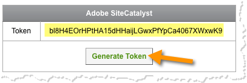

# Qualtrics Adobe Analyticsトークンの生成{#generating-your-qualtrics-adobe-analytics-token}

統合ウィザードを完了するには、トークンが必要です。 このIDを探すには、次の手順を実行します。

1. Qualtrics Research suiteにログインします。
1. ユーザーメ **[!UICONTROL ニューの「アカウント]** 」をクリックします。

   

1. 「Qualtrics IDs」 **[!UICONTROL をクリックします]**。

   

1. 「 **[!UICONTROL Adobe siteCatalyst]** 」セクションの「ト **[!UICONTROL ークンを生成]** 」をクリックし、トークンを保存します。

   

   >[!NOTE]
   >
   >Adobe Analyticsトークンを生成するオプションが表示されない場合は、Qualtricsアカウント管理者に問い合わせて、お使いのアカウントに適した権限を有効にしてください。

