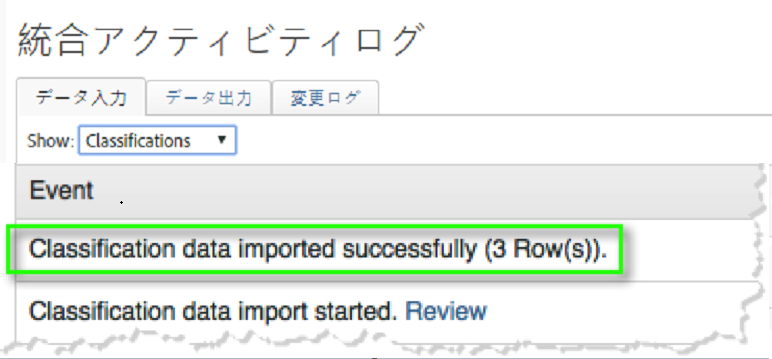

# 統合の確認{#verifying-the-integration}

導入後、以下のチェックを使用して統合が正常にデータを転送していることを検証する必要があります。

1. 統合アクティビティログを表示します。
   1. Adobe Marketing Cloudで **[!UICONTROL 、サポート]** / **[!UICONTROL 統合アクティビティログ]**&#x200B;に移動します。

      

   1. **[!UICONTROL 分類データが正常]**&#x200B;にインポートされたなどのエントリを探し、正常にインポートされた **[!UICONTROL 指標データおよび]****[!UICONTROL 指標データをエクスポート]**&#x200B;しました。これらのエントリは、正常に導入された1日以内に表示されます。
1. Adobe Analytics内でレポートデータを表示します。
   1. **[!UICONTROL カスタムコンバージョン]** / **[!UICONTROL カスタムコンバージョン1-10]** / **[!UICONTROL メッセージIDレポートに移動]**&#x200B;します。

      

   1. 回答者レポートを探します。このデータは、導入が成功した24~48時間以内に表示されます。
