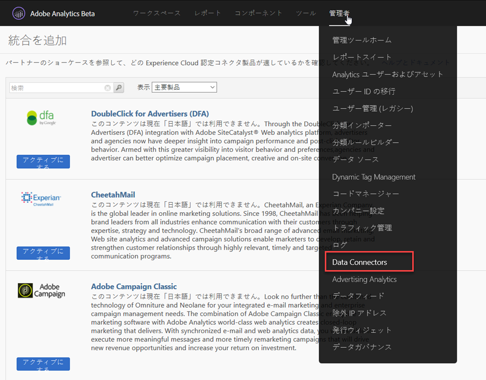
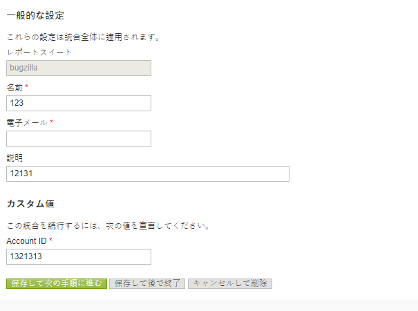
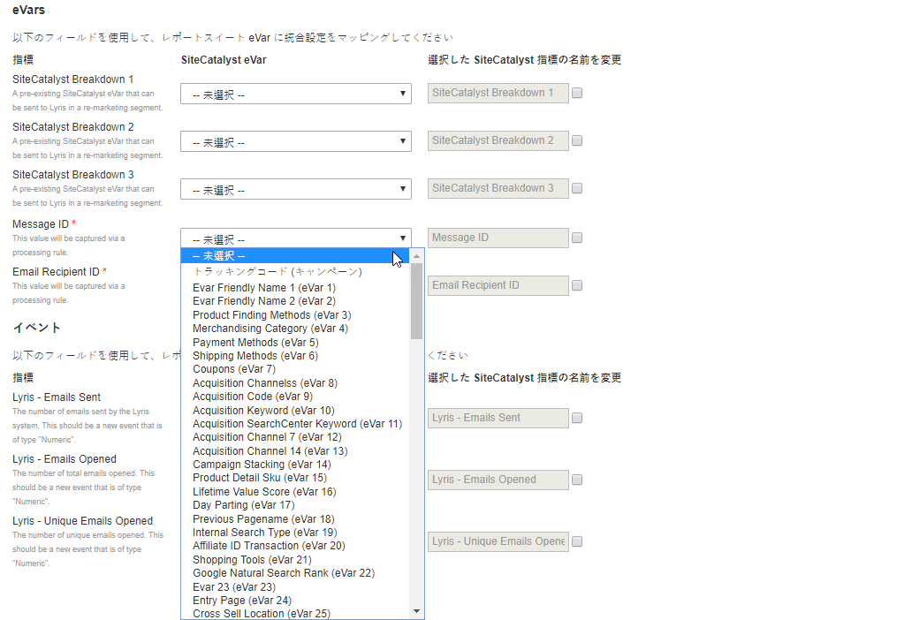
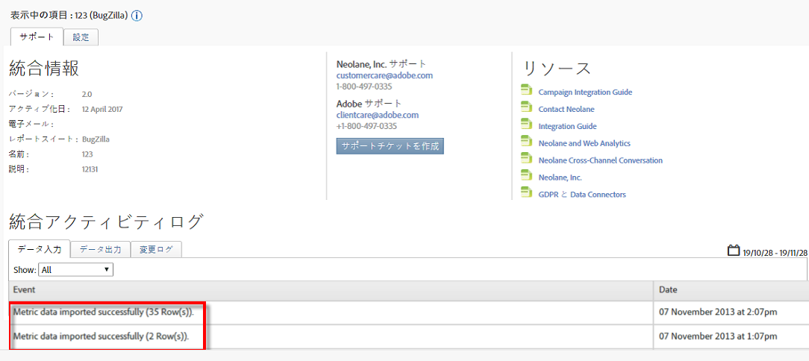

# 統合のデプロイ{#deploying-the-integration}

この統合の導入は、簡単な3ステップのプロセスです。

## 統合ウィザードの完了{#completing-the-integration-wizard}

統合をアクティブ化するには、Data Connectorsインターフェイス内でSelligent統合ウィザードを完了する必要があります。

1. Adobe Experience cloud内のData Connectors領域に移動します。

   

1. 「統 **[!UICONTROL 合を追加]**」で、SelligentプラグインをAdobe Experience cloudにドラッグ&amp;ドロップします。

   

   これにより、Selligent Data Connectors統合が開きます。

1. **統合設定**:目的のレポートスイートを選択し、「統合の設定」で統合の名前を指 **[!UICONTROL 定します]**。

1. 「カス **[!UICONTROL タム値]**」で、Selligentアカウント関連の情報をすべて入力します。

   

1. **変数マッピング**:ドロップダウンメニューから適切な予約済みeVarおよびイベントを選択します。

   

1. **データ設定**:自動化された3つのパートナーセグメントとは別に、 **[!UICONTROL 「自分のセグメント]** 」で自分のセグメントを選択 **[!UICONTROL できます]** 。

1. この統合では、Selligentアカウントへのデータポイントのダウンロードが必要になる場合があります。 「アクセス要求」で同じアクセス権を与えること **[!UICONTROL もできます]**。
1. 「デー **[!UICONTROL タ収集]**」で、自動または手動のソリューション（JavaScriptプラグイン）を選択し、ランディングページのURLからクエリ文字列パラメーターを収集します。 自動化ソリューションを選択する場合は、メッセージIDと受信者IDのクエリ文字列パラメータをそれぞれMIDとRIDに入力します。 JavaScriptプラグインの場合は、アドビコンサルタントにお問い合わせください。
1. **レポート設定**:「ダッシ **[!UICONTROL ュボードの生成]**」で、Selligentダッシュボードを自動的に生成するチェックボックスをオンにします。

   

1. 統合の概要を確認し、「アクティブ化」をクリ **[!UICONTROL ックしま]**&#x200B;す。

## Selligent内の設定{#configuration-within-selligent}

Adobe Analytics内で統合が有効になるとすぐに、Selligent側で自動設定が有効になります。

すべての電子メールを追跡するトラッカーが作成されました。 特定のドメインに制限する場合は、トラッカーの設定を更新してください。

URL内のAdobe Analyticsのトラッキングパラメーターを最前面に移動することを強くお勧めします。 これにより、Adobe処理ルールはランディングページのURLから確実にパラメーターを取得します。 以下に示すチェックボックスをオンにして、追跡を有効にします。

## 統合の確認{#verifying-the-integration}

すべての導入手順が完了したら、統合が正常にデータを転送していることを検証できます。

データ交換が始まるまでに数日かかります。 統合をアクティブ化した後は、Selligentにお問い合わせください。

### 統合アクティビティログ {#section-927e270495db479fba9578915d9ae9c9}

Data Connectors内のSelligent統合に移動します。 「サポート」 **[!UICONTROL タブに]** 、「指標データのインポート」や「分類データのインポートに成功した」などのイベントが表示されます。

### レポートデータ {#section-ebd481a162324e66bd6dc8cb4b8d2424}

適切な指標を使用してSelligentメッセージレポートを表示します。

1. Adobe Experience cloudのReport &amp; Analyticsに移動します。
1. 適切なレポートスイートを選択します。
1. 「カスタ **[!UICONTROL ムコンバージョン]**」で、「メ **[!UICONTROL ッセージIDレポート]** 」を選択し、「メッセージ **[!UICONTROL ID/メッセージ名」を選択します]**。
