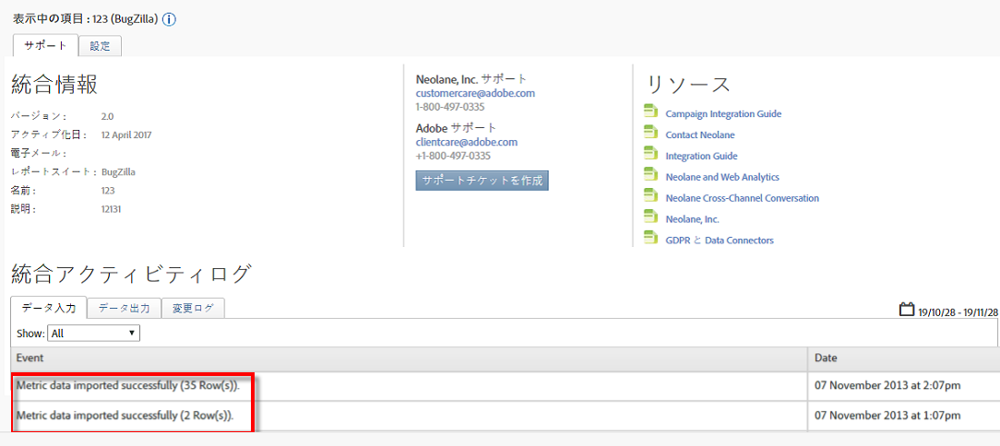

# 統合の確認{#verifying-the-integration}

すべての導入手順が完了したら、統合が正常にデータを転送していることを検証できます。

データ交換が始まるまでに数日かかります。 統合をアクティブ化した後は、Selligentにお問い合わせください。

## 統合アクティビティログ {#section-927e270495db479fba9578915d9ae9c9}

Data Connectors内のSelligent統合に移動します。 「サポート」 **[!UICONTROL タブに]** 、「指標データのインポート」や「分類データのインポートに成功した」などのイベントが表示されます。

## レポートデータ {#section-ebd481a162324e66bd6dc8cb4b8d2424}

適切な指標を使用してSelligentメッセージレポートを表示します。

1. Adobe Experience cloudのReport &amp; Analyticsに移動します。
1. 適切なレポートスイートを選択します。
1. 「カスタ **[!UICONTROL ムコンバージョン]**」で、「メ **[!UICONTROL ッセージIDレポート]** 」を選択し、「メッセージ **[!UICONTROL ID/メッセージ名」を選択します]**。

