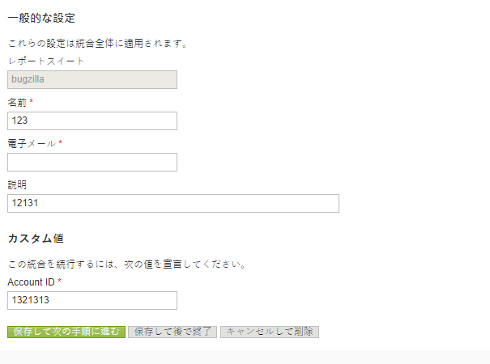
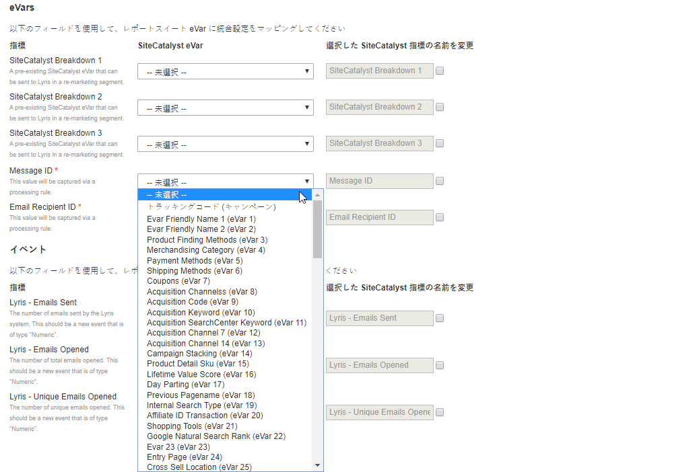

# 統合ウィザードの完了{#completing-the-integration-wizard}

統合をアクティブ化するには、Data Connectorsインターフェイス内でSelligent統合ウィザードを完了する必要があります。

1. Adobe Experience cloud内のData Connectors領域に移動します。

   

1. 「統 **[!UICONTROL 合を追加]**」で、SelligentプラグインをAdobe Experience cloudにドラッグ&amp;ドロップします。

   

   これにより、Selligent Data Connectors統合が開きます。

1. **統合設定**:目的のレポートスイートを選択し、「統合の設定」で統合の名前を指 **[!UICONTROL 定します]**。

1. 「カス **[!UICONTROL タム値]**」で、Selligentアカウン [ト関連の情報をすべて入力します](../../selligent-overview/selligent-activation/selligent-prereqs-seligent.md#concept-071c594b1bcc465cbce7a6fda3f1d829)。

   

1. **変数マッピング**:ドロップダウンメニ [ューから適切な予約済みのeVar](../../selligent-overview/selligent-activation/selligent-configure-variables.md#concept-907c2bdbed274c11a46d4cc323ef0238) /イベントを選択します。

   

1. **データ設定**:自動化された3つのパートナーセグメントとは別に、 **[!UICONTROL 「自分のセグメント]** 」で自分のセグメントを選択するこ **[!UICONTROL とができます]** 。

1. この統合では、Selligentアカウントへのデータポイントのダウンロードが必要になる場合があります。 「アクセス要求」で同じアクセス権を与えること **[!UICONTROL もできます]**。
1. 「デー **[!UICONTROL タ収集]**」で、自動または手動のソリューション（JavaScriptプラグイン）を選択し、ランディングページのURLからクエリ文字列パラメーターを収集します。 自動化ソリューションを選択する場合は、メッセージIDと受信者IDのクエリ文字列パラメータをそれぞれMIDとRIDに入力します。 JavaScriptプラグインの場合は、アドビコンサルタントにお問い合わせください。
1. **レポート設定**:「ダッシ **[!UICONTROL ュボードの生成]**」で、Selligentダッシュボードを自動的に生成するチェックボックスをオンにします。

   

1. 統合の概要を確認し、「アクティブ化」をクリ **[!UICONTROL ックしま]**&#x200B;す。

