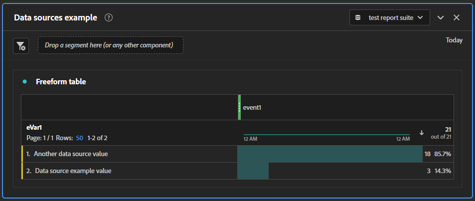

# データソースの概要

次の手順に従うと、サンプルデータを開発レポートスイートに簡単にアップロードして、実行中のワークフローを確認できます。 プロセスを理解したら、プロセスを拡張し、組織の実装に合わせてカスタマイズできます。

>[!IMPORTANT]
>
>開発またはテストレポートスイートを使用して、以下の手順に従います。 データソースを通じてアップロードされるデータは、 **永続的**. アップロードすると、実稼動レポートスイートのデータに影響します。

1. を使用してAdobe Analyticsにログインします。 [https://experience.adobe.com](https://experience.adobe.com).
1. に移動します。 **[!UICONTROL 管理者]** > **[!UICONTROL すべての管理者]** > **[!UICONTROL データソース]**.
1. 右上のドロップダウンリストを使用して開発レポートスイートを選択します。
1. 次をクリック： **[!UICONTROL 作成]** 」ボタンをクリックします。
1. の下 [!UICONTROL カテゴリを選択]を選択します。[!UICONTROL 汎用]「と、 [!UICONTROL タイプを選択]を選択します。[!UICONTROL 汎用データソース（概要データのみ）]&quot;.
1. 「**[!UICONTROL アクティブにする]**」をクリックします。
ポップアップウィンドウが開き、 [!UICONTROL データソース有効化ウィザード].
   1. 手順 1:データソースに名前を付け、免責事項チェックボックスをクリックします。
   1. 手順 2:この手順は、以前のバージョンのAdobe Analyticsでより多くの役割を果たしました。 チェックボックスをクリックし、その横のテキストフィールドに任意の値を入力します。
   1. 手順 3:データソーステンプレートファイルに含める指標を選択します。 ドロップダウンリストから「イベント 1」を選択します。
   1. 手順 4:この手順は、以前のバージョンのAdobe Analyticsでより多くの役割を果たしました。 チェックボックスをクリックし、その横のテキストフィールドに任意の値を入力します。
   1. 手順 5:データソーステンプレートファイルに含めるディメンションを選択します。 ドロップダウンリストから「eVar1」を選択します。
   1. 手順 6:概要を確認し、テンプレートファイルに含まれているディメンションと指標を表示します。
   1. 手順 7:次をクリック： **[!UICONTROL ダウンロード]** ボタンをクリックして、データソーステンプレートファイルをダウンロードします。 また、FTP サイトへのログイン資格情報も、近日中に使用されるので、メモします。
1. これでデータソースが作成されました。次の手順では、処理するデータを指定します。 目的のテキストエディターで、ダウンロードしたファイルを開きます。
1. テンプレートファイルには 3 行あります。2 つのコメント行 (「`#`&quot;)、およびヘッダー行：

   ```text
   # Generic Data Source (Summary Data Only) template file (user: 123456789 ds_id: 2)
   #    eVar1    event1
   Date    Evar 1    Event 1
   ```

1. 複数行のデータを入力し、各エントリをタブで区切ります。 値の区切りには、スペースやコンマを使用しないでください。
   * 最初の列は、次の形式の日付です。 `MM/DD/YYYY/HH/mm/SS`.
   * 2 番目の列は、eVar1 に含めるテキスト値です。
   * 3 番目の列は、イベント 1 を増やす量です。

   ```text
   # Generic Data Source (Summary Data Only) template file (user: 123456789 ds_id: 5)
   #    eVar1    event1
   Date    Evar 1    Event 1
   09/07/YYYY/11/23/00    Data source example value    3
   09/07/YYYY/15/59/00    Another data source value    18
   ```

1. ファイルを保存します。必要に応じて、別のファイル名を指定することもできます。 ファイルを保存したら、テキストエディターを閉じることができます。
1. Windows エクスプローラー、Finder、または選択した FTP クライアントで、に移動します。 [ftp://ftp.omniture.com](ftp://ftp.omniture.com).
1. ログイン資格情報の入力を求められたら、データソース作成ウィザードの最後の手順で指定したユーザー名とパスワードを使用します。 参照するには、次の場所に移動します。 [!UICONTROL データソース] をクリックし、 **[!UICONTROL FTP 情報]** をクリックします。
1. 認証が完了したら、編集したファイルを認証済み FTP ウィンドウにドラッグします。
1. FTP ウィンドウ以外の任意の場所に空のテキストファイルを作成します。 FTP サイトにアップロードしたデータソースファイルと同じファイル名を指定しますが、例外は 1 つです。 代わりに、 `.txt` ファイルタイプを指定するには、 `.fin` ファイルタイプ。 お使いのオペレーティングシステムの設定で、ファイルの種類の表示と変更が許可されていることを確認します。
1. 空の `.fin` ファイルを、データソースファイルと同じ FTP の場所に保存します。 この `.fin` ファイルは、データソースファイルが完全にアップロードされ、取り込みの準備ができたことをAdobeに通知します。
1. 数分後に、ファイルが FTP の場所から消え、レポートに表示されます。
1. データソースページを更新し、ファイルが正常に取り込まれたことを検証します。
1. Analysis Workspaceに移動し、プロジェクトを作成します。
1. eVar1 をディメンションとしてワークスペースキャンバスにドラッグし、イベント 1 を指標としてドラッグします。 Workspace の日付範囲に、データソースで指定した日付が含まれていることを確認します。

   

## 次の手順

[ファイル形式](file-format.md):組織に合わせたデータソースファイルの作成に関する詳細を説明します。
