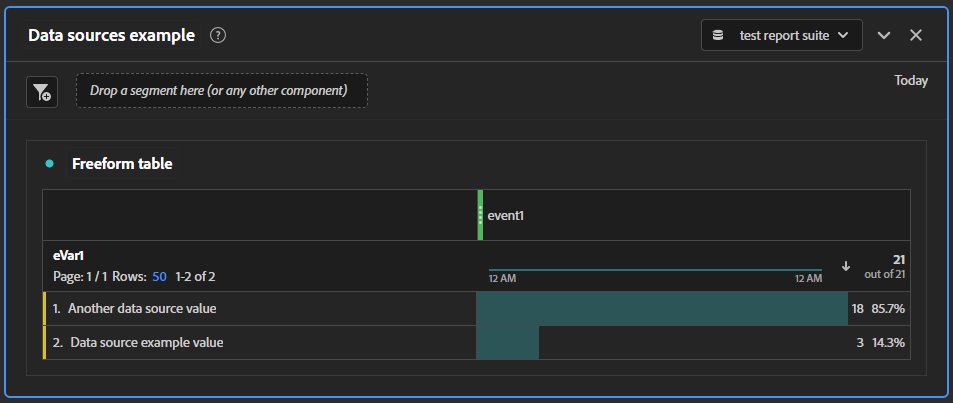

# データソースに取り組む

以下の手順に従うと、サンプルデータを開発レポートスイートに簡単にアップロードして、ワークフローを実際に確認できます。 プロセスを把握することで、自社の導入に合わせてプロセスを拡大および調整できます。

>[!IMPORTANT]
>
>開発またはテストレポートスイートを使用して、次の手順に従います。 データソースを通じてアップロードされたデータは&#x200B;**permanent**&#x200B;です。 そこにアップロードすると、実稼動レポートスイートのデータに影響します。

1. [https://experience.adobe.com](https://experience.adobe.com)からAdobe Analyticsにログインします。
1. **[!UICONTROL 管理者]** > **[!UICONTROL すべての管理者]** > **[!UICONTROL データソース]**&#x200B;に移動します。
1. 右上のドロップダウンリストを使用して、開発レポートスイートを選択します。
1. 左上の「**[!UICONTROL 作成]**」ボタンをクリックします。
1. [!UICONTROL  カテゴリを選択]で「[!UICONTROL 汎用]」を選択し、[!UICONTROL  タイプを選択]で「[!UICONTROL 汎用データSource （概要データのみ） ]」を選択します。
1. 「**[!UICONTROL アクティブにする]**」をクリックします。 ポップアップウィンドウが開き、[!UICONTROL Data Source Activation Wizard]が表示されます。
   1. 手順1：データソースに名前を付け、「免責事項」チェックボックスをクリックします。
   1. 手順2：この手順は、以前のバージョンのAdobe Analyticsでより多く使用されていました。 チェックボックスをクリックし、その横のテキストフィールドに任意の値を入力します。
   1. 手順3：データソーステンプレートファイルに含める指標を選択します。 ドロップダウンリストから「イベント 1」を選択します。
   1. 手順4：この手順は、以前のバージョンのAdobe Analyticsでより多く使用されていました。 チェックボックスをクリックし、その横のテキストフィールドに任意の値を入力します。
   1. 手順5：データソーステンプレートファイルに含めるディメンションを選択します。 ドロップダウンリストから「eVar1」を選択します。
   1. 手順6：概要を確認し、テンプレートファイルに含まれるディメンションと指標を表示します。
   1. 手順7:「**[!UICONTROL ダウンロード]**」ボタンをクリックして、データソーステンプレートファイルをダウンロードします。 また、近日中に使用されるFTP サイトへのログイン資格情報にも注意してください。
1. データソースが作成されます。次のステップは、処理するデータを与えることです。 ダウンロードしたファイルを目的のテキストエディターで開きます。
1. テンプレートファイルには、2つのコメント行（「`#`」で始まる）とヘッダー行の3行が含まれています。

   ```text
   # Generic Data Source (Summary Data Only) template file (user: 123456789 ds_id: 2)
   #    eVar1    event1
   Date    Evar 1    Event 1
   ```

1. 複数のデータ行を入力し、各エントリをタブで区切ります。 値を区切るのにスペースやコンマを使用しないでください。
   * 最初の列は、次の形式の日付です：`MM/DD/YYYY/HH/mm/SS`。
   * 2つ目の列は、eVar1に含めるテキスト値です。
   * 3つ目の列は、イベント 1を増やす金額です。

   ```text
   # Generic Data Source (Summary Data Only) template file (user: 123456789 ds_id: 5)
   #    eVar1    event1
   Date    Evar 1    Event 1
   09/07/YYYY/11/23/00    Data source example value    3
   09/07/YYYY/15/59/00    Another data source value    18
   ```

1. ファイルを保存します。 必要に応じて、別のファイル名をオプションで指定できます。 ファイルが保存されたら、テキストエディターを閉じることができます。
1. Windows エクスプローラー、Finder、または選択したFTP クライアントで、[ftp://ftp.omniture.com](ftp://ftp.omniture.com)に移動します。
1. ログイン資格情報の入力を求められた場合は、データソース作成ウィザードの最後の手順で指定したユーザー名とパスワードを使用します。 [!UICONTROL  データソース ]に移動し、作成したデータソースの横にある&#x200B;**[!UICONTROL FTP情報]**&#x200B;をクリックして、もう一度参照できます。
1. 認証が完了したら、編集したファイルを認証済みFTP ウィンドウにドラッグします。
1. FTP ウィンドウ以外の任意の場所に空のテキストファイルを作成します。 1つの例外を除いて、FTP サイトにアップロードしたデータソースファイルと同じファイル名を指定します。 `.txt` ファイル形式の代わりに、`.fin` ファイル形式を指定してください。 オペレーティングシステムの設定で、ファイルタイプの表示と変更が可能になっていることを確認してください。
1. 空の`.fin` ファイルをデータソースファイルと同じFTPの場所にドラッグします。 `.fin` ファイルが存在すると、データソースファイルが完全にアップロードされ、取り込む準備ができていることをAdobeに伝えます。
1. 数分後、ファイルはFTPの場所から消え、レポートに表示されます。
1. データソースページを更新し、ファイルが正常に取り込まれたことを検証します。
1. Analysis Workspaceに移動し、プロジェクトを作成します。
1. EVar1をディメンションとしてワークスペースキャンバスにドラッグし、イベント 1を指標としてドラッグします。 Workspaceの日付範囲に、データソースで指定した日付が含まれていることを確認します。

   

## 次の手順

[ ファイル形式](file-format.md)：組織に合わせたデータソースファイルの作成について詳しく説明します。
