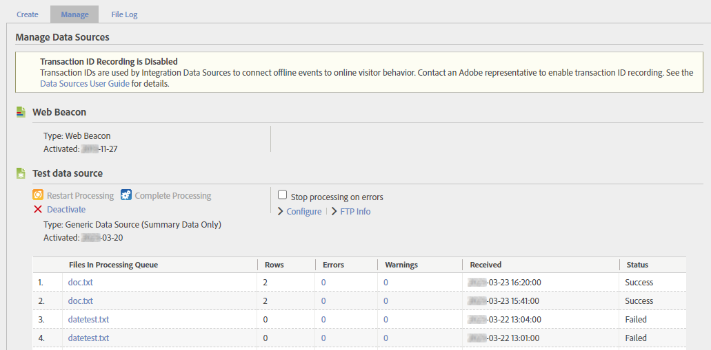
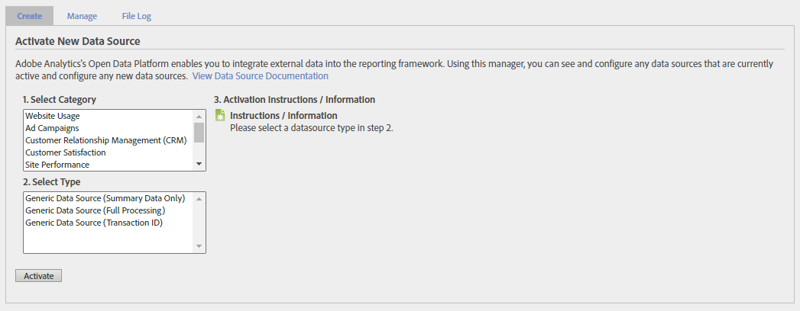
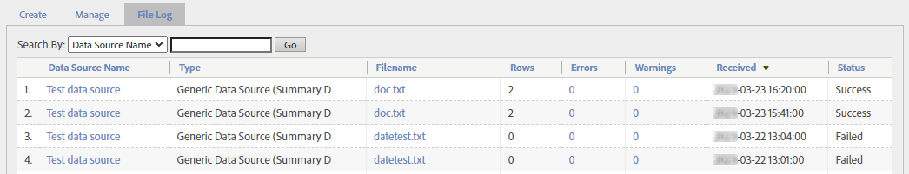

# データソースの管理

データソースマネージャーを使用して、データソースの作成、編集、非アクティブ化を行います。 また、このインターフェイスを使用して、データソースの FTP の場所にアップロードされたファイルのステータスを追跡することもできます。

**[!UICONTROL 管理者]** > **[!UICONTROL すべての管理者]** > **[!UICONTROL データソース]**

右上のレポートスイートセレクターを使用して、組織内のレポートスイートを切り替えます。

このインターフェイスには、**[!UICONTROL 管理]**、**[!UICONTROL 作成]**、**[!UICONTROL ファイルログ]**&#x200B;の3つの主なタブがあります。

## 管理

「**[!UICONTROL 管理]**」タブは、組織が作成したすべてのデータソースを処理します。 FTP情報を表示したり、テンプレートファイルで使用される変数を編集したり、データソースを完全に非アクティブ化したりできます。

最上位のデータソースは常に[!UICONTROL Web ビーコン ]です。 このデータソースは、AppMeasurementを通じた一般的なデータ収集に使用されます。 編集または非アクティブ化することはできません。

各データソースには、次のオプションがあります。

* **[!UICONTROL 処理を再開]**: エラーが原因で以前に停止したデータソース処理を再開します。 処理は次のエラーが発生するまで続けられます。 データソースは、データソースファイルの処理を停止するのは、**[!UICONTROL エラーの処理を停止]**&#x200B;を選択した場合のみです。
* **[!UICONTROL 処理を完了]**：使用されなくなりました。このボタンは[ フル処理データソース ](full-processing-eol.md)にのみ使用されました。
* **[!UICONTROL エラーの処理を停止]**：処理サーバーにエラーが発生したときに停止するように指示するチェックボックス。 データソースは、「**[!UICONTROL 処理を再開]**」を選択するまで処理を再開しません。 データソースでファイルエラーが発生すると、そのエラーが通知されます。 Adobeは、エラーが発生したファイルをFTP サーバー上の`files_with_errors`というフォルダーに移動します。 問題を解決したら、ファイルを再送信して処理します。
* **[!UICONTROL Configure]**：このデータソースのデータソース作成ウィザードを表示するリンク。 このウィザードでは、データソースの名前を変更したり、テンプレートファイルのダウンロード時に自動的に含まれる変数を再設定したりできます。
* **[!UICONTROL FTP情報]**: FTP資格情報が表示されるデータソース作成ウィザードの最後の手順に移動するリンク。

データソースがデータを受信すると、アップロードされたファイルの複数の列を含むテーブルが表示されます。

* **[!UICONTROL 処理中のファイル]**: ファイルの名前。
* **[!UICONTROL 行]**: ファイル内の行の合計数。
* **[!UICONTROL エラー]**: エラーを含み、取り込めなかった行の数。
* **[!UICONTROL Warnings]**：警告が含まれている行の数。
* **[!UICONTROL 受信]**: ファイルがレポートスイートのタイムゾーンで受信されたタイムスタンプ。
* **[!UICONTROL ステータス]**: ファイル （`Success`または`Failed`）のステータス。

## 作成

「**[!UICONTROL 作成]**」タブは、データソース作成ウィザードの開始点を示します。

データソースのカテゴリとタイプは、以前のバージョンのAdobe Analyticsでは、より価値がありました。 ただし、使用方法は限られています。

* データソースタイプは、データソース自体の「[管理](#manage)」タブと、個々のファイルごとに「[ ファイルログ ](#file-log)」タブに表示されます。
* 一部のデータソースタイプでは、テンプレートファイルのダウンロード時に自動的に変数が含まれます。 ただし、既存の[ ファイル形式](file-format.md)に準拠している限り、使用可能なディメンションまたは指標を含めることができます。

これらの理由を除いて、選択できるすべてのデータソースカテゴリとタイプは効果的に同じです。 データソースを使用する目的に最も適したカテゴリとタイプを選択します。

[ フル処理データソース ](full-processing-eol.md)を廃止すると、いくつかのカテゴリとタイプを選択できません。 フル処理データソースタイプを選択すると、「**[!UICONTROL アクティブ化]**」ボタンがグレー表示されます。

## ファイル ログ

「**[!UICONTROL ファイルログ]**」タブには、特定のレポートスイート用にアップロードされたすべてのデータソースファイルの集約ビューが表示されます。

特定のデータソースを見つけるのに役立つ検索バーを利用できます。 次の表に、次の列を示します。

* **[!UICONTROL Data Source Name]**: データソースの名前。
* **[!UICONTROL Type]**: データソースのタイプ。
* **[!UICONTROL ファイル名]**: アップロードされたファイルの名前。
* **[!UICONTROL 行]**: ファイル内の行の合計数。
* **[!UICONTROL エラー]**: エラーが含まれている行の数。
* **[!UICONTROL 警告]**：使用されていません。 警告を含む行の数。
* **[!UICONTROL 受信]**: Adobeがファイルの処理を開始した日時。
* **[!UICONTROL ステータス]**: ファイルのステータス （`Success`または`Failed`）。
