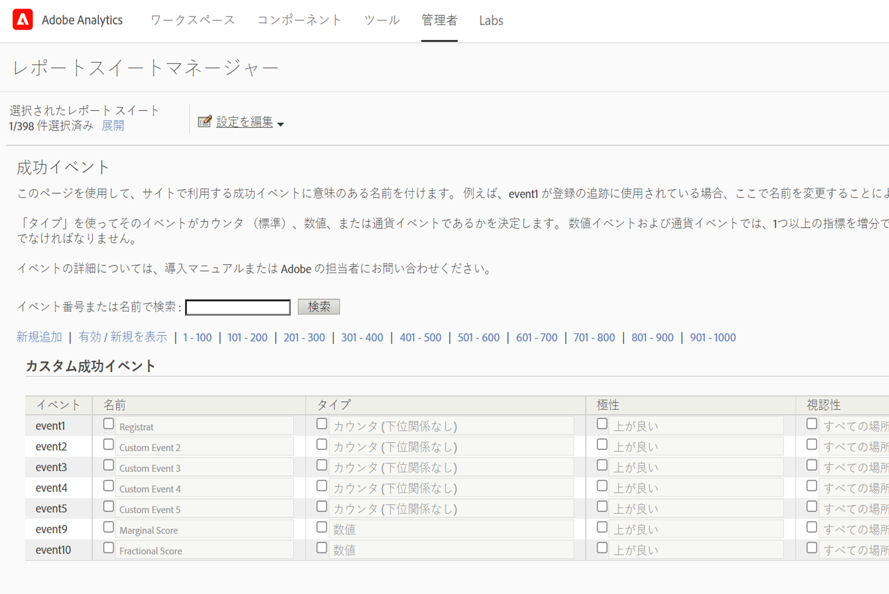
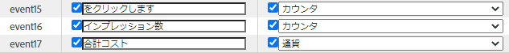
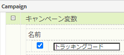
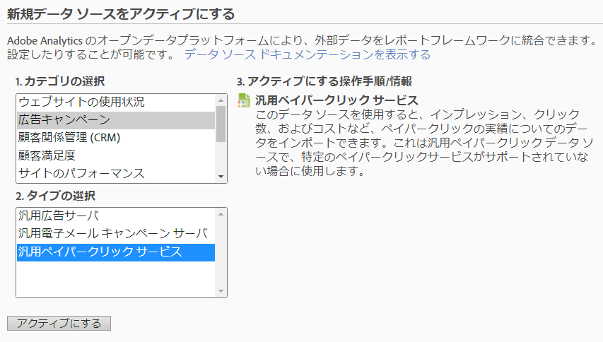
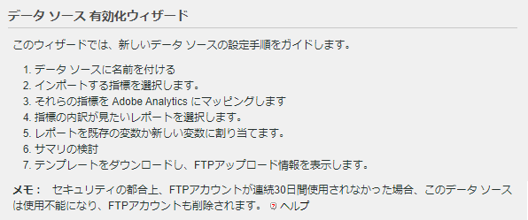
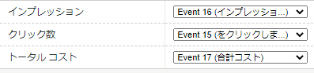
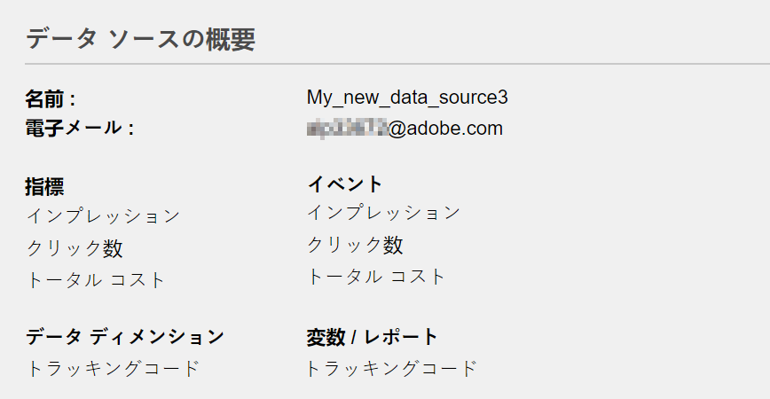
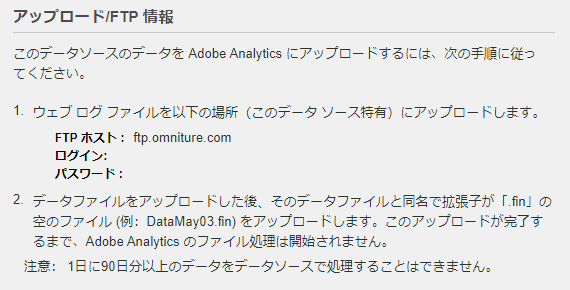

# デ [!UICONTROL ータソースを使用した] 有料検索 [!UICONTROL 指標のインポート]

多くのマーケティング組織では、有料検索は、新規顧客を獲得し、既存の顧客を保持するための最も重要で信頼性の高い方法の1つ&#x200B;です。 Adobe Analyticsの [!UICONTROL データソース] 機能を使用すると、Google AdWordsなどのデジタル広告プラットフォームから、高度な有料検索データを簡単にインポートできます。 このデータをオンサイト行動データおよび顧客属性データと共に他のマーケティングデータと統合し、組織の有料検索活動に対する洞察を高めることができます。

以下の手順では、キーワードデータとインプレッション数、クリック数、クリックあたりのコストなどの指標をインポートするAdWordsとの統合を設定する方法を示します。

この手順では、ペイパークリックデータの1回限りのインポートを設定する方法を説明します。 ただし、 [!UICONTROL データソース] では、ここで説明するファイル形式を使用してデータを継続的にインポートできます。 有料検索プラットフォームに応じて、定期的なエクスポート（日別、月別など）をスケジュールし、それらのエクスポートをAdobe Analyticsが必要とするファイル形式に変換する自動プロセスを設定し、それらのファイルをAdobe Analyticsにアップロードして有料検索レポートに移行できます。

## 前提条件

* 有料検索検知が導入されました。
* トラッキングコードデータを取り込みます。
* 広告グループごとに一意のトラッキングコードがある。

## [!UICONTROL 成功イベントの設定]

まず、Adobe Analyticsに指標を受け取る準備をさせます。 これを行うには、いくつかの成功イベントを設定する必要があります。

[!UICONTROL 成功イベントとは、追跡できるアクションです。]You determine what a [!UICONTROL success event] is. 有 [!UICONTROL 料検索指標の追跡を目的として、クリック数、クリック数、クリック数、インプレッション数、インプレッション数、インプレッション数、インプレッション数、インプレッション]数、イネーブルトラッキングコード、イネーブルトラッキングコード、インプレットを設定します。

1. Go to **[!UICONTROL Adobe Analytics > Admin > Report Suites]**.
1. レポートスイートを選択します。
1. **[!UICONTROL 設定を編集／コンバージョン／成功イベント]**&#x200B;の順にクリックします。

   

1. 「カスタム成功イベント」で、「 **** 追加新規」を使用して、3つのカスタム成功イベントを作成します。 [!UICONTROL クリック数] （カウンター）、 [!UICONTROL インプレッション数] （カウンター）、 [!UICONTROL 合計コスト] （通貨）。

   

1. 「保存」をクリックします。保存が承認されたことを知らせるメッセージが表示されます。
1. **[!UICONTROL 管理者/レポートスイート/設定を編集/コンバージョン/コンバージョン変数に移動します]**。
1. トラッキングコードを有効にするには、 **[!UICONTROL キャンペーン/キャンペーン変数の「]** トラッキングコード **[!UICONTROL 」の横にあるチェックボックスをオンにします]**。

   

## データソースの設定

[!UICONTROL データソース] を使用すると、非クリックストリームデータをAdobe Analyticsと共有できます。 この場合、Adobe Analyticsを使用して有料検索指標を追跡します。 アドビでは、トラッキングコードを鍵として、有料検索指標とAdobe Analytics指標の2つのデータを結び付けます。

1. **[!UICONTROL Adobe Analytics/管理者/データソースに移動します]**。
1. 「 **[!UICONTROL 作成]** 」タブを選択して、新しいデータソースのアクティブ化を開始します。
1. 「 **[!UICONTROL カテゴリを選択]**」で、「 **[!UICONTROL 広告キャンペーン]**」を選択します。

   

1. 「 **[!UICONTROL タイプを]**&#x200B;選択 **[!UICONTROL 」で、「]**&#x200B;汎用ペイパークリックサービス」を選択します。
1. 「**[!UICONTROL アクティブ化]**」をクリックします。The [!UICONTROL Data Source Activation Wizard] displays:

   

1. 「 **[!UICONTROL 次へ]** 」をクリックし、データソースに名前を付けます。 この名前は、データソースマネージャーに表示されます。
1. サービス契約に同意し、「 **[!UICONTROL 次へ]**」をクリックします。
1. 次の3つの標準指標を選択します。 [!UICONTROL インプレッション数]、 [!UICONTROL クリック数] 、 [!UICONTROL 合計コスト] )を確認し、「 **[!UICONTROL 次へ]**」をクリックします。
1. 次に、この新しいデータソースを、成功イベントの [設定で作成したカスタムイベントに「マッピング」します](/help/admin/admin/c-success-events/t-success-events.md)。

   

1. 「データディメンション」「トラッキングコード」の横のボックスをオンにし、「 **[!UICONTROL 次へ]**」をクリックします。
1. マップデータのDimension。
読み込んだデータディメンション（属性）を、格納先のAdobe Analytics属性にマップします。 これは、標準ディメンションまたはeVarの場合があります。 「 **[!UICONTROL Next]**」をクリックすると、結果のマッピングがサマリに表示されます。

   

1. 「**[!UICONTROL 保存]**」をクリックします。
1. 「 **[!UICONTROL ダウンロード]** 」をクリックして、このデータソース用のテンプレートファイルをダウンロードします。
ファイル名は、最初に指定したデータソースのタイプに対応します。この場合は、「Generic Pay-Per-Click Service template.txt」となります。
1. お気に入りのテキストエディターでテンプレートを開きます。
ファイルには、指標とディメンションとそのマッピングが既に入力されています。

## PPCデータを書き出し、Analyticsにアップロードする

Google Adwords、MSN、Yahoo、その他のPPCアカウントに関するこれらの作業に似た手順です。

### データの書き出し

1. PPCアカウントにログインし、新しいレポートまたはエクスポートを作成します。
エクスポートに次のフィールドが含まれていることを確認します。日付、リンク先URL(ランディングページ)、インプレッション数、クリック数およびコスト。 エクスポートに他のフィールドを含めることはできますが、以下の手順で削除します。
1. 可能であれば、レポートをタブ区切りファイル `.csv` またはタブ区切りファイルとして保存します。 これにより、次の手順での作業が容易になります。
1. Microsoft Excelでファイルを開きます。

### Microsoft Excelでのファイルの編集

1. Microsoft Excelで、上記以外の列をすべて削除します。
1. 上部に余分な行がある場合は削除します。
1. トラッキングコードをリンク先URLから分離するには：a.すべての列のデータをコピーして貼り付けます。
b.デ **[!UICONTROL ータ/テキストを列に追加をクリックします]**。
c.ウィザードの手順1で、「 **[!UICONTROL 区切り]** 」が選択されていることを確認し、「 **[!UICONTROL 次へ]**」をクリックします。
d.ウィザードの手順2で、URLの作成方法に応じて区切り文字を指定します(? または&amp;)をクリックし、「 **[!UICONTROL 次へ]**」をクリックします。
e.ウィザードの手順3で、データをプレビューし、列の1つが「trackingcodename=trackingcode」であることを確認します。 変数を追加する場合は、上記の手順を繰り返します（&amp;を区切り文字として使用）。
f.追跡コード、インプレッション、クリック数、コストを除くすべての列を削除します。 「日付」追加という新しい列が追加され、列が次の順序で整理されます。日付：:トラッキングコード：:インプレッション数：クリック数：コスト。
1. この追加データは、上の「データソースの設定」でダウンロードしたテンプレートに送信されます。
これで、ファイルをアップロードする準備が整いました。

### FTP経由でファイルをAdobe Analyticsにアップロード

データソースウィザードに戻り、手順を確認して、FTPを使用してファイルをアップロードします。

## 計算指標の作成

ペイパークリックの意思決定を行う場合、計算指標を追加すると役立ちます。

例えば、次の [計算指標を追加できます](https://experienceleague.adobe.com/docs/analytics/components/calculated-metrics/calcmetric-workflow/cm-build-metrics.html?lang=en#calculated-metrics)。

| 名前 | 数式 | 指標タイプ | 説明 |
| --- | --- | --- | --- |
| 1 訪問あたりのページビュー数 | ページビュー数/訪問回数 | 数値 | サイトレベルで適用されるとき：訪問あたりの平均ページ数はどれだけかが表示されます。最頻訪問ページレポート内で適用されるとき：1 回の訪問で特定のページが表示される平均回数が表示されます。 |
| 平均注文額 | 売上高/注文件数 | 通貨 | 注文あたりの平均売上高が表示されます。 |
| 訪問あたりの売上高 | 売上高/訪問回数 | 通貨 | 訪問あたりの平均売上高が表示されます。 |
| クリックスルー率(CTR) | クリック数/インプレッション数 | 数値 | オンライン広告または電子メールマーケティングキャンペーンのインプレッションに対するクリック数の比率を測定します。 |
| 利益 | 売上高 — コスト | 通貨 | キャンペーンの売上高からコストを引いた額が表示されます。 |
| インプレッションあたりの利益(PPI) | （売上高 — コスト）/インプレッション | 通貨 | 広告を表示するたびに生み出された売上高とコストのバランスを示します。 |
| 広告費収益率(ROAS) | 販売金額/広告費用 | 通貨 | (ROI)対応する広告に費やされた1ドルあたりの利益を表します。 |

## レポートの設定と実行

最後の手順は、データソース指標と計算指標をトラッキングコードレポートに追加し、キャンペーンを詳細に分析して、各広告グループのパフォーマンスを即座に表示することです。

1. **[!UICONTROL Adobe Analytics/レポート]**&#x200B;で、データソースの読み込み先のレポートスイートを選択します。
1. **[!UICONTROL レポート/キャンペーン/トラッキングコード/トラッキングコード]**。
1. 日付範囲を選択します。
1. **** 指標/追加をクリックし、標準指標のリストからデータソース指標（クリック数、インプレッション数、合計コスト）を追加します。
1. 追加した任意の計算指標に対しても同じようにします。 指標を追加すると、レポートが更新されます。
