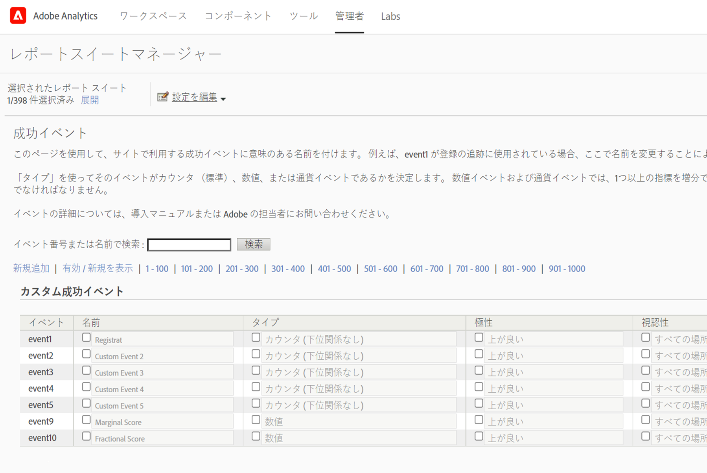
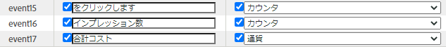
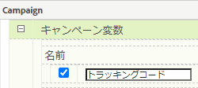
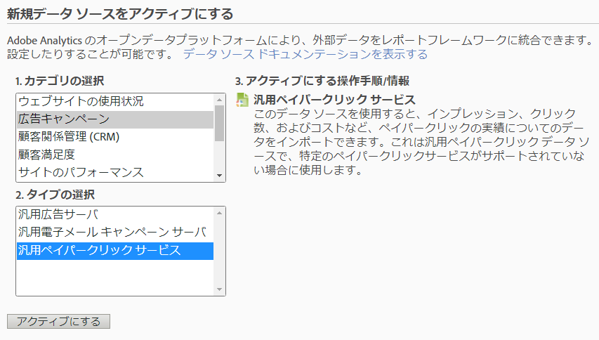
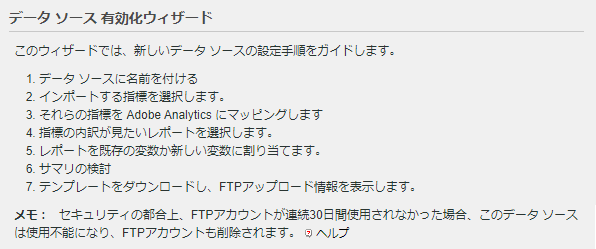
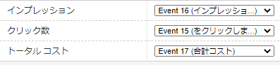
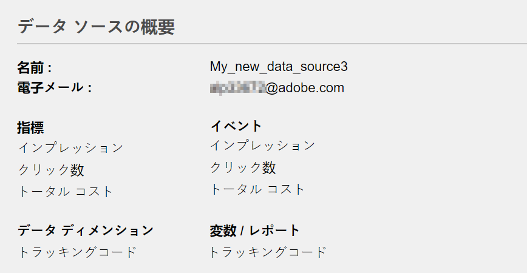
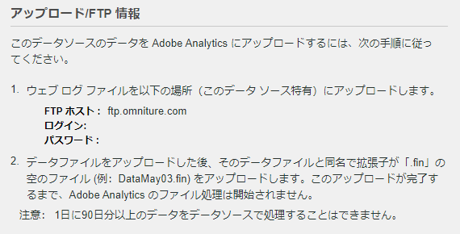

# [!UICONTROL データソース]を使用した[!UICONTROL 有料検索]指標のインポート

多くのマーケティング組織にとって、有料検索は、新規顧客にリーチしつつ既存顧客を維持するための最も有益で信頼性の高い方法の 1 つです。 Adobe Analyticsの[!UICONTROL  データソース ]機能を使用すると、Google Adsなどのデジタル広告プラットフォームから高度な有料検索データを簡単にインポートできます。 そのデータを、オンサイト行動データや顧客属性データと共に、他のマーケティングデータと統合して、組織の有料検索の取り組みに対するより優れたインサイトを得ることができます。

これらの手順では、広告との統合を設定してキーワードデータや、インプレッション数、クリック数、クリック単価などの指標を読み込む方法を説明します。

この手順では、クリック課金型データの1回限りの読み込みを設定する方法について説明します。 ただし、[!UICONTROL データソース]では、ここで説明するファイル形式を使用してデータを継続的にインポートできます。 使用する有料検索プラットフォームによっては、定期的なエクスポート（日次、月次など）をスケジュールしたり、エクスポートを Adobe Analytics に必要なファイル形式に変換するための自動プロセスを設定したり、これらのファイルを Adobe Analytics にアップロードして有料検索統合レポートを作成したりできる場合があります。

## 前提条件

* 有料検索検知を実装しました。
* トラッキングコードデータをキャプチャしています。
* 広告グループごとに一意のトラッキングコードがあります。

## [!UICONTROL 成功イベント]の設定

最初の手順は、指標を受け取るための Adobe Analytics の準備です。 それには、いくつかの成功イベントを設定する必要があります。

[!UICONTROL 成功イベント]とは、追跡できるアクションです。 [!UICONTROL 成功イベント]はお客様によって定義されます。 [!UICONTROL 有料検索]指標を追跡するためには、[!UICONTROL クリック数]、[!UICONTROL インプレッション数]、[!UICONTROL 合計コスト]を中心に[!UICONTROL 成功イベント]を設定し、[!UICONTROL トラッキングコード]を有効にします。

1. **[!UICONTROL Adobe Analytics／管理者／レポートスイート]**&#x200B;に移動します。
1. レポートスイートを選択します。
1. **[!UICONTROL 設定を編集／コンバージョン／成功イベント]**&#x200B;をクリックします。

   

1. 「カスタム成功イベント」で、「**[!UICONTROL 新規追加]**」を使用して、[!UICONTROL クリック数]（カウンター）、[!UICONTROL インプレッション数]（カウンター）、[!UICONTROL 合計コスト]（通貨）の 3 つのカスタム成功イベントを作成します。

   

1. 「保存」をクリックします。
保存が承認されたことを示すメッセージが表示されます。
1. **[!UICONTROL 管理者／レポートスイート／設定を編集／コンバージョン／コンバージョン変数]**&#x200B;に移動します。
1. **[!UICONTROL キャンペーン／キャンペーン変数]**&#x200B;の下の&#x200B;**[!UICONTROL トラッキングコード]**&#x200B;の横にあるチェックボックスをオンにして、トラッキングコードを有効にします。

   

## データソースの設定

[!UICONTROL データソース]を使用すると、クリックストリーム以外のデータを Adobe Analytics と共有できます。 この場合は、Adobe Analytics を使用して有料検索指標を追跡します。 トラッキングコードをキーとして使用し、有料検索指標と Adobe Analytics 指標の 2 つのデータを結び付けます。

1. **[!UICONTROL Adobe Analytics／管理者／すべての管理者／データソース]**&#x200B;に移動します。
1. 「**[!UICONTROL 作成]**」タブを選択し、新しいデータソースのアクティブ化を開始します。
1. **[!UICONTROL カテゴリの選択]**&#x200B;で、「**[!UICONTROL 広告キャンペーン]**」を選択します。

   

1. **[!UICONTROL タイプの選択]**&#x200B;で、「**[!UICONTROL 汎用ペイパークリックサービス]**」を選択します。
1. 「**[!UICONTROL アクティブにする]**」をクリックします。
[!UICONTROL データソース有効化ウィザード]が次のように表示されます。

   

1. 「**[!UICONTROL 次へ]**」をクリックして、データソースに名前を付けます。 この名前は、データソースマネージャーに表示されます。
1. サービス使用許諾契約に同意し、「**[!UICONTROL 次へ]**」をクリックします。
1. 「[!UICONTROL インプレッション数]」、「[!UICONTROL クリック数]」および「[!UICONTROL 合計コスト]」の 3 つの標準指標を選択し、「**[!UICONTROL 次へ]**」をクリックします。
1. この新しいデータソースを、[成功イベント ](/help/admin/tools/manage-rs/edit-settings/conversion-var-admin/c-success-events/success-event.md)で作成したカスタムイベントに「マッピング」します。

   

1. データディメンションの選択
トラッキングコードの横にあるボックスにチェックを入れ、**[!UICONTROL 次へ]**&#x200B;をクリックします。
1. データディメンションのマッピング
インポートしたデータディメンション（属性）を、保存先の Adobe Analytics 属性にマッピングします。 これは、標準ディメンションまたは eVar の場合があります。 「**[!UICONTROL 次へ]**」をクリックすると、結果のマッピングが概要に表示されます。

   

1. 「**[!UICONTROL 保存]**」をクリックします。
1. 「**[!UICONTROL ダウンロード]**」をクリックして、このデータソースのテンプレートファイルをダウンロードします。
ファイル名は、最初に指定したデータソースのタイプに対応します。この場合は、「Generic Pay-Per-Click Service template.txt」となります。
1. お気に入りのテキストエディターでテンプレートを開きます。
ファイルには、指標とディメンションとそのマッピングが既に入力されています。

## PPC データのエクスポートと Analytics へのアップロード

Google Ads、Microsoft Advertising、その他のPPC アカウントの場合は、これらの手順と同様の手順を実行します。

### データのエクスポート

1. PPC アカウントにログインし、新しいレポートまたはエクスポートを作成します。
日付、宛先 URL（ランディングページ）、インプレッション、クリック数およびコストのフィールドがエクスポートに含まれていることを確認します。 エクスポートにはその他のフィールドを含めることができますが、次の手順で削除します。
1. 可能であれば、レポートを `.csv` またはタブ区切りファイルとして保存します。 これにより、次の手順での作業が簡単になります。
1. ファイルを Microsoft Excel で開きます。

### Microsoft Excel でのファイルの編集

1. Microsoft Excel で、上記以外の列をすべて削除します。
1. 上部にある余分な行を削除します。
1. トラッキングコードを宛先URLから分離するには：
a. すべての列のデータをコピーして貼り付けます。
b. **[!UICONTROL データ/テキストから列]**をクリックします。
c. ウィザードの手順1で、**[!UICONTROL 区切り]**&#x200B;が選択されていることを確認し、**[!UICONTROL 次へ]**をクリックします。
d. ウィザードの手順2で、URLの作成方法に応じて区切り文字を指定します（または？）。 または &amp;）に応じて区切り文字を指定し、「**[!UICONTROL 次へ]**」をクリックします。
e. ウィザードの手順3で、データをプレビューし、列の1つが「trackingcodename=trackingcode」であることを確認します。 変数を追加する場合は、（&amp; を区切り文字として使用して）これらの手順を繰り返します。
f. トラッキングコード、インプレッション数、クリック数、コスト以外のすべての列を削除します。 「日付」という新しい列を追加し、日付 :: トラッキングコード :: インプレッション数 :: クリック数 :: コストの順序で列を整理します。
1. 上記の「データソースの設定」節でダウンロードしたテンプレートに、このデータを追加します。
これで、ファイルをアップロードする準備が整いました。

### FTP を使用した Adobe Analytics へのファイルのアップロード

データソースウィザードに戻って手順を確認し、FTP を使用してファイルをアップロードします。

## 計算指標の作成

計算指標の追加は、クリック課金の決定を行う際に役立ちます。

例えば、次の[計算指標](/help/components/calculated-metrics/workflow/c-build-metrics/cm-build-metrics.md#calculated-metrics)を追加できます。

| 名前 | 数式 | 指標タイプ | 説明 |
| --- | --- | --- | --- |
| 1訪問あたりのページビュー数 | ページビュー/訪問数 | 数値 | サイトレベルで適用した場合：1訪問あたりの平均ページ数を表示します。 「最も人気のあるページ」レポートに適用した場合：特定のページが1回の訪問で閲覧された平均回数を示します。 |
| 平均注文額 | 収益/注文 | 通貨 | 注文あたりの平均売上を表示します。 |
| 訪問あたりの売上高 | 売上高／訪問 | 通貨 | 訪問あたりの平均売上高が表示されます。 |
| クリックスルー率（CTR） | クリック数／インプレッション数 | 数値 | オンライン広告またはメールマーケティングキャンペーンのインプレッション数に対するクリック数の割合を測定します。 |
| 利益 | 売上高 - コスト | 通貨 | キャンペーンの売上高からコストを引いた値を表示します。 |
| インプレッションあたりの利益（PPI） | （売上高 - コスト）／インプレッション数 | 通貨 | 広告が表示されるたびに生み出されてきた売上高とコストのバランスを表示します。 |
| 広告費用対効果（ROAS） | 売上高／広告費用 | 通貨 | （ROI）対応する広告に費やした 1 ドルあたりの獲得金額を表します。 |

## レポートの設定と実行

最後の手順は、データソース指標と計算指標をトラッキングコードレポートに追加し、キャンペーンにドリルダウンして各広告グループのパフォーマンスをすぐに確認することです。

1. **[!UICONTROL Adobe Analytics／レポート]**&#x200B;で、データソースのインポート先のレポートスイートを選択します。
1. **[!UICONTROL レポート／キャンペーン／トラッキングコード／トラッキングコード]**&#x200B;に移動します。
1. 日付範囲を選択します。
1. **[!UICONTROL 指標／追加]**&#x200B;をクリックし、標準指標のリストからデータソース指標（クリック数、インプレッション数、合計コスト）を追加します。
1. 既に追加してある計算指標に対しても同じ操作を行います。 指標を追加すると、レポートが更新されます。
