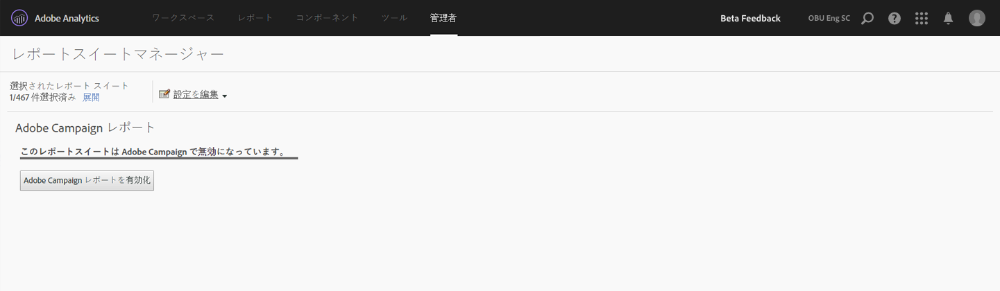

# Adobe Campaignレポート

この統合を設定する方法について詳しくは、[Adobe Campaign のドキュメント](https://helpx.adobe.com/campaign/standard/integrating/using/about-campaign-analytics-integration.html)を参照してください。

Adobe Analytics と Adobe Campaign のこの統合により、

* Adobe Campaign Standard の KPI（主要なパフォーマンスインジケーター）データを Adobe Analytics と共有できます。
* Adobe Analytics のパラメーターにより、トラッキングの数式が拡張されます。
* **[!UICONTROL Analytics]** / **[!UICONTROL レポート]** / **[!UICONTROL Adobe Campaignの下に新しいレポートを追加します。]**
* 5 個の新しい Adobe Campaign 分類が追加されます。
* 10 個の新しい Adobe Campaign 指標が追加されます。
* 6 個の新しい Adobe Campaign ディメンションが追加されます。
* 15 分ごとにデータが Analytics に同期されます。

## 手順 1. Adobe Campaign レポートを有効にする {#section_C685EF10505045708A6536BB13F6CD58}

Analytics で Campaign データを表示するには、最初に Campaign レポートを有効にする必要があります。

1. **[!UICONTROL Analytics]** / **[!UICONTROL 管理者]** / **[!UICONTROL レポートスイート]** / **[!UICONTROL <select report suite>]** 設定 **[!UICONTROL を編集]** / **[!UICONTROL Adobe Campaign]** / **[!UICONTROL Adobe Campaign Reportingに移動]** します。
1. Click **[!UICONTROL Enable Campaign Reporting]**.

   

## 手順 2：Adobe Campaign レポートを表示する {#section_9C18A29F3CC54BD4AC5EA96417F17B33}

The integration between Adobe Campaign Standard and Adobe Analytics adds the following report under  **[!UICONTROL Analytics]** &gt; **[!UICONTROL Reports]**

<table id="table_3627F40DC90646A7B5E217A88B6FD630"> 
 <thead> 
  <tr> 
   <th colname="col1" class="entry"> レポート </th> 
   <th colname="col2" class="entry"> 定義 </th> 
  </tr> 
 </thead>
 <tbody> 
  <tr> 
   <td colname="col1"> 
Adobe Campaign 実行された配信 ID 
 </td> 
   <td colname="col2"> 
Adobe Campaign から送信された電子メールに関する、Adobe Campaign から読み込まれたデータを表示します。 
 </td> 
  </tr> 
 </tbody> 
</table>

## 手順 3. Adobe Campaign 分類を使用する {#section_74A28AF3F4CA4091943789DE4D8B2B63}

**[!UICONTROL Analytics]** / **[!UICONTROL 管理者]** / **[!UICONTROL レポートスイート]** / **[!UICONTROL <select report suite>]** 設定 **** を編集/ **[!UICONTROL Adobe Campaign]** / **[!UICONTROL Adobe Campaign分類]**

Adobe Campaign に対してレポートスイートを有効にすると、次の分類を使用できます。

* 配信 ID（Campaign 内で表示される内部配信名）
* 配信ラベル（キャンペーンでの配信-個々の配信/定期配信/トランザクション配信）
* キャンペーン ID（Campaign 内で表示される内部キャンペーン名）
* キャンペーンラベル（Adobe Campaign のキャンペーン）
* 実行された配信ラベル（個々の実行された配信のリスト）

## Adobe Analytics で使用できる Adobe Campaign のディメンションおよび指標 {#section_F33385C9660644AF84172EC39601469B}

Adobe Analytics レポートスイートで、次の Campaign の&#x200B;**指標**&#x200B;を使用できます。

* Adobe Campaign 送信
* Adobe Campaign 開封
* Adobe Campaign クリック
* Adobe Campaign 処理済み
* Adobe Campaign 配信
* Adobe Campaign ユニーク開封
* Adobe Campaign ユニーククリック
* Adobe Campaign 購読解除
* Adobe Campaign バウンス数合計
* Adobe Campaign 実行された配信 ID インスタンス

Adobe Analytics レポートスイートで、次の Campaign の&#x200B;**ディメンション**&#x200B;を使用できます。

| ディメンション名 | 定義 |
|--- |--- |
| キャンペーン ID | 期間中に KPI が送信されたすべてのキャンペーンの ID |
| キャンペーンラベル | キャンペーン ID のラベル |
| 配信 ID | 期間中に KPI が送信されたすべての配信の ID。定期的な配信およびトランザクション配信のマスター配信の ID も含まれます。例：定期的な配信 DM1 がスケジュールされ、DM2、DM3、DM4 および DM5 が定期的な配信の子配信であるとします。配信 ID には、DM1～DM5 のすべての配信の結果が表示されます。 |
| 配信ラベル | 配信 ID のラベル |
| 実行済み配信ID | 実行された配信の ID のみ。定期的な配信およびトランザクション配信のマスター配信の ID は含まれません。例：定期的な配信 DM1 がスケジュールされ、DM2、DM3、DM4 および DM5 が定期的な配信の子配信であるとします。実行された配信 ID には、実際に実行された配信である DM2～DM5 のすべての配信の結果が表示されます。 |
| 実行された配信ラベル | 実行された配信 ID のラベル |
