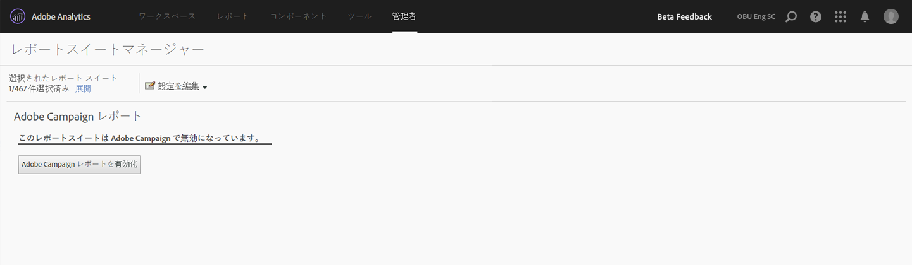

# Adobe Campaign Standard レポート

この統合を設定する方法について詳しくは、[Adobe Campaign のドキュメント](https://helpx.adobe.com/jp/campaign/standard/integrating/using/about-campaign-analytics-integration.html)を参照してください。

>[!IMPORTANT]
>この記事は Adobe Campaign **Standard** レポートにのみに当てはまります。 Adobe Campaign **Classic** レポートの追加については、[こちら](/help/integrate/analytics-to-campaign-classic.md)を参照してください。

Adobe Analytics と Adobe Campaign Standard の統合によって行われること：

* Adobe Campaign StandardからAdobe AnalyticsにKPI （主要業績評価指標）データを共有できます。
* Adobe Analytics パラメーターを使用してトラッキング式を強化します。
* **[!UICONTROL Analytics]**／**[!UICONTROL レポート]**／**[!UICONTROL Adobe Campaign]** で新しいレポートを追加できます。
* 5 個の新しい Adobe Campaign 分類が追加されます。
* 9 個の新しい Adobe Campaign 指標が追加されます。
* 6 個の新しい Adobe Campaign ディメンションが追加されます。
* 自動的にプロビジョニングされたデータソースを使用して、15 分ごとに Analytics にデータを同期します。

## 手順 1. Adobe Campaign Standard レポートを有効にする {#section_C685EF10505045708A6536BB13F6CD58}

Analytics で Campaign Standard データを表示するには、まずレポートスイートマネージャーで Campaign レポートを有効にする必要があります。

1. **[!UICONTROL Analytics]**／**[!UICONTROL 管理者]**／**[!UICONTROL レポートスイート]**／**`<select report suite>`**／**[!UICONTROL 設定を編集]**／**[!UICONTROL Adobe Campaign]**／**[!UICONTROL Adobe Campaign レポート]**&#x200B;に移動します。
1. 「**[!UICONTROL Adobe Campaign レポートを有効化]**」をクリックします。

   

## 手順 2： Adobe Campaign レポートを表示する {#section_9C18A29F3CC54BD4AC5EA96417F17B33}

Adobe Campaign Standard と Adobe Analytics の統合により、**[!UICONTROL Analytics]**／**[!UICONTROL レポート]**&#x200B;に次のレポートが追加されます。

* **[!UICONTROL Adobe Campaign Executed Delivery ID]**: Adobe Campaignから送信された電子メールについて、Adobe Campaignからインポートされたデータを表示します。 |

## 手順 3. Adobe Campaign 分類を使用する {#section_74A28AF3F4CA4091943789DE4D8B2B63}

**[!UICONTROL Analytics]**／**[!UICONTROL 管理者]**／**[!UICONTROL レポートスイート]**／**`<select report suite>`**／**[!UICONTROL 設定を編集]**／**[!UICONTROL Adobe Campaign]**／**[!UICONTROL Adobe Campaign 分類]**

Adobe Campaign に対してレポートスイートを有効にすると、次の分類を使用できます。

| 分類 | 説明 |
| --- | --- |
| [!UICONTROL 配信 ID] | Campaign 内で表示される内部配信名 |
| [!UICONTROL 配信ラベル] | Campaign での配信 - 個別配信／繰り返し配信／トランザクション配信 |
| [!UICONTROL キャンペーン ID] | Campaign 内で表示される内部キャンペーン名 |
| [!UICONTROL キャンペーンラベル] | Adobe Campaign でのキャンペーン |
| [!UICONTROL 実行された配信ラベル] | 個々に実行された配信のリスト |

## Adobe Analytics で使用できる Adobe Campaign Standard のディメンションと指標 {#section_F33385C9660644AF84172EC39601469B}

次の&#x200B;**指標**&#x200B;は、CampaignからAdobe Analytics レポートスイートで利用できます。

* Adobe Campaign送信
* Adobe Campaignを開きました
* Adobe Campaignをクリック
* 配信済みのAdobe Campaign
* Adobe Campaignユニーク・オープン
* Adobe Campaign ユニーククリック
* Adobe Campaign登録解除
* Adobe Campaignの合計バウンス数
* Adobe Campaignが実行した配信ID インスタンス

次の&#x200B;**ディメンション**&#x200B;は、Adobe Analytics レポートスイートのCampaignから利用できます。

| Dimension名 | 定義 |
| --- | --- |
| キャンペーン ID | 期間中に KPI が送信されたすべてのキャンペーンの ID。 |
| キャンペーンラベル | キャンペーン IDのラベル |
| 配信ID | 期間中にKPIが送信されたすべての配信のID。 定期的な配信とトランザクション配信のマスター配信のIDも含まれます。 例：定期的な配信 DM1 がスケジュールされ、DM2、DM3、DM4 および DM5 が定期的な配信の子配信であるとします。  配信IDには、すべての配信（DM1 ～ DM5）の結果が表示されます。 |
| 配信ラベル | 配信IDのラベル |
| 実行済み配信 ID | 実行された配信のみのID。 定期的/トランザクションマスター配信のIDがありません。 例：定期的な配信 DM1 がスケジュールされ、DM2、DM3、DM4 および DM5 が定期的な配信の子配信であるとします。 実行された配信IDは、DM2からDM5まで開始するすべての配信（実際に実行された配信）の結果を表示します。 |
| 実行された配信ラベル | 実行された配信IDのラベル |
