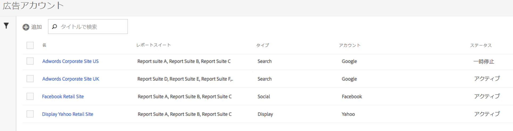
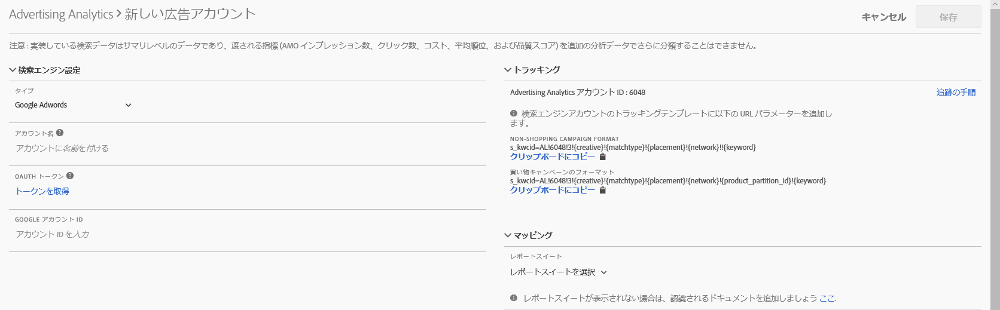

# 広告アカウントの設定

Adobe Analytics Administrator は、新しい広告アカウントを作成して、複数のアカウントを複数のレポートスイート（1 対 1、1 対多、多対多）にマッピングできます。

また管理者は、Advertising アカウントを設定するための[アクセス権限を管理者以外のユーザーに付与する](../../../integrate/c-advertising-analytics/overview.md#section_FCC58EB635954A32990D4E67B52B4369)こともできます。

1. In Adobe Analytics, navigate to **[!UICONTROL Admin]** &gt; **[!UICONTROL Advertising Accounts]**.
1. （初回の使用時のみ）エンドユーザー使用許諾契約書に同意します。
1. **[!UICONTROL "+追加]**」をクリックします。
1. [!UICONTROL 新規検索エンジンアカウント]ダイアログが表示されます。

   

1. 以下のガイドラインに従って「**[!UICONTROL 検索エンジンの設定]」に入力します。**

   <table id="table_B3BE66B7D4C54766B8FFD2C6DCD657AF"> 
    <thead> 
      <tr> 
      <th colname="col1" class="entry"> 設定 </th> 
      <th colname="col2" class="entry"> 説明 </th> 
      </tr>
    </thead>
    <tbody> 
      <tr> 
      <td colname="col1"> 
タイプ 
 </td> 
      <td colname="col2"> 
次の2つのオプションがあります。Google AdWordsおよびMicrosoft Bing広告 
 
注意：Yahoo Gemini は、2019 年 3 月 31 日に Microsoft Bing に吸収されました。その結果、Yahoo Gemini 広告アカウントオプションは使用できなくなりました。  
 </td> 
      </tr> 
      <tr> 
      <td colname="col1"> 
アカウント名 
 </td> 
      <td colname="col2"> 
このアカウント名は最適な名前に設定できます。これが UI に表示されるアカウントのわかりやすい名前になります。 
 </td> 
      </tr> 
      <tr> 
      <td colname="col1"> 
OAuth のトークン 
 </td> 
      <td colname="col2"> 
注意：OAuth はアクセス委任のオープン標準です。Web サイトまたはアプリケーションに他の Web サイト上にある関連情報へのアクセス権限を付与しても、パスワードを渡さないようにする方法として一般的に使用されます。 
 
注意：サードパーティの URL（efrontier.com）への誘導を示すメッセージが表示されます。アドビは efrontier を使用して 3 つのすべての検索エンジンに対して OAuth 認証プロセスを強化しています。 
 
注意：Internet Explorer 11（または以前のバージョン）を使用している場合、3 つのどの検索エンジンでも OAuth のトークンを正しく取得できません。他の Web ブラウザーを使用してください。 
 
「トークンを取得」をクリックすると、OAuth2 認証プロセスが開始されます。つまり、資格情報を使用して　Google／Bing 検索アカウントにサインインするように求められます。選択している検索エンジンに応じて、このプロセスは多少異なります。 
 
        <ul id="ul_FC9B5612F6554495B04C357CB0AB72EB"> 
        <li id="li_CD54231BFF134F83B3B5B14B34A0E1D2">Google AdWords：Google アカウント ID を入力します。 </li> 
        <li id="li_89B9D54BAA914E5DB2959B193489582E">Microsoft Bing：Bing アカウント ID と Bing カスタマー ID を入力します。 </li> 
        </ul> 
これらの ID について詳しくは、<a href="../../../integrate/c-advertising-analytics/c-adanalytics-workflow/aa-locate-account-id.md#concept_F7F67448F3B44342967E0419E96F384D" format="dita" scope="local">アカウント ID を見つける方法</a>を参照してください。 
 
ログインすると、OAuthトークンフィールドが表示されます 
        <systemoutput>
          Retrieved
        </systemoutput>を参照してください。 
 </td> 
      </tr> 
    </tbody> 
    </table>

1. 「**[!UICONTROL トラッキング]」セクションで、Adobe Analytics の実装による検索エンジンデータの追跡方法に関する情報を入力します。**&#x200B;これは、検索エンジンのデータで Adobe Analytics のデータを適切に拡張するために必要な手順です。以下のガイドラインに従って「**[!UICONTROL トラッキングの設定]」に入力します。**

   <table id="table_1AB4E31456E84ABF8209B02058259C4D"> 
    <thead> 
      <tr> 
      <th colname="col1" class="entry"> 設定 </th> 
      <th colname="col2" class="entry"> 説明 </th> 
      </tr>
    </thead>
    <tbody> 
      <tr> 
      <td colname="col1"> 
タイプ 
 </td> 
      <td colname="col2"> 
        <ul id="ul_1C5A0502A4984E57A08417A91CCD6FFE"> 
        <li id="li_5736E38286FF494ABDDC6E85281D7F2A"> 自動：Advertising Cloud Engine によって、トラッキングパラメーターを検索エンジンのトラッキングテンプレート／リンク先 URL に追加する方法が決定されます。これはもっともシンプルな方法ですが、統合されたデータセットの品質が最良ではなくなる可能性があります。 
重要：「自動モード」で検索エンジンのアカウントを設定するには、以下の作業を行う責任があります。 
          <ul id="ul_4FF9D1E3CC4E452BA339E0A725D29FEE"> 
            <li id="li_6F3A6D6259C0420CB7E6FD2C26A1B6E0">「s_kwcid」のパラメーターおよび値がアカウントのトラッキングテンプレート、または追加されるアカウント内のランディングページ URL に追加されます。これは、URL の最後に挿入されます。結果として、ウェブサーバーに特定の key=value ペアが URL の最後に必要な場合や、URLの で新しい key=value ペアをサポートするための更新が必要な場合は、ご自身で追加の作業を行う必要がある場合があります。 </li> 
            <li id="li_A04D4AA31A934392808639E46C86573F">加えて、キーワードを「s_kwcid」値の一部としてランディング URL に追加できるため、特殊文字や記号が含まれている場合、ウェブサーバーでそれらの文字がサポートされていることを確認してください（一般的な特殊文字の例は「+」です。これは、「絞り込み部分一致」キーワードに使用されます）。 </li> 
          </ul> 
 </li> 
        <li id="li_EAA7A7CA1E584854A7EC1E43E13B63FE">手動：トラッキングパラメーターを検索エンジンのトラッキングテンプレート／リンク先 URL に追加する方法を管理できます。<a href="../../../integrate/c-advertising-analytics/c-adanalytics-workflow/aa-manual-vs-automatic-tracking.md#concept_87B28BA9E7F84BA5972F69E6F3482A33" format="dita" scope="local">各検索エンジンについては手動トラッキングの例を参照してください</a>。 </li> 
        </ul> </td> 
      </tr> 
    </tbody> 
    </table>

1. 「**[!UICONTROL マッピング]」セクションで、この検索エンジンアカウントにリンクするレポートスイートを選択します。**&#x200B;少なくとも 1 つのレポートスイートを指定しないと、Advertising アカウントを保存できません。複数のレポートスイートに複数のアカウントをマッピングできます（1 対 1、1 対多、多対多）。AMO で検索エンジンから取り込んだデータは、マッピングしたどのレポートスイートにもデータ分割がないようにコピーされます。

   >[!IMPORTANT]
   >
   >Only report suites that have been [mapped to an Experience Cloud organization](https://marketing.adobe.com/resources/help/en_US/mcloud/map-report-suite.html) will be available for selection. If you do not see your report suite listed, refer to [Troubleshoot Advertising Analytics](/help/integrate/c-advertising-analytics/c-adanalytics-workflow/aa-troubleshooting.md).

   「**[!UICONTROL マッピングの設定]」では、以下のガイドラインに従います。**

   <table id="table_AF876DC40F97403882C0AA528BD204FF"> 
    <thead> 
      <tr> 
      <th colname="col1" class="entry"> 設定 </th> 
      <th colname="col2" class="entry"> 説明 </th> 
      </tr>
    </thead>
    <tbody> 
      <tr> 
      <td colname="col1"> 
レポートスイートのマッピング 
 </td> 
      <td colname="col2"> 
レポートスイートのマッピングにより、この検索エンジンアカウントにリンクされるレポートスイートが決まります。つまり、検索エンジンデータの送信先となるレポートスイートが決まります。 
 
<a href="https://marketing.adobe.com/resources/help/en_US/mcloud/map-report-suite.html" format="html" scope="external">使用するレポートスイートが表示されない場合、このツールを使用してレポートスイートを Experience Cloud</a> 組織にマッピングできます。 
 </td> 
      </tr> 
    </tbody> 
    </table>

1. 「**[!UICONTROL 保存]**」をクリックします。
1. 保存すると、免責事項に注意事項の一覧が表示されます。この注意事項を読み、理解したことを確認してください。Click the checkbox, then click **[!UICONTROL OK]**.

   Advertising Accounts [管理 UI](../../../integrate/c-advertising-analytics/c-adanalytics-workflow/aa-manage-ad-accounts.md#concept_531B99165A4E47B4B8849376B532AFDB) に移動し、新規に作成したアカウントが表示されます。

>[!NOTE]
>
>検索エンジンデータの入力が開始されるまで、少なくとも24時間待機する予定です。

