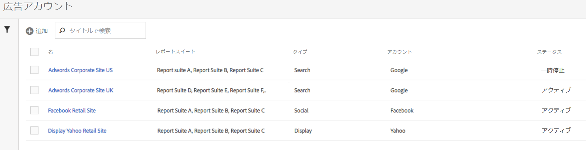

# 広告アカウントの設定

Adobe Analytics管理者は、新しい広告アカウントを作成し、複数のアカウントを複数のレポートスイート（1 : 1、1：多、多：多）にマッピングできます。

管理者は、広告アカウントを設定するために[管理者以外のユーザー](/help/integrate/c-advertising-analytics/overview.md#section_FCC58EB635954A32990D4E67B52B4369)にアクセス権を付与することもできます。

<!--

-->

1. Adobe Analytics で、**[!UICONTROL 管理者]**／**[!UICONTROL Advertising アカウント]**&#x200B;に移動します。
1. （初回使用のみ） エンドユーザー使用許諾契約の条件に同意します。
1. **[!UICONTROL +追加]**&#x200B;を選択します。
1. [!UICONTROL 新しい検索エンジン設定] ダイアログが表示されます。

   

1. 次のガイドラインに従って、**[!UICONTROL 検索エンジン設定]**&#x200B;を入力します。

   | 設定 | 説明 |
   | --- | --- |
   | **[!UICONTROL タイプ]** | 選択肢は2つあります。**[!UICONTROL Google Adwords]**&#x200B;と&#x200B;**[!UICONTROL Bing Ads]**。 注：Yahoo Geminiは2019年3月31日にMicrosoftに吸収されました。 その結果、Yahoo Gemini 広告アカウントオプションは使用できなくなりました。 |
   | アカウント名 | このアカウント名は、自分に合った任意の名前に設定できます。  アカウント名は、UIに表示されるアカウントのわかりやすい名前です。 |
   | OAuth トークン | **注意**: OAuthはアクセス委任のためのオープンスタンダードであり、一般的にweb サイトまたはアプリケーションにweb サイト上の情報へのアクセス権を付与する方法として使用されますが、パスワードは提供されません。 サードパーティ URL （efrontier.com）にルーティングされることに注意してください。 Adobeでは、Adobe Media Managerを使用して、3つの検索エンジンのOAuth認証プロセスを強化しています。 Internet Explorer 11以前を使用している場合、3つの検索エンジンのいずれかでOauth トークンを取得できません。 他の web ブラウザーを使用してください。
「**[!UICONTROL トークンを取得]**」を選択して、OAuth2認証プロセスを開始します。 資格情報を使用してGoogle AdsまたはMicrosoft Advertisingの検索アカウントにログインするように求められます。 選択したプロセスによって、少し異なります。 <ul><li>Google Ads:Google アカウント IDを指定します</li><li>Microsoft Advertising：アカウント IDとManager アカウント IDを指定します。</li></ul>これらのIDについて詳しくは、[ アカウント IDを探す](aa-locate-account-id.md)を参照してください。 正常にログインすると、「**[!UICONTROL OAuth のトークン]**」フィールドに「**[!UICONTROL 取得済み]**」が表示されます。 |

1. 「**[!UICONTROL トラッキング]**」セクションでは、Adobe Analyticsの実装を使用してデータをトラッキングする方法に関する情報を提供します。 トラッキングは、Adobe Analytics データを検索エンジンデータで適切に拡張するために必要な手順です。
次のガイドラインに従って、**[!UICONTROL トラッキング設定]**&#x200B;を入力します。

   | 設定 | 説明 |
   | --- | --- |
   | タイプ | <ul><li>**自動**: Adobe Advertising エンジンが、トラッキングパラメーターをトラッキングテンプレートや宛先URLに追加する方法を決定できます。 [!UICONTROL 自動タイプトラッキング ]は最も単純なアプローチですが、最も統合されたデータセットにはなりません。 **重要：** [!UICONTROL 自動タイプトラッキング ]を使用して検索エンジンアカウントを設定するには、次の操作を実行する必要があります。<ul><li>`s_kwcid` パラメーターと値が、追加するアカウントのアカウント トラッキング テンプレートまたはランディングページ URLに追加されます。 パラメーターと値は、URLの最後に挿入されます。 Web サーバーがURLの最後に特定の`key=value` ペアを必要とする場合、追加のアクションが必要になる場合があります。 または、URL内の新しい`key=value` ペアをサポートするための更新が必要です。 **メモ**：このパラメーターを[ コンテンツセキュリティポリシー](https://experienceleague.adobe.com/en/docs/id-service/using/reference/csp)に追加する必要があるかどうかについて詳しく説明します。</li><li>加えて、キーワードを `s_kwcid` 値の一部としてランディング URL に追加できます。キーワードに特殊文字または記号が含まれる場合は、Web サーバーがその文字をサポートできることを確認してください。 一般的な特殊文字の例は`+`です。これは、「Broad Match Modified」キーワードで使用されます。</li></ul></li><li>**手動**：検索エンジンのトラッキングテンプレートや宛先URLにトラッキングパラメーターを追加する方法を管理できます。 [各検索エンジンについては手動トラッキングの例を参照してください](/help/integrate/c-advertising-analytics/c-adanalytics-workflow/aa-manual-vs-automatic-tracking.md)。</li></ul> |

1. 「**[!UICONTROL 保存]**」を選択します。
1. 免責事項には、注意事項のリストが表示されます。 この契約書を読み、理解していることを確認してください。 チェックボックスを選択し、**[!UICONTROL OK]**&#x200B;を選択します。

   これで、新しく作成したアカウントが一覧表示されるAdvertising アカウント [管理UI](/help/integrate/c-advertising-analytics/c-adanalytics-workflow/aa-manage-ad-accounts.md)に移動しました。

>[!NOTE]
>
>検索エンジンデータがAnalytics レポートに入力されるまでに、少なくとも24時間待つ必要があります。
