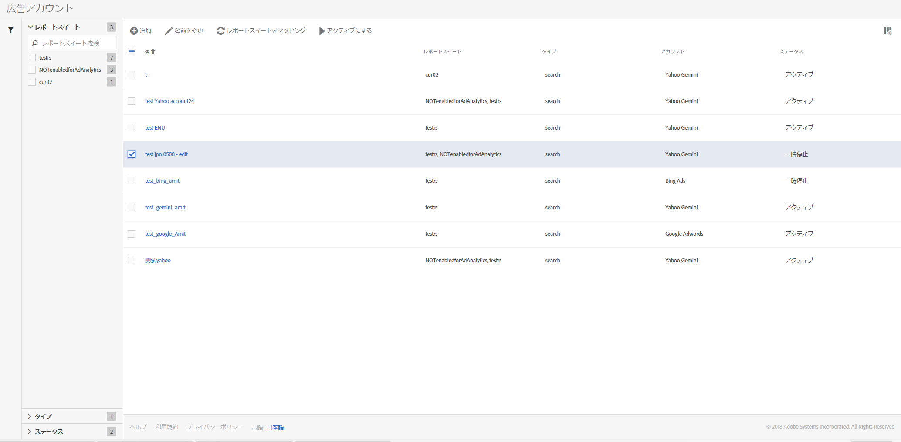

# 広告アカウントの管理

You can access the Management UI by navigating to **[!UICONTROL Admin]** &gt; **[!UICONTROL Advertising Accounts]**.

<table id="table_BE318026CF024E94A885EED86AA7077F"> 
 <thead> 
  <tr> 
   <th colname="col1" class="entry"> 要素 </th> 
   <th colname="col2" class="entry"> 定義 </th> 
  </tr>
 </thead>
 <tbody> 
  <tr> 
   <td colname="col1"> 
<b>アクション</b> 
 </td> 
   <td colname="col2"> 
<b>注意:アクションは、少なくとも1つの広告アカウントを選択した場合にのみ表示されます。 </b> 
 </td> 
  </tr> 
  <tr> 
   <td colname="col1"> 
+ 追加 
 </td> 
   <td colname="col2"> 
<a href="../../../integrate/c-advertising-analytics/c-adanalytics-workflow/aa-create-ad-account.md#concept_1958E8C15C334E8B9DC510EC8D5DCA7C" format="dita" scope="local">Advertising アカウントの設定</a> UI が表示されます。 
 </td> 
  </tr> 
  <tr> 
   <td colname="col1"> 
名前変更 
 </td> 
   <td colname="col2"> 
このアカウントがマッピングされているすべてのレポートスイートで、このアカウントの名前を変更します。 
 </td> 
  </tr> 
  <tr> 
   <td colname="col1"> 
レポートスイートをマッピング 
 </td> 
   <td colname="col2"> 
レポートスイートのマッピングを編集できるようになります。 
 </td> 
  </tr> 
  <tr> 
   <td colname="col1"> 
一時停止 
 </td> 
   <td colname="col2"> 
アカウントを非アクティブ化します。再びアクティブ化するには、「アクティブにする」をクリックします。 
 </td> 
  </tr> 
  <tr> 
   <td colname="col1"> 
<b>列ヘッダー</b> 
 </td> 
   <td colname="col2"> </td> 
  </tr> 
  <tr> 
   <td colname="col1"> 
名前 
 </td> 
   <td colname="col2"> 
この Advertising アカウントに割り当てた名前。 
 </td> 
  </tr> 
  <tr> 
   <td colname="col1"> 
レポートスイート 
 </td> 
   <td colname="col2"> 
この Advertising アカウントにマッピングされたレポートスイート。 
 </td> 
  </tr> 
  <tr> 
   <td colname="col1"> 
タイプ 
 </td> 
   <td colname="col2"> 
現時点では「検索」タイプのみがサポートされています。 
 </td> 
  </tr> 
  <tr> 
   <td colname="col1"> 
アカウント 
 </td> 
   <td colname="col2"> 
サポートされている2つのアカウントタイプのいずれかを表示します。Google AdwordsまたはBing広告。 
 </td> 
  </tr> 
  <tr> 
   <td colname="col1"> 
ステータス 
 </td> 
   <td colname="col2"> 
2 つのステータスインジケーターがあります。 
 
    <ul id="ul_376263DEF6EE44B48564D272D3CBFCBC"> 
     <li id="li_75E329B68B4D4E929E227E717C993082"><b>アクティブ</b>：アカウントは検索データを取り込んでいます。 </li> 
     <li id="li_5E2DF98B22D34437A2A2C93F996C1EA2"><b>一時停止</b>：現在アカウントは非アクティブ化され検索データを取り込んでいません。 </li> 
    </ul> </td> 
  </tr> 
  <tr> 
   <td colname="col1"> 
<b>フィルター</b> 
 </td> 
   <td colname="col2"> 
（左余白）レポートスイート、タイプ、ステータスによって、Advertising アカウントをフィルターできます。 
 </td> 
  </tr> 
 </tbody> 
</table>

