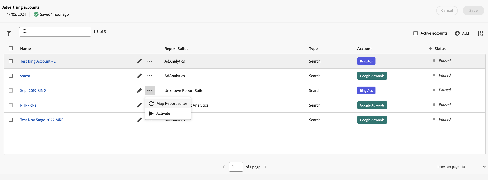

# 広告アカウントの管理

Advertising アカウントのインターフェイスにアクセスするには、**[!UICONTROL 管理者]** > **[!UICONTROL Advertising アカウント]**&#x200B;に移動します。

広告アカウントを一覧表示するテーブルが表示されます。 利用できる広告アカウントがない場合は、**[!UICONTROL 新しい広告アカウントを作成]**&#x200B;を選択します。

この表は、次の列で構成されています。

| 名前または要素 | 説明 |
|---|---|
| **[!UICONTROL 名前]** | *アカウント名*。 検索エンジンの設定を編集する名前を選択できます。 |
|  | 広告アカウントの名前を変更するか、検索エンジンの設定を編集する場合に選択します。 |
|  | 選択すると、コンテキストメニューが開き、[&#x200B; レポートスイートをマップ &#x200B;](#map-reporting-suites)、[広告アカウントをアクティブ化または一時停止](#activate-or-pause-advertising-accounts)できます。 |
| **[!UICONTROL レポートスイート]** | 広告アカウントがマッピングされているレポートスイートを一覧表示します。 |
| **[!UICONTROL タイプ]** | 広告アカウントの種類を表示します。 デフォルトでは、タイプは[!UICONTROL 検索]です |
| **[!UICONTROL アカウント]** | [!UICONTROL Bing Ads]または[!UICONTROL Google Adwords]のいずれかのアカウントタイプを表示します。 |
| **[!UICONTROL ステータス]** | 広告アカウントのステータス：*一時停止*&#x200B;またはアクティブ |

- レポートスイート、タイプ、ステータスでリストをフィルタリングするには、を選択します
- 検索フィールドを使用して広告アカウントを検索するには、次の手順を実行します。
- テーブルでアクティブなアカウントを選択するには、**[!UICONTROL アクティブなアカウント]**&#x200B;を確認してください。
- テーブルに表示する列を定義するには、を選択します。   「**[!UICONTROL テーブルをカスタマイズ]**」ダイアログ：
   - 表示する列を選択します。
   - 「**[!UICONTROL 適用]**」を選択します。

1つ以上の広告アカウントを選択すると、選択したアカウントのステータスに基づく青いアクションバーにより、 **[!UICONTROL 名前変更]**、 **[!UICONTROL マップレポートスイート]**、 **[!UICONTROL アクティベート]**&#x200B;または **[!UICONTROL 広告アカウントを一時停止]**&#x200B;できます。

## 広告アカウントの作成

新しい広告アカウントを作成するには：

1. 「 **[!UICONTROL 追加]**」を選択します。
1. 新しい広告アカウントを定義するための[!UICONTROL Advertising アカウント &#x200B;] > **[!UICONTROL 新しいアカウント]** ダイアログが表示されます。 詳しくは、[Advertising アカウントの設定](aa-create-ad-account.md)を参照してください。

## 広告アカウントの編集

広告アカウントの検索エンジン設定を編集するには：

- 広告アカウントの名前を選択します。
- 広告アカウント名の横にあるを選択します。

## マップレポートスイート

1つ以上の広告アカウントをレポートスイートにマッピングするには：

1. （オプション）複数の広告アカウントを選択します。
1. 特定の広告アカウントに対してを選択します。
1. コンテキストメニューから「 **[!UICONTROL レポートスイートをマップ]**」を選択します。
1. レポートスイートをマップ ダイアログで、ドロップダウンメニューから1つ以上のレポートスイートを選択します。 マッピングからレポートスイートを削除するには、を使用します。
1. マッピングを保存するには、**[!UICONTROL 保存]**&#x200B;を選択します。

## 広告アカウントをアクティベートまたは一時停止する

1つ以上の広告アカウントをアクティブ化するには：

1. （オプション）複数の広告アカウントを選択します。
1. 特定の広告アカウントに対してを選択します。
1. コンテキストメニューから「 **[!UICONTROL アクティベート]**」を選択します。

1つ以上の広告アカウントを一時停止するには：

1. （オプション）複数の広告アカウントを選択します。
1. 特定の広告アカウントに対してを選択します。
1. コンテキストメニューから「 **[!UICONTROL 一時停止]**」を選択します。

