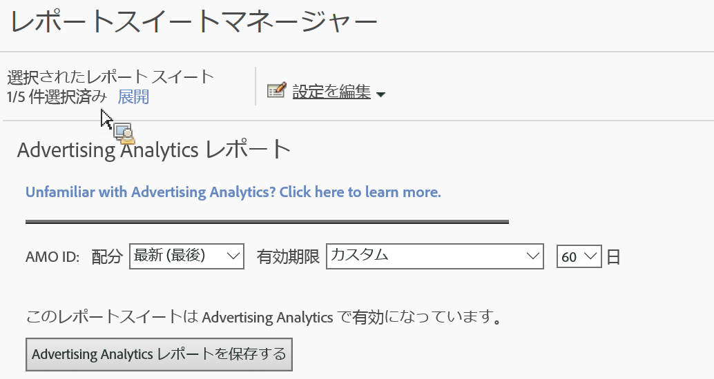

# 広告分析用にレポートスイートを有効にする

Analyticsで広告分析の検索データを表示するには、広告分析レポート用の各Experience Cloudマップレポートスイートを設定する必要があります。

1. [レポートスイートを組織にマッピング](https://marketing.adobe.com/resources/help/en_US/mcloud/map-report-suite.html)します。
1. **[!UICONTROL 管理]** 者/ **[!UICONTROL レポートスイート]**&#x200B;に移動します。

1. Select the report suite that is [mapped to your Experience Cloud organization](https://marketing.adobe.com/resources/help/en_US/mcloud/map-report-suite.html).
1. Click **[!UICONTROL Edit Settings]** &gt; **[!UICONTROL Advertising Analytics Configuration]**.

   

   >[!IMPORTANT]
   >
   >AMO IDは、検索データが挿入されるAdobe Advertising Cloud変数を指します。

1. 変数の配分と AMO ID 変数で使用する有効期限を設定します。コンバージョン変数（eVar）を使用することで、Adobe Analytics は成功イベントを具体的な変数値と紐づけることができます。成功イベントが発生するまでに変数が変化することがあります。その場合、どの変数値にイベントのクレジットが付与されるかは、配分の設定によって決まります。

   | 設定 | 定義 |
   |--- |--- |
   | 元の値（最初） | 最初の値にクレジットのすべての配分が付与されます。それ以降の値は関係ありません。 |
   | 最新（最後） | 最後の値に成功イベントのクレジットのすべての配分が付与されます。その前にどのような変数が発生したかは関係ありません。 |
   | 有効期限 | eVar 値の有効期限が切れる（成功イベントのクレジットを受け取らなくなる）までの期間またはイベントを指定できます。eVar の有効期限が切れた後に成功イベントが発生した場合、「なし」がそのイベントのクレジットを受け取ることになります。つまり、アクティブな eVar がないということを示します。 |

1. Click **[!UICONTROL Enable Advertising Analytics Reporting]** (first time), or **[!UICONTROL Update Advertising Analytics Reporting]** (subsequent times). これで、レポートスイートが Advertising Analytics 検索データを受け取ることができます。[アカウントを作成できる](../../../integrate/c-advertising-analytics/c-adanalytics-workflow/aa-create-ad-account.md#concept_1958E8C15C334E8B9DC510EC8D5DCA7C)状態ではありません。

