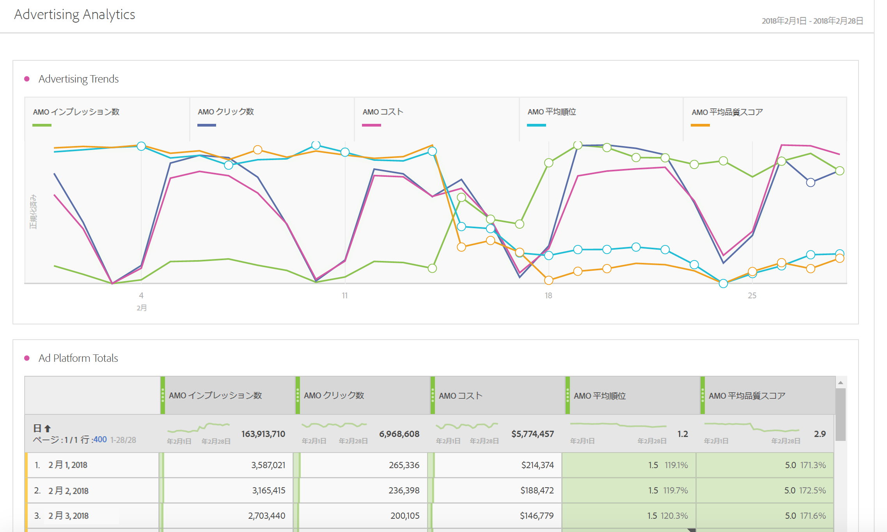
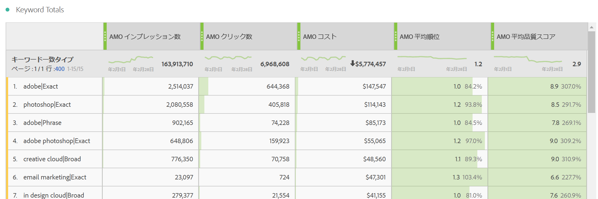
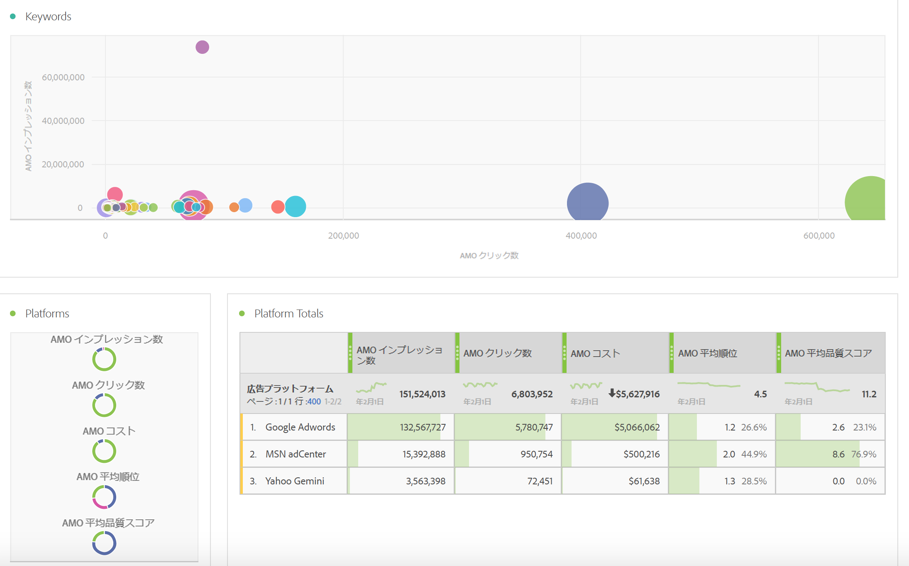
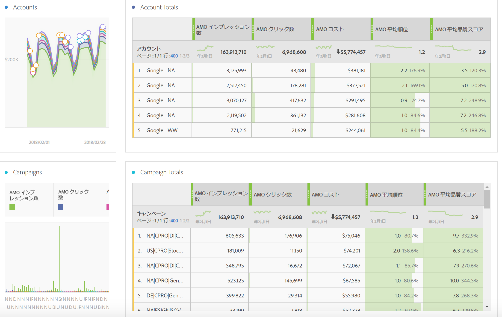
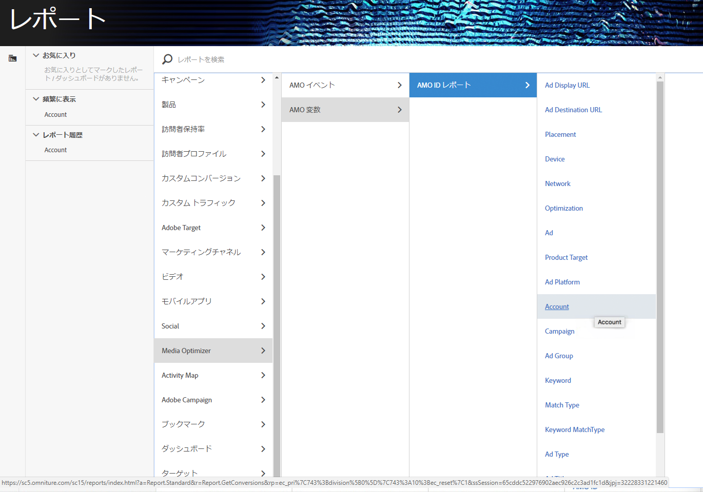

# Adobe Analyticsの広告データのレポート

Analysis Workspace テンプレート、および Reports &amp; Analytics と Report Builder でのレポートについて説明します。

>[!NOTE]
>
>検索エンジンデータの入力がAnalyticsレポートに反映されるまで、少なくとも24時間待機する予定です。また、AMO データは時間単位の精度をサポートしていないので、Analytics レポートが時間単位の精度でデータを返さないことに注意してください。

## Analysis Workspace: Search Engines {#section_8173F42B2C784F41B9FD82CBB66F9ADF}

このテンプレートを使用すると、この検索エンジン統合を実装するユーザーは、Analytics で大量の検索エンジンデータにアクセスできます。You can access it via **[!UICONTROL Workspace]** &gt; **[!UICONTROL Templates]** &gt; **[!UICONTROL Advertising]** &gt; **[!UICONTROL Search Engines.]**

>[!NOTE]
>
>広告テンプレートカテゴリは、広告アカウントを実装していない場合でも、すべての顧客に表示されます。ただし、プロビジョニングされていない会社の検索エンジンテンプレートを開こうとすると、検索エンジンアカウントが設定されていないというエラーメッセージが表示されます。この場合は、「**[!UICONTROL 今すぐ設定]**」をクリックし、[Advertising アカウント設定](../../../integrate/c-advertising-analytics/c-adanalytics-workflow/aa-create-ad-account.md#concept_1958E8C15C334E8B9DC510EC8D5DCA7C)画面に移動します。

       

| 表／ビジュアライゼーション | 説明 |
|--- |--- |
| 広告のトレンド | AMO インプレッション数、AMO クリック数、AMO コストの毎日のトレンド。 |
| 広告プラットフォーム | トップ2プラットフォーム（Google、Bing）のコストのドーナツグラフ。 |
| 広告プラットフォームの合計 | 最上位プラットフォームの AMO インプレッション数、AMO クリック数、AMO コスト、AMO 平均順位、AMO 平均品質スコアごとの内訳を示す自由形式の表。 |
| アカウント | コストの積み重ね面グラフ。 |
| アカウントの合計 | 関連する指標による上位のアカウント内訳を示す自由形式の表。 |
| キャンペーン | キャンペーンコストの棒グラフ。 |
| キャンペーン合計 | 関連する指標による上位のキャンペーン内訳を示す自由形式の表。 |
| グループ | コストのツリーマップ。 |
| グループの合計 | 関連する指標による上位の広告グループ内訳を示す自由形式の表。 |
| 広告 | インプレッション数、クリック数、コストの横棒グラフ。 |
| 広告の合計 | 関連する指標による上位の広告内訳を示す自由形式の表。 |
| キーワード | すべてのキーワード／一致タイプの組み合わせのインプレッション数、クリック数、コストの散布グラフ。 |
| キーワードの合計 | 関連する指標による上位のキーワード／一致タイプの組み合わせ内訳を示す自由形式の表。 |

## Reports &amp; Analytics {#section_BB2E75DF909C49EA8D4E92D14D6DFD85}

Advertising Analytics アカウントを設定するとすぐに、Advertising Analytics が利用できるようになります。

## Report Builder {#section_8E0371CF81144C33990D909685D1726E}

Advertising Analytics アカウントを設定するとすぐに、Advertising Analytics が利用できるようになります。
