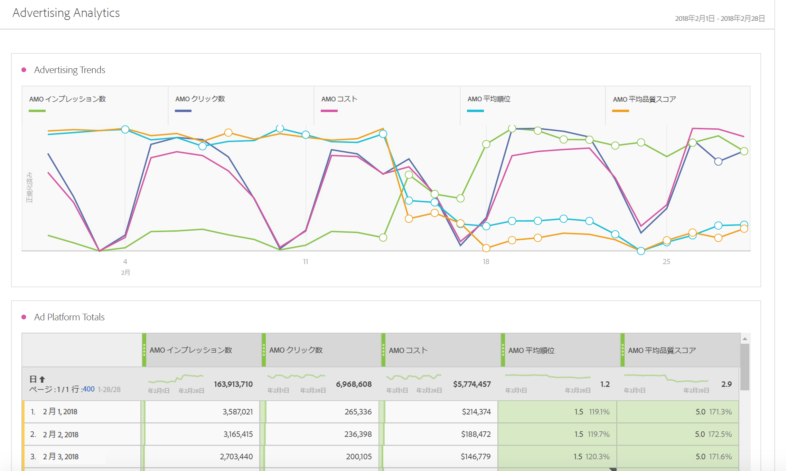
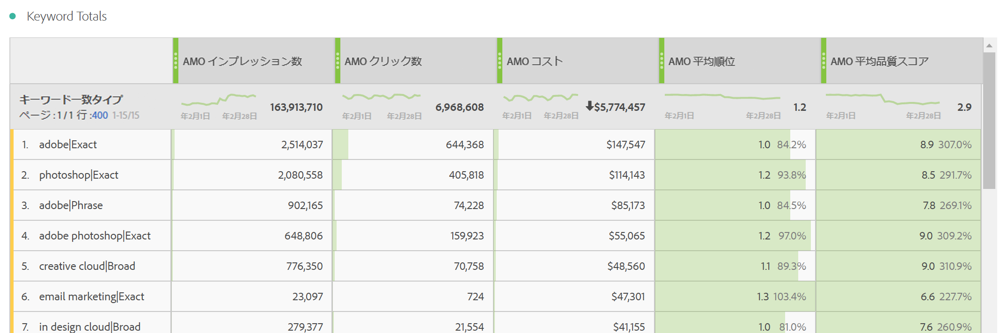
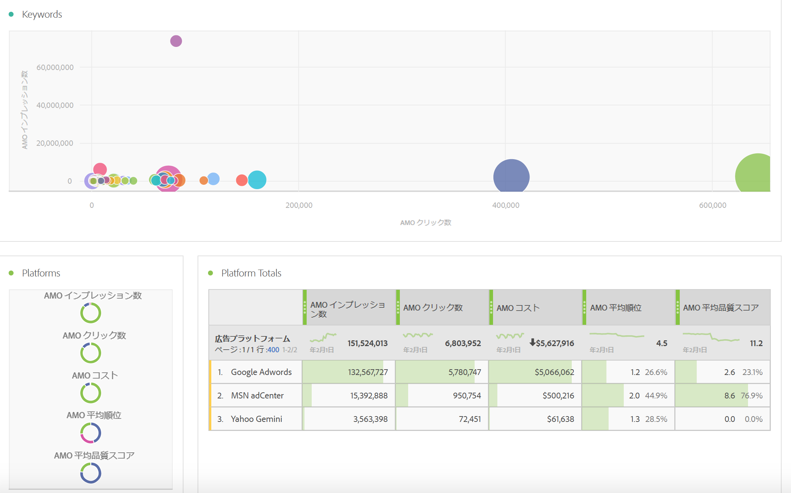
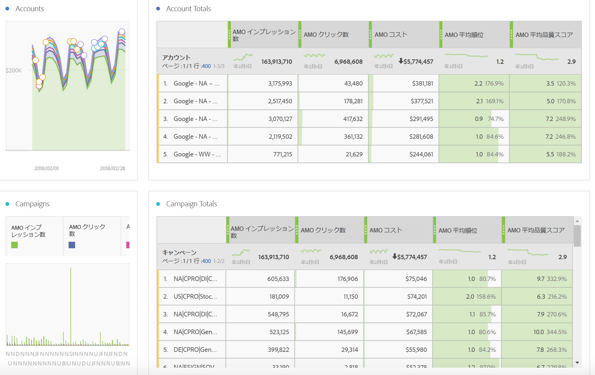
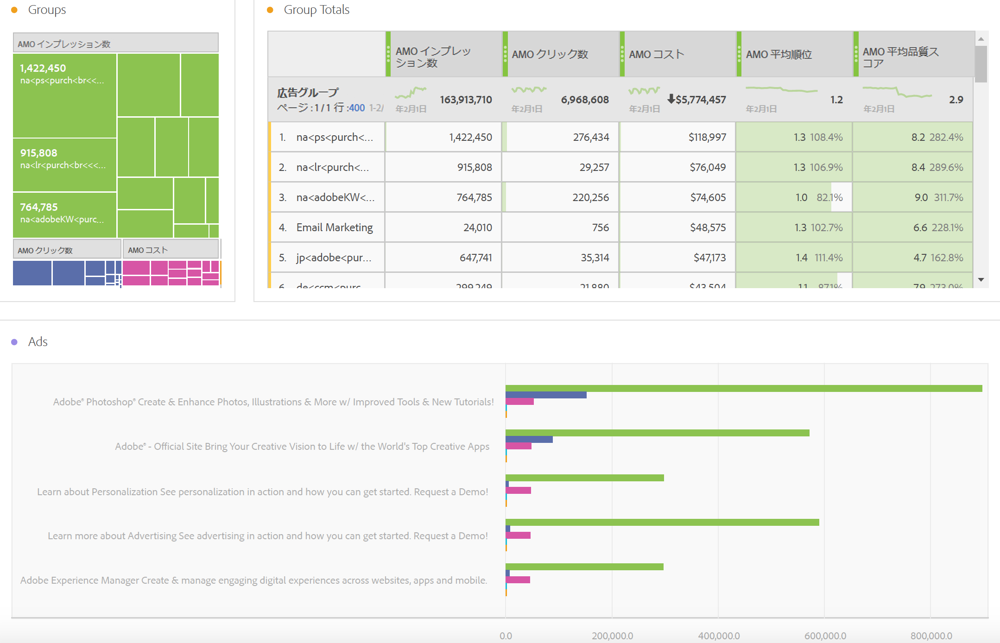
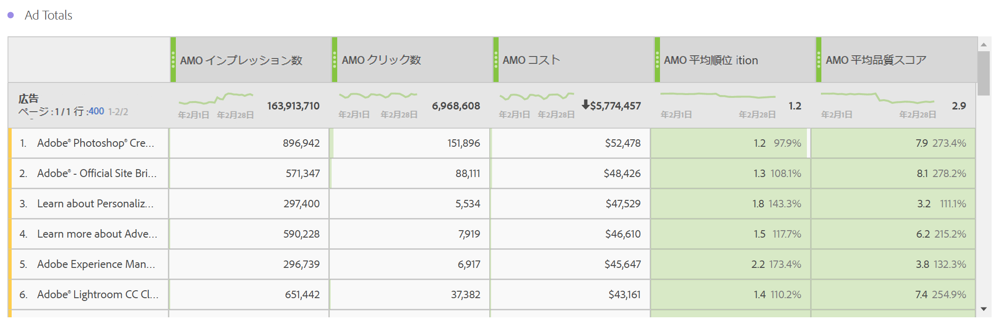

# 広告データのレポート

この記事では、Analysis Workspace レポートとReport Builderでのレポートについて詳しく説明します。

>[!NOTE]
>
>検索エンジンデータがAnalytics レポートの入力を開始するには、少なくとも24時間待つ必要があります。 Adobe Advertising dataでは時間単位の精度はサポートされていないため、Analytics レポートでは時間単位の精度に関するデータは返されません。

## 有料検索レポート {#section_8173F42B2C784F41B9FD82CBB66F9ADF}

このレポートでは、検索エンジン統合を実装するユーザーは誰でも、Analytics内の検索エンジンデータにアクセスできます。 **[!UICONTROL Workspace]** > **[!UICONTROL レポート]** > **[!UICONTROL 獲得]** > **[!UICONTROL Advertising Analytics：有料検索]**&#x200B;からアクセスできます

>[!NOTE]
>
>Advertising アカウントを実装していない場合でも、有料検索レポートはすべての顧客に表示されます。 プロビジョニングされていない会社の有料検索レポートを開こうとすると、検索エンジンアカウントを設定していないことを示すエラーメッセージが表示されます。 「**[!UICONTROL 今すぐ設定]**」を選択すると、[Advertising アカウント設定](/help/integrate/c-advertising-analytics/c-adanalytics-workflow/aa-create-ad-account.md)画面に移動します。

       

| テーブル/ビジュアライゼーション | 説明 |
|--- |--- |
| Advertising Trends | AMO インプレッション数、AMO クリック数、AMO コストの日次トレンドの概要。 |
| 広告プラットフォーム | 上位2つのプラットフォーム（Google Ads、Microsoft Advertising）のコストのドーナツチャート。 |
| 広告プラットフォームの合計 | AMO インプレッション数、AMO クリック数、AMO コスト、AMO Avg別に分類されたトッププラットフォームのフリーフォームテーブル。 AMO平均順位 品質スコアです。 |
| アカウント | 積み重ねコストの領域。 |
| アカウント合計 | 関連する指標ごとに分類された上位アカウントのフリーフォームテーブル。 |
| キャンペーン | キャンペーンコストを棒グラフで表示。 |
| キャンペーン合計 | 関連する指標ごとに分類された上位のキャンペーンのフリーフォームテーブル。 |
| グループ | コストのツリーマップ。 |
| グループ合計 | 関連する指標ごとに分類された、上位の広告グループのフリーフォームテーブル。 |
| 広告 | インプレッション数、クリック数、コストを示す横棒グラフ。 |
| 広告合計 | 上位の広告のフリーフォームテーブルを関連する指標で分類。 |
| キーワード | すべてのキーワード/一致タイプの組み合わせに対するインプレッション数、クリック数、コストの散布図。 |
| キーワード合計 | 上位のキーワード/一致タイプの組み合わせのフリーフォームテーブルを、関連する指標ごとに分類します。 |

## Report Builder {#section_8E0371CF81144C33990D909685D1726E}

Advertising Analytics アカウントを設定すると、Advertising Analytics レポートが使用できるようになります。
