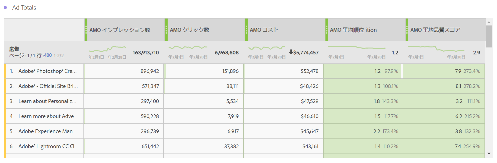

# 広告データのレポート

この記事では、Analysis Workspace レポートとReport Builderでのレポートの詳細を説明します。

>[!NOTE]
>
>検索エンジンデータが Analytics レポートに入力され始めるまで、少なくとも 24 時間待つことをお勧めします。 また、Advertising Cloud データは時間単位の精度をサポートしていないので、Analytics レポートが時間単位の精度でデータを返さないことに注意してください。

## 有料検索レポート {#section_8173F42B2C784F41B9FD82CBB66F9ADF}

このレポートを使用すると、検索エンジン統合を実装しているすべてのユーザーが Analytics 内の検索エンジンデータにアクセスできます。 **[!UICONTROL Workspace]**/**[!UICONTROL レポート]**/**[!UICONTROL 獲得]**/6&rbrace;Advertising Analytics：有料検索 **からアクセスできます。**

>[!NOTE]
>
>有料検索レポートは、Advertising アカウントを実装していない場合でも、すべてのお客様に表示されます。 プロビジョニングされていない会社の有料検索レポートを開こうとすると、検索エンジンアカウントを設定していないというエラーメッセージが表示されます。 **[!UICONTROL 今すぐ設定]** を選択すると、[Advertising アカウントの設定 ](/help/integrate/c-advertising-analytics/c-adanalytics-workflow/aa-create-ad-account.md) 画面が表示されます。

       

| 表／ビジュアライゼーション | 説明 |
|--- |--- |
| 広告のトレンド | AMO インプレッション数、AMO クリック数、AMO コストの毎日のトレンド。 |
| 広告プラットフォーム | 2 つの最上位プラットフォーム（Google、Bing）のコストを示すドーナツグラフ。 |
| 広告プラットフォームの合計 | 最上位プラットフォームの AMO インプレッション数、AMO クリック数、AMO コスト、AMO 平均順位、AMO 平均品質スコアです。 |
| アカウント | コストの積み重ね面グラフ。 |
| アカウントの合計 | 関連する指標による上位のアカウント内訳を示す自由形式の表。 |
| キャンペーン | キャンペーンコストの棒グラフ。 |
| キャンペーン合計 | 関連する指標による上位のキャンペーン内訳を示す自由形式の表。 |
| グループ | コストのツリーマップ。 |
| グループの合計 | 関連する指標による上位の広告グループ内訳を示す自由形式の表。 |
| 広告 | インプレッション数、クリック数、コストの横棒グラフ。 |
| 広告の合計 | 関連する指標による上位の広告内訳を示す自由形式の表。 |
| キーワード | すべてのキーワード／一致タイプの組み合わせのインプレッション数、クリック数、コストの散布グラフ。 |
| キーワードの合計 | 関連する指標による上位のキーワード／一致タイプの組み合わせ内訳を示す自由形式の表。 |

## Report Builder {#section_8E0371CF81144C33990D909685D1726E}

Advertising Analytics アカウントを設定すると、すぐにAdvertising Analytics レポートが使用できるようになります。
