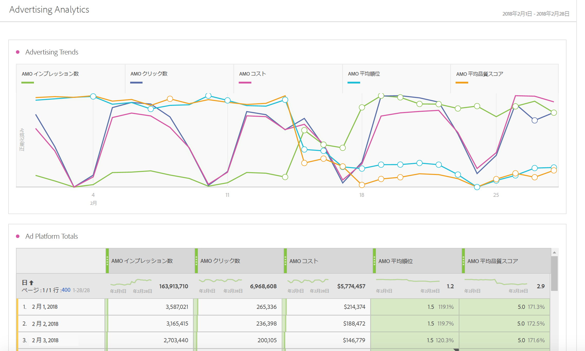

# 広告分析の概要

Advertising Analytics では、すべての Google および Bing 有料検索データを並べて表示できます。以前は、Google AdWords/DFAまたはMicrosoft Bing広告データは、Adobe Advertising Cloud（AMO）またはGoogle/Bingで表示する必要がありました。現在 Adobe Analytics では、インプレッション数、クリック数、コスト、品質スコア、平均順位を、検索エンジンおよび AMO ID インスタンス（クリックインスタンス）から直接取得できるようになりました。

>[!NOTE]
>
>Yahoo Geminiは2019年3月31日にMicrosoft Bingにより吸収されています。その結果、Yahoo Gemini 広告アカウントオプションは使用できなくなりました。

これらの検索エンジンからデータをまとめて Adobe Analytics に取り込むことで、Analysis Workspace の高い機能性を利用して同じデータを分析できます。Workspace に含まれる新しい[有料検索パフォーマンス](../../integrate/c-advertising-analytics/c-adanalytics-workflow/aa-report-ad-data-an.md#concept_E29B25BEE60C4A64B66E9255D7612254)テンプレートにより、この分析を容易におこなうことができます。

この統合は、以下のオーディエンスを対象にしています。

* 有料検索マーケターのパフォーマンスレポートを収集する必要がある&#x200B;**アナリスト**。
* 次の問いの答えを模索している&#x200B;**有料検索マーケター**：自社サイトへ自分で送信しているトラフィックの量、お客様が変換しているトラフィックの量はどの程度か。コスト効果の高い広告キャンペーンとはどのようなものか。

## 前提条件 {#section_C25E0CA3474C4EDEAEAA9A5B8AAC9299}

* Advertising Analytics は、Adobe Analytics [Select](https://www.adobe.com/data-analytics-cloud/analytics/select.html)、[Prime](https://www.adobe.com/data-analytics-cloud/analytics/prime.html)、[Ultimate](https://www.adobe.com/data-analytics-cloud/analytics/ultimate.html) SKU でのみ利用できます。

* この機能は、Advertising Cloud 以外、および AMO 以外のお客様が利用できます。
* Advertising Analytics へのアクセス権限を保有するには、Adobe Analytics 管理者である必要があります。これにより、管理者以外のユーザーに[アクセス権限を付与できます](../../integrate/c-advertising-analytics/overview.md#section_FCC58EB635954A32990D4E67B52B4369)。
* Any Analytics report suite where you want to view Google/Bing search data has to be [mapped to your Experience Cloud organization](https://marketing.adobe.com/resources/help/en_US/mcloud/report-suite-mapping.html).
* For any report suite where you want to view Google/Bing search data, you must [enable those report suite/s for Advertising Analytics](../../integrate/c-advertising-analytics/c-adanalytics-workflow/aa-provision-rs.md#concept_BE491B2A2CAE4D818C218033B985A0FB) ( **[!UICONTROL Admin]** &gt; **[!UICONTROL Edit Settings]** &gt; **[!UICONTROL Advertising Analytics Configuration]**).

* Adobe Analytics と統合するアカウントを検索するには、編集権限を持つユーザーのログイン資格情報（Google アカウント ID とパスワードなど）が必要です。
* Bing 広告の場合、Bing 顧客 ID も必要になります。
* Internet Explorer 11（または以前のバージョン）を使用している場合、3 つのどの検索エンジンでも [Advertising アカウントを正しく設定](../../integrate/c-advertising-analytics/c-adanalytics-workflow/aa-create-ad-account.md#concept_1958E8C15C334E8B9DC510EC8D5DCA7C)できません。他の Web ブラウザーを使用してください。

## Advertising Analytics の権限 {#section_FCC58EB635954A32990D4E67B52B4369}

Analytics には、Analytics 管理者に自動で付与される 2 つの権限があります。管理者は、これらの権限を管理者以外のユーザーに付与することを選択できます。

<table id="table_86256AD8B4554F369439A8FDF2F545E1"> 
 <thead> 
  <tr> 
   <th colname="col1" class="entry"> 権限 </th> 
   <th colname="col2" class="entry"> 定義 </th> 
   <th colname="col3" class="entry"> Adobe Analytics での権限の付与 </th> 
   <th colname="col4" class="entry"> Adobe Experience Cloud にログインしている場合の権限の付与 </th> 
  </tr>
 </thead>
 <tbody> 
  <tr> 
   <td colname="col1"> 
Advertising Analytics 管理 
 </td> 
   <td colname="col2"> 
ユーザーは Advertising 検索アカウントを設定／編集／表示できます。 
 </td> 
   <td colname="col3"> 管理者／ユーザー管理／グループ／全レポートアクセスの編集／Analytics ツールのカスタマイズ／Advertising Analytics 管理 </td> 
   <td colname="col4"> Adminconsole.adobe.com にログイン／製品／製品プロファイル／「権限設定」タブ／Analytics ツール／Advertising Analytics 管理 </td> 
  </tr> 
  <tr> 
   <td colname="col1"> 
Advertising Analytics 設定 
 </td> 
   <td colname="col2"> 
ユーザーは、Advertising Analytics 用にプロビジョニングするレポートスイートを設定できます。 
 </td> 
   <td colname="col3"> 管理者／ユーザー管理／グループ／全レポートアクセスの編集／レポートスイートツールのカスタマイズ／Advertising Analytics 設定 </td> 
   <td colname="col4"> Adminconsole.adobe.com にログイン／製品／製品プロファイル／「権限設定」タブ／レポートスイートツール／Advertising Analytics 管理 </td> 
  </tr> 
 </tbody> 
</table>

## Advertising Analytics のディメンションと指標 {#section_C0DF4A08EA9E46ADABE9E465AFC11E32}

Advertising Analytics では、以下のディメンションと指標が Analysis Workspace、Reports &amp; Analytics、Report Builder、Analytics レポート API に加わります。

**ディメンション**

>[!IMPORTANT]
>
>この統合により、AMO ID変数の分類によってディメンションの新しいセットが作成されます。この新しいディメンションは、既存のマーケティングチャネルまたはキャンペーンのトラッキング変数ディメンションには影響せず、それらを変更しません。AMO ID は、訪問者が有料検索広告からサイトにランディングしたときに、訪問者のプロファイルに接続されます。このように、AMO ディメンションを使用して、この統合によってもたらされる AMO 指標と、訪問者によってダウンストリームでキャプチャされるデータの両方の内訳を表示できます（訪問回数、訪問者数、ページビュー数、バウンス率、注文件数、売上高、カスタムイベントなど）。これらの内訳は、他のオンサイト指標のレポート時に他のディメンションによっても表示できます。
>
>これらの指標の分類は毎日更新されます。このため、検索エンジンのメタデータに変更を加えた場合、それらの変更が反映されるのを翌日分類が更新されるまで認識できない可能性があります。

| 分類（ディメンション）名 | 定義 |
|--- |--- |
| キーワード一致タイプ（AMO ID） | キーワード一致タイプ。通常、値は部分一致、フレーズ一致、完全一致となり、広告タイプに一致するタイプがない場合は値なしです。 |
| 広告プラットフォーム（AMO ID） | 検索エンジンの名前。値にはGoogle AdWordsまたはMicrosoft Bing広告を含めることができます。 |
| アカウント（AMO ID） | トラッキングする検索エンジンアカウントの名前。 |
| キャンペーン（AMO ID） | 検索エンジンアカウントでのキャンペーン名。 |
| 広告グループ（AMO ID） | 検索エンジンキャンペーンでの広告グループ名。 |
| 広告（AMO ID） | 広告で使用される広告タイトル + 広告の説明。 |
| キーワード（AMO ID） | 検索エンジンアカウントからのキーワード値 |
| 一致タイプ（AMO ID） | キーワードに割り当てられたキーワードの一致タイプ。通常、値は部分一致、フレーズ一致、完全一致となり、広告タイプに一致するタイプがない場合は値なしです。 |
| 広告タイプ（AMO ID） | 掲載中の広告のタイプ（通常は「テキスト広告」）。 |
| 広告タイトル（AMO ID） | 広告で使用されるタイトルオブジェクト。 |
| 広告説明（AMO ID） | 広告で使用される広告の説明オブジェクト。 |
| 広告ディスプレイ URL（AMO ID） | 広告で使用される広告のディスプレイ URL オブジェクト。 |
| 広告リンク先 URL（AMO ID） | 広告に割り当てられたランディングページの URL または最終 URL。 |
| ネットワーク（AMO ID） | 広告が掲載されているネットワーク。Advertising Analytics では、この値は常に「Search」です。 |
| プレースメント（AMO ID） | 管理されているプレースメントのウェブサイト（コンテンツネットワーク向け）。このディメンションは管理されているプレースメントのみによって使用されます。 |
| 製品ターゲット（AMO ID） | PLA 広告で使用される製品の名前（購入した実際の製品ではありません）。 |
| 最適化（AMO ID） | Advertising Analytics では使用しません。Advertising Cloud のお客様のみが使用します。 |
| デバイス（AMO ID） | 現在は使用しません。広告のターゲットのデバイスタイプ（モバイル、デスクトップなど）を示すための、将来の潜在的な製品の改良用のプレースホルダーです（訪問者の実際のデバイスではありません）。 |

**指標**

>[!IMPORTANT]
>
>広告分析によって提供される指標（以下に一覧表示）は、検索エンジンからの概要レベルデータです。これらは Analytics の訪問者プロファイルには接続されません。AMO ID 変数とそれに関連する分類ディメンションのみに接続されます。このため、これらは AMO ID ディメンションに基づくもの以外のディメンション／セグメントによってレポートされません。レポートすると Analytics ではデータがゼロで表示されます。これらの指標は、他の指標とともに計算指標に含めることができますが、その計算指標の内訳は AMO ID ディメンションでのみ表示されます。
>
>これらの指標は毎日取得されるデータなので、今日に対応するデータはなくなります。また「毎日」より低い精度でレポートすることはできません。
>
>AMO ID がランディングページに設定されると設定される、AMO ID インスタンス指標があります（クリックスルーなど）。この指標は、ランディングページヒットによってリアルタイムにキャプチャされ、同じランディングページに設定されている他のディメンションとともに内訳を示すために使用できます。

| 指標名 | 定義 |
|--- |--- |
| AMO インプレッション数 | 検索エンジンでレポートされる広告インプレッション数。 |
| AMO クリック数 | 検索エンジンでレポートされる広告のクリック数。 |
| AMO コスト | 検索エンジンでレポートされる、キーワード／広告ごとに支払われたコスト。 |
| 平均掲載順位 | 検索エンジンでレポートされる、広告の平均順位を反映する計算指標。 |
| 平均品質スコア | 検索エンジンでレポートされる、平均品質スコアを反映する計算指標。 |