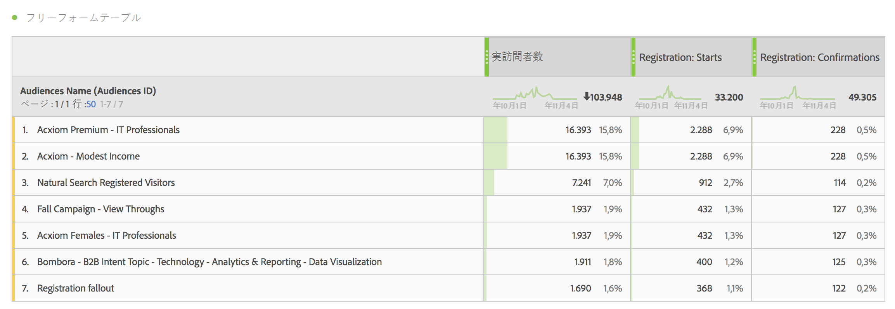
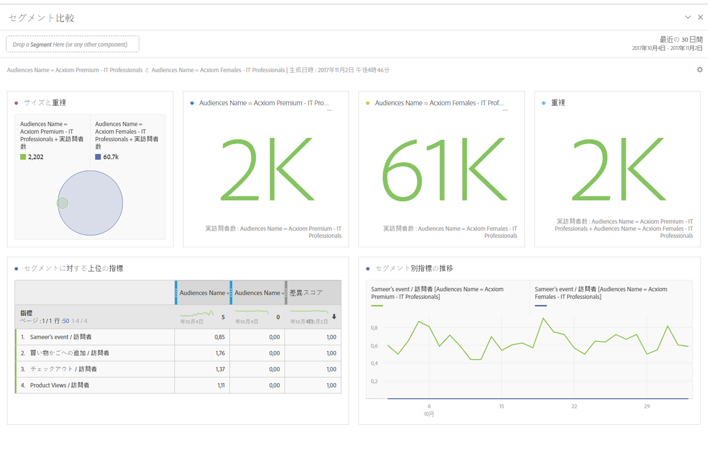
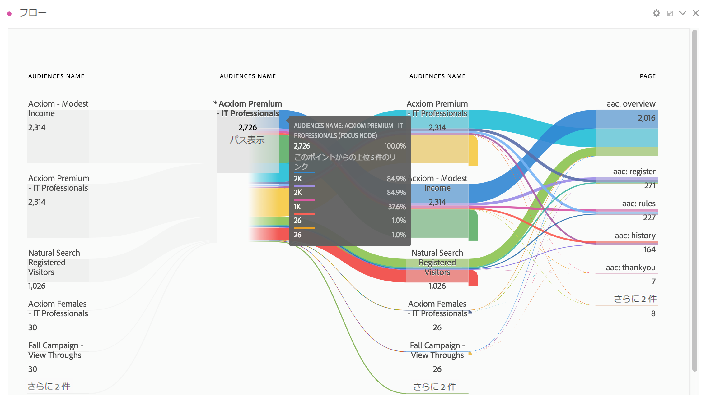
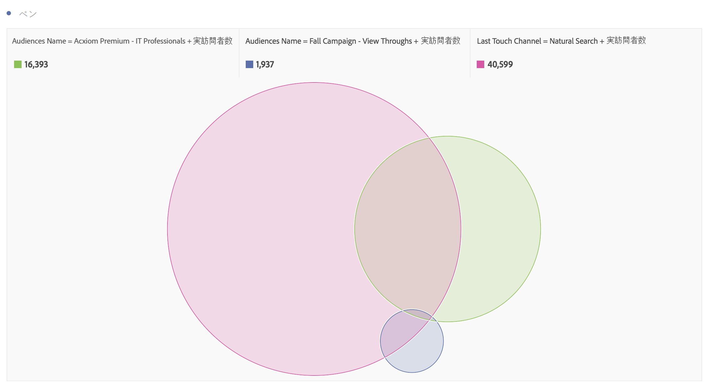
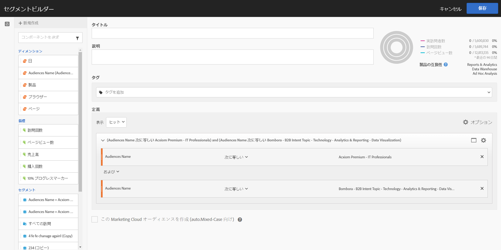
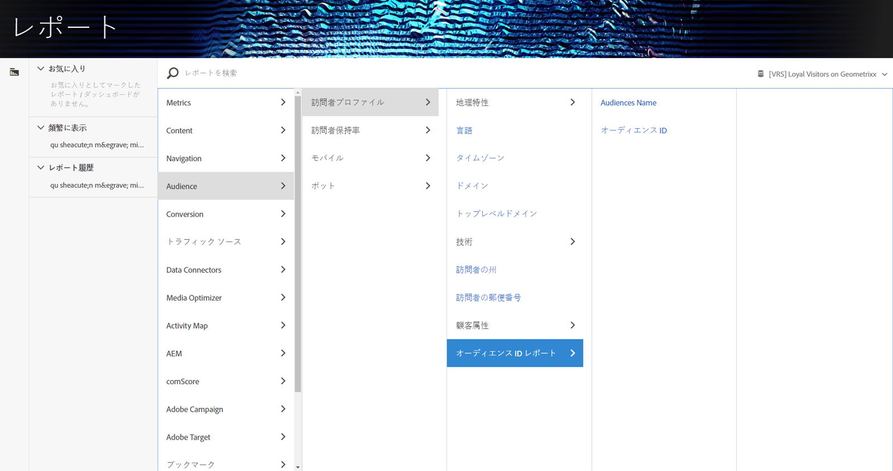

# Analytics でのオーディエンスデータの使用

AAM オーディエンスディメンションは Analytics の任意の場所で使用できます。統合されるセグメントはオーディエンス ID およびオーディエンス名と呼ばれる新しい Analytics ディメンションであり、Analytics によって収集される他のディメンションと同様に使用できます。データフィードでは、オーディエンス ID は「mc_audiences」列に保存されます。現在、これらのディメンションは Data Workbench または Livestream では使用できません。オーディエンスディメンションの活用方法の例としては、次のものがあります。：

## Analysis Workspace {#section_C70837499BEA4DED885B3486C9E02C68}

Analysis Workspace では、AAM セグメントは 2 つのディメンションとして表示されます。

1. **[!UICONTROL Workspace]** に移動します。
1. 「**[!UICONTROL ディメンション]**」のリストから、ディメンション「**[!UICONTROL オーディエンス ID]**」または「**[!UICONTROL オーディエンス名]**」を選択します。名前は ID をわかりやすく分類するものです。

   

## セグメント比較 {#section_E72B80B6470C42D4B9B19BE90E6070A2}

[セグメント比較](https://experienceleague.adobe.com/docs/analytics/analyze/analysis-workspace/panels/segment-comparison/segment-comparison.html)は、2 つのセグメントの統計的に最も重要な違いを検出します。オーディエンスデータは、セグメント比較で 2 つの方法（1：比較する 2 つのセグメントとして、2：「上位ディメンション項目」テーブルの項目として）で使用できます。

1. **[!UICONTROL Workspace]** に移動して、左パネルから「**[!UICONTROL セグメント比較]**」パネルを選択します。

1. **[!UICONTROL コンポーネント]**&#x200B;メニューで[!UICONTROL オーディエンス名]を検索します。

1. [!UICONTROL オーディエンス名]を開いて、関連するディメンション項目を表示します。
1. 比較するオーディエンスをセグメント比較ビルダーにドラッグします。
1. （オプション）：ほかのディメンション項目またはセグメントを選択することも可能です。最大 2 つを比較できます。
1. 「**[!UICONTROL 作成]**」をクリックします。

   オーディエンス ID ディメンションとオーディエンス名ディメンションは、比較している 2 つのセグメントの追加のプロファイルデータであるので、「上位ディメンション項目」テーブルに自動的に表示されます。

   

## Analysis Workspace でのカスタマージャーニー（フロー） {#section_FC30E5795C9D4539838E30FE11FAEA6E}

AAM セグメントのデータはヒットごとに Analytics に渡され、その時点での訪問者のオーディエンスのメンバーシップを表します。これは、訪問者があるセグメント（例えば、「認識」）に該当し、その後、他のセグメント（例えば、「検討」）に認定される場合があることを意味します。Analysis Workspace で[フロー](https://experienceleague.adobe.com/docs/analytics/analyze/analysis-workspace/visualizations/fallout/fallout-flow.html)を使用すると、訪問者がオーディエンス間でたどるカスタマージャーニーを可視化できます。

1. **[!UICONTROL Workspace]** に移動して、左パネルから「**[!UICONTROL フロー]**」ビジュアライゼーションを選択します。

1. [!UICONTROL オーディエンス名]ディメンションをフロービルダーにドラッグします。
1. 「**[!UICONTROL 作成]**」をクリックします。
1. （オプション）：ほかのディメンションをフロービジュアライゼーションにドラッグして、[ディメンション間フロー](https://experienceleague.adobe.com/docs/analytics/analyze/analysis-workspace/visualizations/flow/multi-dimensional-flow.html)を作成します。

オーディエンスは[フォールアウトのビジュアライゼーション](https://experienceleague.adobe.com/docs/analytics/analyze/analysis-workspace/visualizations/fallout/fallout-flow.html)で使用することもできます。

## Analysis Workspace でのベン図のビジュアライゼーション {#section_E78AB764FB5047148B51DC1526B0DF89}

[ベン図のビジュアライゼーション](https://experienceleague.adobe.com/docs/analytics/analyze/analysis-workspace/visualizations/venn.html)には、最大 3 つのセグメントの重複が表示されます。

1. **[!UICONTROL Workspace]** に移動して、左パネルから「**[!UICONTROL ベン図]**」ビジュアライゼーションを選択します。

1. コンポーネントメニューで[!UICONTROL オーディエンス名]を検索します。
1. [!UICONTROL オーディエンス名]を開いて、関連するディメンション項目を表示します。
1. 比較するオーディエンスをベン図ビルダーにドラッグします。
1. （オプション）：他のディメンション項目またはセグメントを選択することも可能です。最大 3 つを比較できます。
1. 「**[!UICONTROL 作成]**」をクリックします。

## セグメントビルダー {#section_2AA81852A1404AB894472CA8959461B6}

Analytics が収集した行動情報に加えて、オーディエンスディメンションを Analytics の[セグメントビルダー](/help/components/segmentation/segmentation-workflow/seg-build.md)に取り込むことができます。

1. **[!UICONTROL コンポーネント]**／**[!UICONTROL セグメント]**&#x200B;に移動します。
1. 「**[!UICONTROL 追加]**」をクリックして新しいセグメントを作成します。
1. セグメントに名前を付けたら「[!UICONTROL オーディエンス名]」ディメンションを定義パネルにドラッグします。
1. （オプション）：他の条件をセグメントに追加します。
1. セグメントを保存します。

   

## Reports &amp; Analytics と Report Builder {#section_04E8FD30F73344D7937AD3C6CD19E34A}

1. Analytics レポートを表示するには、**[!UICONTROL レポート]**／**[!UICONTROL 訪問者プロファイル]**／**[!UICONTROL オーディエンス ID レポート]**&#x200B;に移動します。
1. このフォルダーから、オーディエンス ID ディメンションとオーディエンス名ディメンションの両方にアクセスできます。

   
