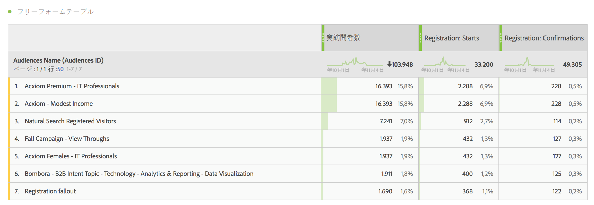
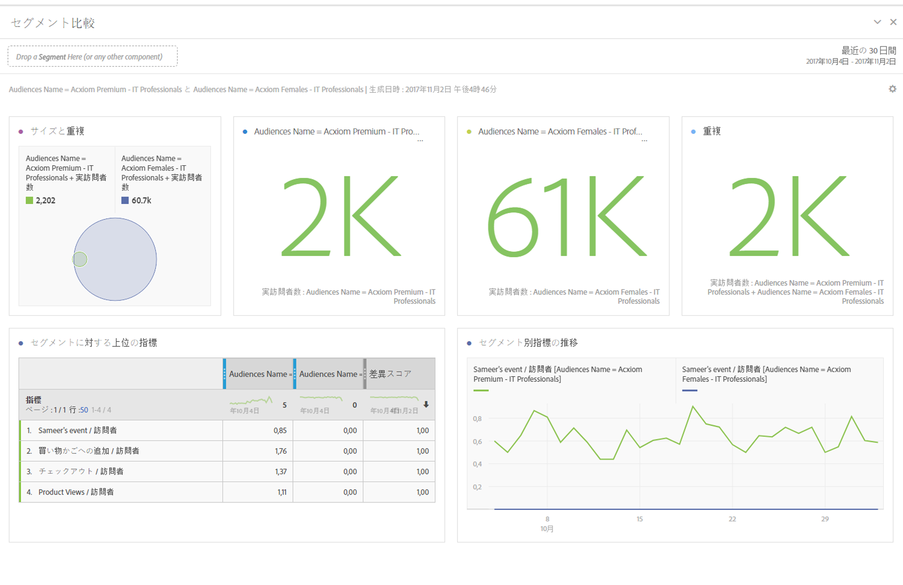
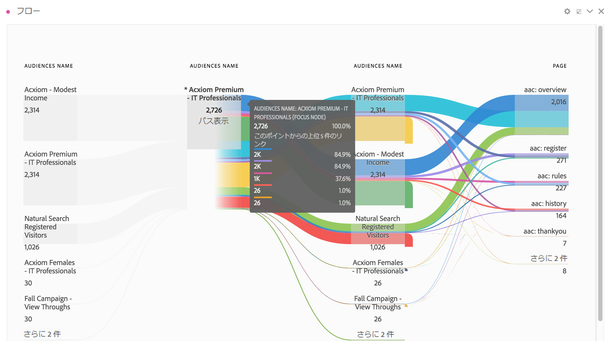
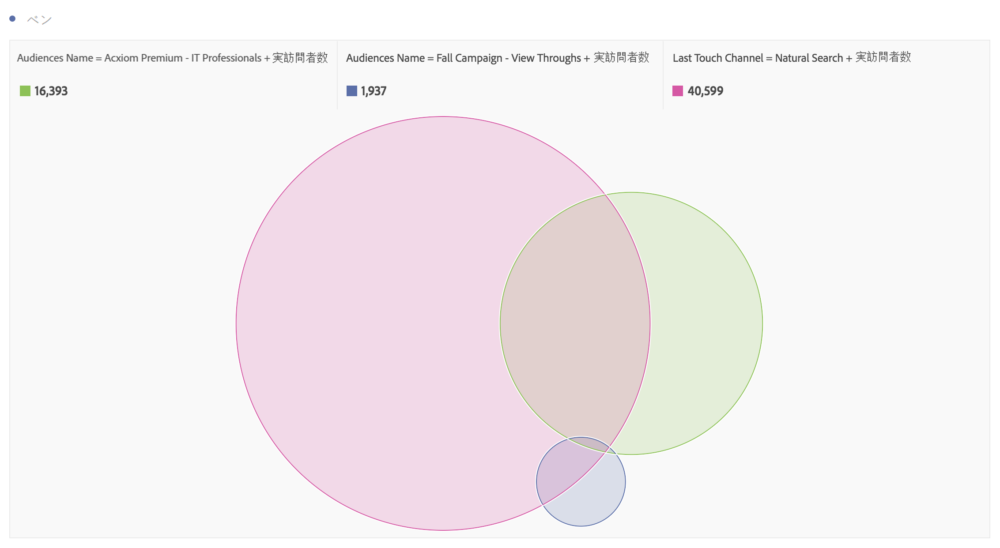
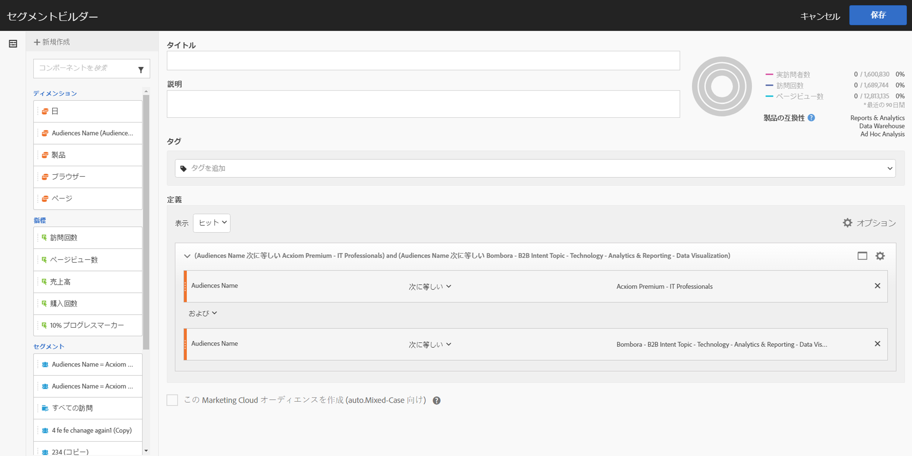

# Analytics でのオーディエンスデータの使用

Analytics全体でAdobe Audience Manager Audience ディメンションを使用できます。 統合セグメントは、Audiences IDとAudiences Nameと呼ばれる新しいAnalytics ディメンションであり、Analyticsが収集する他のディメンションと同じように使用できます。 データフィードでは、オーディエンス ID は「mc_audiences」列に保存されます。 現在、これらのディメンションは Data Workbench または Livestream では使用できません。 オーディエンスディメンションの活用方法には、次のようなものがあります。

## Analysis Workspace {#workspace}

Analysis Workspaceでは、Adobe Audience Manager セグメントは2つのディメンションとして表示されます。

1. **[!UICONTROL Workspace]** に移動します。
1. **[!UICONTROL ディメンション]**&#x200B;のリストから、ディメンション **[!UICONTROL オーディエンス ID]**&#x200B;または&#x200B;**[!UICONTROL オーディエンス名]**&#x200B;を選択します。 名前は、IDのわかりやすい分類です。

   

## セグメント比較 {#compare}

[セグメント比較](/help/analyze/analysis-workspace/c-panels/c-segment-comparison/segment-comparison.md)は、2 つのセグメントの統計的に最も重要な違いを検出します。 オーディエンスデータは、セグメント比較で 2 つの方法（1：比較する 2 つのセグメントとして、2：「上位ディメンション項目」テーブルの項目として）で使用できます。

1. **[!UICONTROL Workspace]** に移動して、左パネルから「**[!UICONTROL セグメント比較]**」パネルを選択します。

1. **[!UICONTROL コンポーネント]** メニューで[!UICONTROL &#x200B; オーディエンス名]を検索します。

1. [!UICONTROL オーディエンス名]を開いて、関連するディメンション項目を表示します。
1. 比較するオーディエンスをセグメント比較ビルダーにドラッグします。
1. （オプション）：他のディメンション項目またはセグメントも取り込むことができ、最大2つを比較できます。
1. 「**[!UICONTROL 作成]**」をクリックします。

   オーディエンス ID ディメンションとオーディエンス名ディメンションは、比較している 2 つのセグメントの追加のプロファイルデータであるので、「上位ディメンション項目」テーブルに自動的に表示されます。

   

## Analysis Workspace でのカスタマージャーニー（フロー） {#flow}

Adobe Audience Manager セグメントデータは、ヒット単位でAnalyticsに渡され、その時点での訪問者のオーディエンスメンバーシップを表します。 これは、訪問者があるセグメント（例えば、「認識」）に該当し、その後、他のセグメント（例えば、「検討」）に認定される場合があることを意味します。 Analysis Workspaceの[&#x200B; フロー](/help/analyze/analysis-workspace/visualizations/fallout/fallout-flow.md)を使用すると、訪問者がオーディエンス間で取るジャーニーを視覚化できます。

1. **[!UICONTROL Workspace]** に移動して、左パネルから「**[!UICONTROL フロー]**」ビジュアライゼーションを選択します。

1. [!UICONTROL &#x200B; オーディエンス名] ディメンションをフロービルダーにドラッグします。
1. 「**[!UICONTROL 作成]**」をクリックします。
1. （任意）：ほかのディメンションをフロービジュアライゼーションにドラッグして、[ディメンション間フロー](/help/analyze/analysis-workspace/visualizations/c-flow/multi-dimensional-flow.md)を作成します。

オーディエンスは、[&#x200B; フォールアウトビジュアライゼーション &#x200B;](/help/analyze/analysis-workspace/visualizations/fallout/fallout-flow.md)でも使用できます。

## Analysis Workspaceでのベンのビジュアライゼーション {#venn}

[&#x200B; ベンのビジュアライゼーション &#x200B;](/help/analyze/analysis-workspace/visualizations/venn.md)は、最大3つのセグメント間の重複を示します。

1. **[!UICONTROL Workspace]** に移動して、左パネルから「**[!UICONTROL ベン図]**」ビジュアライゼーションを選択します。

1. コンポーネントメニューで「[!UICONTROL &#x200B; オーディエンス名]」を検索します。
1. 関連するディメンション項目が表示されるように、[!UICONTROL &#x200B; オーディエンス名]を開きます。
1. 比較するオーディエンスをベン ビルダーにドラッグします。
1. （オプション）：他のディメンション項目またはセグメントも取り込むことができます。最大3つを比較できます。
1. 「**[!UICONTROL 作成]**」をクリックします。

## セグメントビルダー {#builder}

Analytics が収集した行動情報に加えて、オーディエンスディメンションを Analytics の[セグメントビルダー](/help/components/segmentation/segmentation-workflow/seg-build.md)に取り込むことができます。

1. **[!UICONTROL コンポーネント]**／**[!UICONTROL セグメント]**&#x200B;に移動します。
1. 「**[!UICONTROL 追加]**」をクリックして新しいセグメントを作成します。
1. セグメントに名前を付けた後、[!UICONTROL &#x200B; オーディエンス名] ディメンションを定義パネルにドラッグします。
1. （オプション）：他の基準をセグメントに追加します。
1. セグメントを保存します。

   

