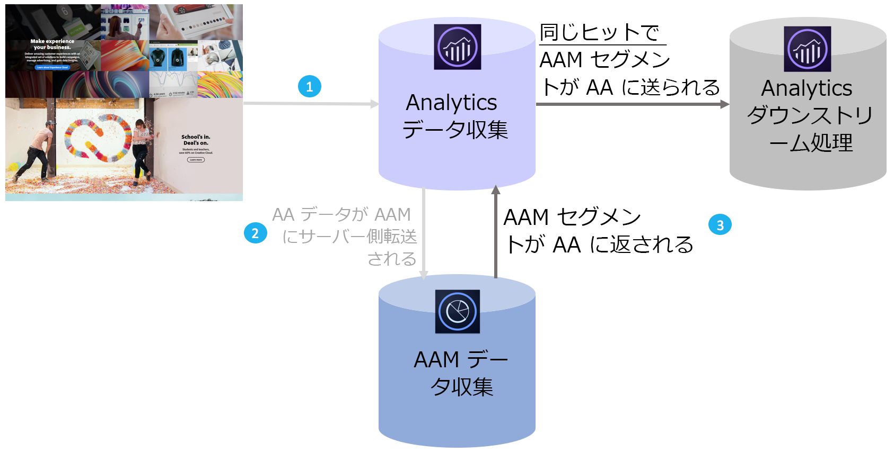

# オーディエンス分析の概要

Adobe Audience Manager（AAM）は、ファーストパーティ、セカンドパーティ／パートナーおよびサードパーティのデータ統合から一意のオーディエンスプロファイルを構築できる強力なデータ管理プラットフォームです。広告主の場合、これらのオーディエンスプロファイルを利用すれば、デジタルチャネル全体で最も効果的なセグメントを定義できます。

Audience Analytics を統合したら、デモグラフィック情報（性別、所得水準など）、サイコグラフィック情報（興味や趣味）、CRM データ、広告インプレッションデータといった AAM オーディエンスのデータを、任意の Analytics ワークフローに組み込むことができます。

## 主要なメリット {#section_94816D17283349E0BA28521BE55BB868}

Audience Analytics 統合には次の主要なメリットがあります。

* 市場で初めて製品化されたデータ管理プラットフォーム（DMP）と分析エンジンの統合製品です。
* セグメントは AAM から Analytics にリアルタイムで共有され、オーディエンスの検出、セグメント化および最適化が通知されます。
* デフォルトですべての AAM セグメントが共有されるので、Analytics の顧客プロファイルが充実します。
* ソリューション管理者は、ユーザーインターフェイスから統合を有効にすることができ、コードの変更は最小限で済みます。
* Audience Manager のデータエクスポートコントロールに準拠するセグメントのみが共有されます。

## 仕組み {#section_CECDF5A0FEC64264B206EFEF54F19EF2}

1. デジタルプロパティに訪問者が訪問するたびに、ヒットが収集されて Analytics に送信されます。
1. with[サーバー側転送](/help/admin/admin/c-server-side-forwarding/ssf.md)では、Analytics が受け取った各ヒットが AAM にリアルタイムで自動的に送信されます。
1. Audience Analytics 統合を通じて、各ヒットについて訪問者のオーディエンスメンバーシップが AAM で検索され、リアルタイムで処理するためにセグメント ID のリストが Analytics に返されます。

AAM セグメントは同じヒットごとに挿入されるので、AAM で使用可能な訪問者に関するどのデータも欠落することなく、ヒットに対して最新の状態が保たれます。AppMeasurement プラグインでは、これらのセグメントを次のヒットでのみ使用できます（現在のヒットでは使用できません）。Analytics データ収集は、この点で AppMeasurement プラグインより優れています。

また、AAM セグメント ID はわかりやすい名前に自動的に分類されるので、Analytics レポートで英数字の ID を参照する必要はありません。

## 前提条件 {#section_A345DC31F7D44EAE9DC1AB53E824C0CC}

次の前提条件を満たしていることを確認します。

* Audience Manager と Adobe Analytics の両方のユーザーである。
* Audience Manager 管理者である。
* IDサービスv1.5以降を使用している。
* AAM および Adobe Analytics レポートスイートが、[同じ Experience Cloud 組織にマッピングされている](https://marketing.adobe.com/resources/help/en_US/mcloud/report-suite-mapping.html)。
* [サーバー側転送](/help/admin/admin/c-server-side-forwarding/ssf.md) を使用して [、Audience Managementモジュール](https://marketing.adobe.com/resources/help/en_US/aam/c_profiles_audiences.html) （DILコードなし）- AppMeasurement1.5以降を実装しました。

These prerequisites are described in the [Audience Analytics Workflow](../../integrate/c-audience-analytics/c-workflow/audiences-workflow.md#concept_A5F067D14C794B759A1D92526DE27F83).
