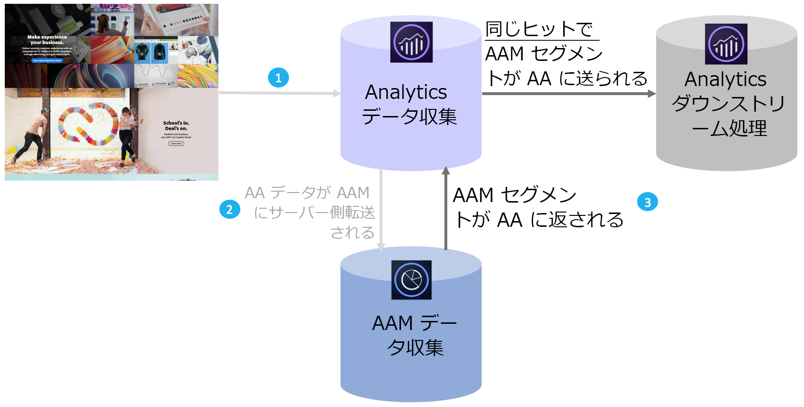

# Audience Analytics の概要

Adobe Audience Manager（Adobe Audience Manager）は、ファーストパーティ、セカンドパーティ/パートナー、サードパーティデータの統合から、独自のオーディエンスプロファイルを構築するのに役立つ強力なデータ管理基盤です。 広告主にとって、これらのオーディエンスプロファイルは、あらゆるデジタルチャネルで使用すべき最も価値のあるセグメントを定義するのに役立ちます。

Audience Analyticsとの連携により、デモグラフィック情報（性別や収入レベルなど）、サイコグラフィック情報（興味や趣味など）、CRM データ、広告インプレッションデータなどのAdobe Audience Managerのオーディエンスデータを任意のAnalytics ワークフローに組み込むことができます。

>[!BEGINSHADEBOX]

デモ動画については、 [Audience Analytics](https://experienceleague.adobe.com/en/docs/analytics-learn/tutorials/integrations/audience-manager/audience-analytics-integrate-aam-segments-into-analytics){target="_blank"}を参照してください。

>[!ENDSHADEBOX]

## 主なメリット {#benefits}

Audience Analyticsとの連携には、次の主な利点があります。

* これは、DMP（Data Management Platform）と分析エンジンの間で、市場で初めて製品レベルで連携したものです。
* セグメントは、Adobe Audience ManagerからAdobe Analyticsにリアルタイムで共有され、オーディエンスの発見、セグメンテーション、最適化に活用されます。
* あらゆるAdobe Audience Managerセグメントは、デフォルトで共有されており、Analyticsで顧客プロファイルを完全に強化します。
* ソリューション管理者は、コードの変更を最小限に抑えながら、ユーザーインターフェイスを通じた統合を実現できます。
* Audience Manager データ書き出し制御に準拠するセグメントのみが共有されます。

## Audience Analyticsの仕組み {#works}

1. 訪問者がデジタルプロパティにアクセスするたびに、ヒット数が収集され、Analyticsに送信されます。
1. [ サーバーサイド転送](/help/admin/tools/manage-rs/edit-settings/general/c-server-side-forwarding/ssf.md)を使用すると、Analyticsが受け取る各ヒットは、リアルタイムで自動的にAdobe Audience Managerに送信されます。
1. Audience Analyticsとの統合により、ヒットごとに訪問者のオーディエンスメンバーシップがAdobe Audience Managerで検索され、セグメント IDのリストがAnalyticsに返され、リアルタイムで処理されます。

Adobe Audience Managerのセグメントは同じヒット単位で挿入されるため、Adobe Audience Managerで使用可能な訪問者に関するデータを見逃すことなく、そのヒットに関する最新の情報を確認することができます。 これはAppMeasurement プラグインよりも優れています。プラグインでは、これらのセグメントを（現在のヒットではなく）次のヒットでのみ使用できます。

また、Adobe Audience Manager セグメント IDは、Analytics レポートで英数字IDを確認する必要がないように、わかりやすい名前に自動的に分類されます。

## 前提条件 {#prerequisites}

次の前提条件が満たされていることを確認します。

* あなたはAudience ManagerとAdobe Analyticsの両方のお客様です。
* あなたはAudience Manager管理者です。
* ID サービス v1.5 以降を使用している。
* Adobe Audience ManagerとAdobe Analyticsのレポートスイートは、同じCX Enterprise組織にマッピングされます。
* [サーバー側転送](/help/admin/tools/manage-rs/edit-settings/general/c-server-side-forwarding/ssf.md)を使用していて、[Audience Management モジュール](https://experienceleague.adobe.com/docs/audience-manager/user-guide/implementation-integration-guides/integration-other-solutions/audience-management-module.html?lang=ja)（DIL コードなし） - AppMeasurement 1.5 以降を実装している。

これらの前提条件は、[Audience Analytics ワークフロー](/help/integrate/c-audience-analytics/c-workflow/audiences-workflow.md)に記載されています。
