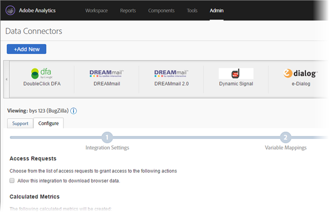

# Adobe Analytics 用 DFA Data Connector{#dfa-data-connector-for-adobe-analytics}

ますます複雑になり、競争の激しくなる今日のオンラインマーケットプレイスにおいて、オンライン広告主や代理店は、オンラインマーケティング環境の理解と広告費用対効果を向上させ続ける必要があります。広告主、代理店、パブリッシャーのそれぞれが、目標達成に役立つツールを個別に所有していますが、異なるデータシステムやプロセスからのデータを手動で集計するようでは、オンラインマーケティングキャンペーンの有効性が大幅に阻害され、最適なキャンペーンの効果を得られなかったり、データの相違や混乱を招く原因となります。

Adobe® Data Connectors™ を使用して DoubleClick DFA から Reports &amp; Analytics にデータを自動的に渡すことができる DoubleClick for Advertisers（DFA）統合を活用すれば、この問題を解決できます。

**[!UICONTROL Analytics]** / **[!UICONTROL 管理者]** / **[!UICONTROL Data Connectors]**

