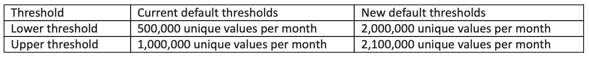

# 現在の Adobe Analytics リリースノート（2024年4月）

**最終更新日**：2024年4月17日（PT）

これらのリリースノートは、2024 年 4 月 17 日（PT）から 5 月のリリース期間に対応しています。 Adobe Analytics リリースは、[継続的な配信モデル](releases.md)に基づいて動作します。このモデルにより、機能のデプロイメントに対する、よりスケーラブルかつ段階的なアプローチが可能になります。 したがって、これらのリリースノートは月に数回更新されます。 リリースノートを定期的に確認してください。

## 新機能または機能強化 {#features}

| 機能 | 説明 | [ロールアウト開始](releases.md) | [一般公開](releases.md) |
| ----------- | ---------- | ------- | ---- |
| **ストリーミングメディア：Roku データをAdobe Experience Platform Edge Networkに送信する** | 次の場合 [media Analytics とExperience Platform Edge のインストール](https://experienceleague.adobe.com/en/docs/media-analytics/using/implementation/edge-recommended/media-edge-sdk/implementation-edge)Adobe Experience Platform Roku SDK を使用すると、ストリーミングメディアデータをAdobe Experience Platformに送信できます。 |  | 2024年4月12日（PT） |
| **Web SDK 移行のワークフローの改善** | Adobe Experience Platform Data Collection は、データオブジェクトの多くのフィールドをAdobe Analyticsに直接、自動的にマッピングするようになりました。 この強化されたワークフローには、次の利点があります。<ul><li>の作成や準拠を気にすることなく、組織から Web SDK に移行できます。 [!UICONTROL XDM スキーマ]. 参照： [データオブジェクト変数のマッピング](https://experienceleague.adobe.com/en/docs/analytics/implementation/aep-edge/data-var-mapping) を参照してください。 （その他のドキュメントリンクの手順）</li><li>Web SDK に移行した後は、Adobe AnalyticsからCustomer Journey Analyticsに移行する方が適切です。 これは、Web SDK により、Customer Journey Analyticsへのよりシームレスな移行が可能になるからです。</li></ul> （この移行オプションおよびその他の移行オプションの詳細は、近日中に提供されます。） |  | 2024年4月 |
| **プロジェクトのみの権限強化 [!UICONTROL ワークスペース] components** | 以前は、ユーザー（ユーザー A）が別のユーザー（ユーザー B）とプロジェクトを共有し、ユーザー B にそのプロジェクトへの編集アクセス権を付与した場合、ユーザー B はプロジェクトを編集できます。 ただし、ユーザー B はを編集できません [!UICONTROL クイックセグメント] プロジェクトに埋め込まれています。 この制限は削除されました – ユーザー B は編集できます [!UICONTROL クイックセグメント] および共有プロジェクトに埋め込まれた、その他のプロジェクト専用コンポーネント。 |  | 2024年4月17日（PT） |
| **に同じクラウドアカウントを使用 [!UICONTROL データフィード], [!UICONTROL Data Warehouse]、および [!UICONTROL 分類セット]** | 作成したクラウドアカウントおよび場所は、（を使用した）データの書き出しに使用できるようになりました [!UICONTROL データフィード] および [!UICONTROL Data Warehouse]）とデータの読み込み（を使用） [!UICONTROL 分類セット]）に設定します。
 **アカウントを設定する際の変更：** ユーザーは次のことができます [クラウドのインポートおよびエクスポートアカウントの設定](https://experienceleague.adobe.com/en/docs/analytics/components/locations/configure-import-accounts) および [クラウドの読み込み場所と書き出し場所の設定](https://experienceleague.adobe.com/en/docs/analytics/components/locations/configure-import-locations) 次のいずれかの目的で使用できます。<ul><li>でのデータの読み込み [!UICONTROL 分類セット]</li><li>を使用したデータのエクスポート [!UICONTROL データフィード]</li><li>を使用したデータのエクスポート [!UICONTROL Data Warehouse].</li></ul>
**からアカウントと場所を管理する際の変更 [!UICONTROL 場所] ページ**：ユーザーは以下を使用できます [場所](https://experienceleague.adobe.com/en/docs/analytics/components/locations/locations-manager) ページ （下） [!UICONTROL Components] > Locアクション）を使用して、作成場所に関係なく、作成したすべてのアカウントと場所を表示および管理します。 
以前は、 [!UICONTROL 場所] でデータをインポートするために作成されたアカウントにのみ適用されたページ [!UICONTROL 分類セット].
**からの場所を管理する際の変更 [!UICONTROL Data Warehouse] または [!UICONTROL 分類セット]**
特定のアプリケーション領域内の場所を管理する場合（[!UICONTROL Data Warehouse] または [!UICONTROL 分類セット]）に設定した場合は、その特定のアプリケーション領域内で作成された場所のみを使用できます。 例えば、 [!UICONTROL Data Warehouse] アプリケーション領域のみ [!UICONTROL Data Warehouse] 場所は利用できます。 作成されたアプリケーション領域に関係なく、すべてのアカウントが各アプリケーション領域で引き続き使用できます。 以前は、作成されたアプリケーション領域に関係なく、すべてのアカウントと場所が各アプリケーション領域で使用可能でした。 これは、 [!UICONTROL データフィード] アプリケーション領域。 | | 2024年4月17日（PT） |
| **管理者は組織内のすべての場所とアカウントを管理できる** | 「場所」タブ（コンポーネント／場所ページ）の新しいオプションを使用すれば、管理者は組織内のすべての場所を表示および管理できます。
の新しいオプション [場所](https://experienceleague.adobe.com/en/docs/analytics/components/locations/locations-manager) 「アカウント」タブ（コンポーネント / ロケーション ページ）を使用すると、管理者は、組織内のすべてのアカウントを表示および管理できます。
 
以前は、管理者は自分が作成した場所とアカウントのみを表示および管理できました。
 |  | 2024年4月17日（PT） |
| **デフォルトの低トラフィックしきい値の増加** | **2024年4月中旬**&#x200B;に、アドビは、次のように、デフォルトのレポートスイートの低トラフィックしきい値を引き上げ始めます。：これは、現在新しいしきい値を下回って設定されている変数にのみ影響します。 この度の変更は段階的に行われ、作業は **5月末**&#x200B;に完了する予定です。 この度の増加がロールアウトされると、高基数変数の変更に気付く場合があります。<ul><li>レポートには、より多くのディメンション値を使用できる場合があります。</li><li>セグメントと計算指標に含まれるデータの量が多くなる場合があります。</li><li>セグメントに基づく仮想レポートスイートには、より多くのデータが含まれる場合があります。</li><li>分類の書き出しには、より多くのデータが含まれる場合があります。</li></ul> | 2024年4月中旬 | 2024年5月31日（PT） |
| **Activity Map が使用する Web SDK のサーバー呼び出しの数が低減します** | 現在、Activity Map リンクイベントは独自のイベントとしてカウントされ、追加費用が発生します。 
この機能強化では、AppMeasurement でのイベントの処理と同様に、一部のリンクイベントを取り上げ、それらを次のヒットにパッケージ化します。
 |  | 2024年5月31日（PT） |

{style="table-layout:auto"}

## Adobe Analytics の修正点

* 分類に関する次の問題を修正しました：AN-343439、AN-343503、AN-343504、AN-343986、AN-344262、AN-344564、AN-345204、AN-345234
* 分類ルールビルダーの AN-341488; AN-342501; AN-345751 の問題を修正しました。
* インテリジェントアラートの次の問題を修正しました：AN-343466;
* 次のセグメント化の問題を修正しました。AN-342313
* 次のData Warehouseの問題を修正しました：AN-344292
* An-339545、AN-340092、AN-342124、AN-342862、AN-343737、AN-344035、AN-344329、AN-344703、AN-344721 344940、AN-345180、AN-345196、AN-345225、AN-345236、AN-345326、AN-345631、AN-345659 のデータフィードの問題を修正しました。
* データソースの AN-343541 の問題を修正しました。
* Analysis Workspaceの次の問題を修正しました。AN-336303、AN-336472、AN-338422、AN-338556、AN-339718、AN-340147、AN-340301、AN-340421、AN-340951 341172、AN-342905 342909、AN-343448、AN-343570、AN-344050、AN-344182、AN-344763、AN-344768、
* Analytics 管理者の次の問題を修正しました。AN-342519、AN-342523、AN-343623、AN-343882、AN-344237、AN-344829、AN-345235;
* A4T の次の問題を修正しました。AN-341619; AN-344402
* モバイルアプリの AN-342010 の問題を修正しました。

### Analytics のその他の修正

AN-336099; AN-337474; AN-337993; AN-339718; AN-339901; AN-340014; AN-341356; AN-343021; AN-343102; AN-343353; AN-343416; AN-340014; AN-344037; AN-344525; AN-345737

## Adobe Analytics 管理者向けの重要な注意事項 {#admin}

| 通知 | 追加日または更新日 | 説明 |
| ----------- | ---------- | ---------- |
| **保存された`cust_visids`** の有効期限は 13 か月 | 2024年3月20日（PT） | Analytics のヒット処理エンジンの次回リリース（4月または 5月を予定）では、保存された `cust_visids` に 13 か月の有効期限が適用されます。 レポートスイートで「訪問者のステッチを有効にする」が有効になっている場合、この設定は、ヒット時の `cust_visid` がない `visid_high/visid_low value` で、`cust_visid` を見つける際に使用します。 現在、`visid_high/visid_low` に対する `cust_visid` のマッピングに有効期限はありません。 このリリースでは、`visid_high/visid_low` にヒット時の `cust_visid` が設定されてから 13 か月以上が経過すると、マッピングが期限切れになります。 |
| **Adobe API オブジェクトメンバーの追加** | 2024年1月17日（PT） | アドビでは、バージョン管理の通知や変更なしに、オプションのリクエストおよび応答メンバー（名前／値のペア）を既存の API オブジェクトにいつでも追加できます。 アドビでは、API と統合するサードパーティツールの API ドキュメントを参照し、理解できない場合は、そのような追加が処理で無視されるようにすることをお勧めします。 適切に実装されている場合、そのような追加は実装に対して破壊的な変更ではありません。 アドビでは、最初にリリースノートを通じて標準通知を提供することなく、パラメーターを削除したり、必要なパラメーターを追加したりすることはありません。 |

{style="table-layout:auto"}

## 提供終了（EOL）に関する注意事項 {#eol}

| EOL 対象の製品または機能 | 追加日または更新日 | 説明 |
| --- | --- | --- |
| **Adobe I/O OAuth サーバー間資格情報への移行** | 2023年5月11日（PT） | Adobe I/O JWT 資格情報を使用している Adobe Analytics API および Livestream のお客様は、**2025年1月1日（PT）**&#x200B;までに Adobe I/O OAuth サーバー間資格情報に移行する必要があります。 Adobe I/O では、2024年5月1日（PT）以降、新しい JWT 資格情報を作成できなくなります。 JWT を使用しているお客様は、新しい OAuth サーバー間資格情報を作成するか、既存の JWT 資格情報を OAuth サーバー間資格情報に移行する必要があります。 また、お客様が新しい OAuth サーバー間資格情報を使用するには、クライアントアプリケーションを更新する必要もあります。 <ul><li>[サービスアカウント（JWT）資格情報からの移行](https://developer.adobe.com/developer-console/docs/guides/authentication/ServerToServerAuthentication/migration/)</li><li>[OAuth を使用した新旧のアプリケーションの実装ガイド](https://developer.adobe.com/developer-console/docs/guides/authentication/ServerToServerAuthentication/implementation/)<li>[新しい OAuth サーバー間資格情報の使用](https://developer.adobe.com/developer-console/docs/guides/authentication/ServerToServerAuthentication/implementation/)</li><li>[よくある質問（FAQ）](https://developer.adobe.com/developer-console/docs/guides/authentication/ServerToServerAuthentication/faqs/)</li></ul> |

{style="table-layout:auto"}

## AppMeasurement

AppMeasurement リリース（バージョン 2.26.0）の最新のアップデートについて詳しくは、[JavaScript 版 AppMeasurement リリースノート](https://experienceleague.adobe.com/docs/analytics/implementation/appmeasurement-updates.html?lang=ja)を参照してください。

## 関連リソース

* [2023年の以前のリリースノート](/help/release-notes/2023.md)
* [Customer Journey Analytics リリースノート](https://experienceleague.adobe.com/docs/analytics-platform/using/releases/latest.html?lang=ja)
* [Media Analytics リリースノート](https://experienceleague.adobe.com/docs/media-analytics/using/additional-resources/release-notes.html?lang=ja)
* [Adobe Experience Cloud 製品](https://business.adobe.com/jp/products/adobe-experience-cloud-products.html)の最新のリリース更新
