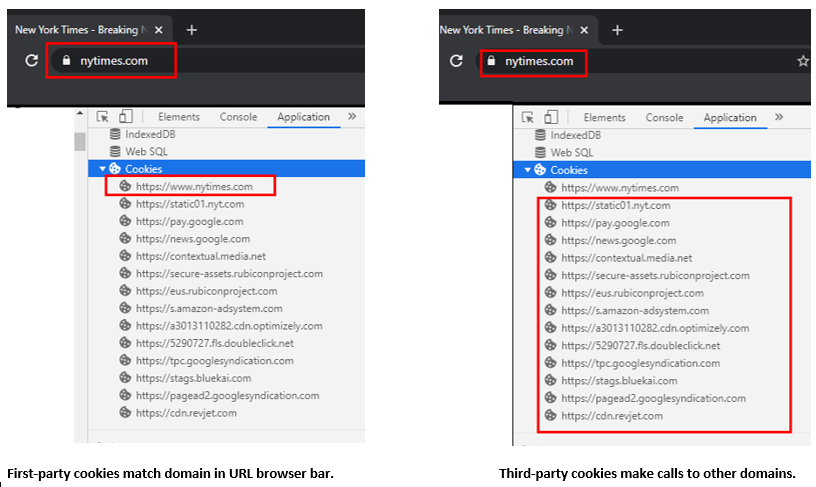

# Adobe Analytics とブラウザーの cookie

Adobe Analytics では、プロパティやソリューション間での永続的なユーザー識別を可能にするために、ブラウザーにおける cookie の処理方法の変更に対応します。次の FAQ では、ブラウザーの cookie の変更に応じて訪問者の永続的な識別が保持される方法について確認できます。

## ブラウザーは cookie の処理方法をどのように変更していますか？

一般的に、多くのブラウザーでは、サードパーティ cookie の保持方法に対する制限が厳しくなっています。これは、ブラウザーが cookie を削除または拒否した場合の追跡に影響を与える可能性があります。Safari ブラウザーでは、一部のファーストパーティ cookie に対してもいくつかの制限が設定されています。

次のリストに、ブラウザーに応じた最新の変更を示します。

* Chrome：Chrome 80 以降では、サードパーティ cookie やクロスサイトリクエストを管理するために、`SameSite`属性の処理方法が変更されました。Chrome 開発者は、最終的に[サードパーティ cookie を完全に非推奨](https://blog.chromium.org/2020/01/building-more-private-web-path-towards.html?m=1)にする予定です。

* Firefox および Edge：各社の発表によると、今後のバージョンでは、Chrome 80 と同じ変更が適用される予定です。

* Safari：[Safari 12.1](https://webkit.org/blog/category/privacy/) の場合、document.cookie API（多くの場合、「クライアントサイド」cookie とも呼ばれる）を使用して設定された永続的なファーストパーティ cookie は、7 日を上限として期限が切れます。

## サードパーティ cookie とファーストパーティ cookie の違いは何ですか？

### ファーストパーティ cookie

ファーストパーティ cookie は、お客様の（ドメイン固有の）Web サイトによって作成され、ユーザーが Web サイトを訪問するとクライアントブラウザーに保存されます。一般的に、すべてのブラウザーはファーストパーティ cookie を受け入れます。Analytics におけるファーストパーティ cookie の実装では、[CNAME](https://docs.adobe.com/content/help/ja-JP/id-service/using/reference/analytics-reference/cname.html) を使用してドメインのホスト名を調整すると、訪問者 ID cookie がアドビのノードで作成されます。その後、cookie はファーストパーティのコンテキストでブラウザーによって受け入れられます。詳しくは、[ファーストパーティ cookie について](https://docs.adobe.com/content/help/ja-JP/core-services/interface/ec-cookies/cookies-first-party.html)を参照してください。

### サードパーティ cookie

サードパーティ cookie は、ユーザーが訪問する Web サイトによって作成されるものではありません。現在、ブラウザーはすべてのサードパーティ cookie を同じように処理し、保存しますが、サードパーティ cookie はそれぞれ異なる方法で重要な動作をおこなう場合があります。Analytics におけるサードパーティ cookie の実装では、クライアントはアドビに対してのみ呼び出しをおこない、不明または疑わしいサードパーティドメインには呼び出しをおこないません。これは Analytics の実装で現在使用されているメソッドであり、永続的な識別子を使用した（HTTPS による）安全で信頼性の高い追跡を実現します。このメソッドは、AppMeasurement.js ファイルを設定することで実装できます。詳しくは、[cookie と Experience Platform ID サービス](https://docs.adobe.com/content/help/ja-JP/id-service/using/intro/cookies.html)を参照してください。

## 現在、ブラウザーは Analytics の cookie をどのように保存および管理していますか？

実装に応じて、Analytics の cookie は次のように保存されます。

### サードパーティ cookie の実装

現在、ブラウザーはアドビの [demdex.net](https://docs.adobe.com/content/help/ja-JP/audience-manager/user-guide/reference/demdex-calls.html) ID をサードパーティ cookie として保存します。この cookie はドメイン間で永続的な識別子と（HTTPS による）安全なコンテンツを提供します。

### ファーストパーティ cookie の実装

CNAME を設定すると、ユーザーはブラウザーのファーストパーティ cookie コンテキストでアドビの cookie を受け取ることができます。サードパーティ cookie の実装がユーザーにとって最適でない場合は、ファーストパーティ cookie が有効な選択肢となり得ます。

## SameSite cookie 属性とは何ですか？また、Analytics にどのような影響を与えますか？

Chrome 80 ブラウザーのリリース（および Firefox と Edge の今後のバージョン）では、SameSite cookie 属性により、クロスサイトリクエストの動作を制御するための次の 3 つの値が指定されます。

* `None`：この設定によってクロスサイトアクセスが可能になり、cookie をサードパーティコンテキストで渡すことができます。この属性を指定するには、`Secure` を指定する必要があります。また、すべてのブラウザーリクエストは HTTPS に対応しなければなりません。例えば、cookie を設定する場合、「`Set-Cookie: example_session=test12; SameSite=None; Secure`」のように属性の値を組み合わせます。ラベル付けが適切でない場合、新しいブラウザーで cookie を使用できなくなり、拒否されます。

* `Lax`：*安全な*（`GET` などの読み取り専用の）HTTP メソッドを使用するトップレベルナビゲーションに対してのみ、SameSite cookie を使用してクロスサイトリクエストを送信できます。

* `Strict`：サードパーティ Web サイトのリクエストに対して SameSite cookie が送信されません。サイトが URL バーのサイトと一致する場合にのみ送信されます。

これらのブラウザーバージョンのデフォルトの動作では、指定された `SameSite` 属性を持たない cookie が `SameSite=Lax` と同じように処理されます。

## Adobe Analytics は、これらの変更に対してどのように対応しますか？

アドビの cookie の更新はすべて、アドビのサーバーを介して処理されます。アドビは、適切な cookie 属性を設定するためにエッジサーバーを更新しました。さらにアドビは、サードパーティ cookie に適切な属性を設定するためのサーバーサイドのアップデートをリリースしました。サイトの JavaScript を更新する必要はありません。

アドビのエッジサーバーによるこのアップグレードは、cookie が使用されている Web サイトにユーザーがアクセスすると自動的に実行されます。多くのアドビ製品では、Chrome 80 のリリース時に cookie に適切なフラグが設定されます。ただし、Adobe Analytics の実装において、Experience Cloud IDサービス（ECID）ではなくサードパーティのデータ収集機能を使用している場合は例外となります。この場合、本来は再訪問者としてタグ付けされるべき訪問者が新規訪問者としてカウントされ、新規訪問者数が一時的に増加する場合があります。

`SameSite` が `None` に設定されており、ブラウザーによる cookie の処理が誤っていると Google によって認識された場合、`SameSite` は未設定のままになります。

次の表に、Analytics の cookie についてまとめます。

## Chrome、Firefox、Edge の変更に備えてサイトを準備する最善の方法を教えてください。

Analytics をご利用のお客様は、JavaScript 設定でアドビのサービスへの呼び出しに HTTPS が使用されていることを確認する必要があります。ECID は、サードパーティ HTTP 呼び出しを HTTPS エンドポイントにリダイレクトします。これにより、待ち時間が長くなる可能性がありますが、設定を変更する必要がなくなります。

サイトのすべてのページを HTTPS に対応させることをお勧めします。

### 複数のドメインに対して 1 つの CNAME を使用

Web サイトと同じドメインに設定された CNAME 実装がある場合、これはファーストパーティ cookie コンテキストとなり、変更をおこなう必要はありません。

ただし、複数のドメインを所有し、すべてのドメインで同じ CNAME をデータ収集に使用する場合、他のドメインではサードパーティ cookie として扱われます。Chrome 80 の場合、他のドメインでは表示されなくなります。Analytics では、すべてのブラウザーにおいて動作を統一するために、この cookie の `SameSite` 値を `Lax` に明示的に設定しています。この cookie を明確なサードパーティコンテキストで使用する場合は、cookie に `SameSite=None` 値を設定し、常に HTTPS を使用する必要があります。セキュアな CNAME に対して SameSite の値を変更する場合は、アドビカスタマーケアにお問い合わせください。ECID を使用する場合は、この操作は必要ありません。

## Safari の変更（ITP 2.1）による Analytics への影響を教えてください。

Safari 12.1 の変更後も、Adobe Experience Cloud の cookie からのデータセットは引き続き収集されます。cookie の有効期限は 7 日ですが、その間にユーザーがお客様のプロパティに再訪した場合は cookie が更新され、さらに 7 日間有効になります。アドビのアップデートが利用可能になるまで、Safari のトラフィックのルックバックウィンドウと再訪問者数が減少する場合があります。

有効期限が 7 日間に短縮されたため、個別訪問者数が増加する可能性があります。訪問回数とページビュー数は影響を受けません。税務サービスやホリデーリテールなどの季節性のあるトラフィックを持つプロパティがある場合、訪問者が季節に応じて変動するので、より大きな影響が生じる可能性があります。

CNAME を使用する場合、訪問者 ID サービスは ECID をサーバーサイドのファーストパーティ cookie に保存します。これにより、cookie がその期間にわたって保持されます。

**注意：ITP 2.1 は、モバイルアプリに埋め込まれたブラウザーには適用されません。**

### 影響を受けるファーストパーティ cookie

`document.cookie` を使用して作成されたファーストパーティ cookie が影響を受けます。HTTP レスポンス（サーバーサイド）または CNAME 証明書を使用してこれらの cookie のいずれかを設定する場合は、ITP 2.1 の変更の影響を受けません。次のファーストパーティ cookie および関連するアドビの JavaScript ライブラリが影響を受けます。

* ECID（Experience Cloud ID）サービスライブラリによって設定される AMCV cookie
* Analytics の従来のフォールバック cookie `s_fid`

adobedc.net、2o7.netまたはomtrdc.netの収集ターゲットを含む、サードパーティCookieとしてのAnalyticsの従来の`s_vi` Cookieは、以前のバージョンのITPに基づいて引き続きブロックされます。

まとめ：

* CNAME が設定されており、訪問者 ID サービスを使用する場合：実装は影響を受けません。

* ファーストパーティのコンテキストでファーストパーティの CNAME を使用し、訪問者 ID サービスを使用しない場合：実装は影響を受けません。

* ファーストパーティcookieドメインをサードパーティのコンテキストで使用する場合、または標準的なサードパーティドメイン名（`adobedc.net`、`2o7.net`、`omtrdc.net`など）を使用する場合、Safariは引き続きそれをブロックします。

* カスタム訪問者 ID を使用する場合：訪問者 ID の保存方法によって異なります。ID をファーストパーティの「クライアントサイド」cookie に保存する場合、7 日間の有効期限が適用されます。他の保存方法を使用する場合は、影響を受けるかどうか検証する必要があります。

### 最も影響が小さいデータセット

頻繁に再訪するアクティブな訪問者を持つデータセットは、変更による影響を最も受けません。ユーザーがサイトのコンテンツに毎日または週に 2 回以上再訪するような場合は、アクティブなユーザーの cookie が期限切れになる前に更新されます。ソーシャルネットワークやニュースなどのメディアサイトは、多くのユーザーが頻繁に再訪する可能性が最も高いです。

`s_vi` をプライマリ訪問者 ID として使用し、CNAME を使用してファーストパーティデータ収集を設定した場合は、ITP 2.1 の影響を受けません。`s_vi` を設定できない場合は、フォールバック cookie（`s_fid`）が使用され、7 日間の有効期限が適用される可能性があります。

また、訪問者 ID サービスを使用し、ファーストパーティドメインを持つデータセットは、最も影響を受けません。

## Safari の変更は自社のビジネスに影響を与えますか？

アドビでは、データ収集を変更する前に貴社への影響を検証することを推奨しています。影響の検証は、この節で後述する方法で実行できます。

レポートやテストへの影響を検証するには、実装した訪問者とトラッキング cookie のタイプ、および Safari を使用するユーザーからのトラフィック量を把握することが重要です。個々の業務に与える影響を検証する際は、以下の点を考慮します。

* アドビのライブラリが設定している cookie のタイプを確認します。

* 最新の Safari ブラウザーでデベロッパーコンソールを開きます。ファーストパーティドメインに上記の cookie が設定されている場合は、Safari の変更による影響を受ける可能性があります。

* `s_vi` cookie を表示できるものの、CNAME のコンテキストに `AMCV` cookie が設定されていない場合は、訪問者の識別に CNAME を使用しているので、Analytics の使用は Safari の変更による影響を受けません。CNAMEのコンテキストに`s_vi` cookieと`AMCV` cookieの両方が設定されている場合は、最近または現在猶予期間を使用しているので、Adobe Analyticsトラフィックの一部に影響が出る可能性があります。

* Analytics を使用して、7 日以内に再訪しない訪問者の割合を測定します。訪問者が 7 日以内に繰り返し再訪した場合、トラフィックは大きな影響を受けない可能性があります。Adobe Analyticsを使用してこの問題を解決する手順については、[Safari ITP 2.1 Impact onAdobe Experience Cloud andExperience Platformのお客様](https://medium.com/adobetech/safari-itp-2-1-impact-on-adobe-experience-cloud-customers-9439cecb55ac)を参照してください。

* Safari ブラウザーからトラフィックの割合を測定し、変更が必要かどうかを判断します。Analyticsを使用してサイトへのSafariトラフィックの割合を特定する方法については、[Safari ITP 2.1 Impact on the safari andExperience Platformのお客様](https://medium.com/adobetech/safari-itp-2-1-impact-on-adobe-experience-cloud-customers-9439cecb55ac)を参照してください。

## 訪問者が最も使用しているブラウザーを特定する方法を教えてください。

訪問者が使用するブラウザーの詳細を知りたい場合は、Analytics の[ブラウザーディメンション](https://docs.adobe.com/content/help/ja-JP/analytics/components/dimensions/browser.html)を使用して、サイトで最も使用されるブラウザーを特定できます。また、Analytics の各種ディメンションを使用して、地域ごとにどのブラウザーが最も使用されているかを確認することも可能です。詳しくは、[地理特性](https://docs.adobe.com/content/help/ja-JP/analytics/components/dimensions/countries.html)を参照してください。

[StatCounter の調査](https://gs.statcounter.com/browser-market-share/all)によると、2019 年末における各ブラウザーの世界市場シェアは以下のとおりでした。

* Chrome：～ 64%
* Safari：～ 17%
* Firefox：～ 4%
* Edge：～ 2%

市場シェアの変化に対応するために、こうした[統計](https://gs.statcounter.com/browser-market-share/all)を参照することで実装戦略を見直すことができます。

## Safari ITP 2.1 の変更に合わせて短期間で最適化する方法を教えてください。

アドビの CNAME および Adobe Managed Certificate Program を利用して、ITP の変更に対応できます。Adobe Managed Certificate Program を利用すると、ファーストパーティ cookie 用の新しいファーストパーティ 証明書を追加費用なしで実装できます。現在、アドビはソリューション別に複数の CNAME サービスを提供しており、近日中に Analytics 認定プログラムを開始する予定です。

現在 CNAME を設定しており、訪問者の識別に Experience Cloud ID サービスを使用しているお客様は、ECID ライブラリの今後のアップデートをご利用いただけます。この変更により、CNAME 認定トラッキングサーバーで ECID を維持し、訪問者を識別する際に参照できるようになります。詳しくは、ECID ライブラリの今後のリリースを参照してください。

アドビは、ECID ライブラリを利用しているすべてのお客様が CNAME または Analytics を使用しているわけではないことを認識しています。ECID ライブラリを利用しているすべてのお客様には、同じ機能を利用できるように、CNAME の設定オプションが提供されます。

現在実装に CNAME を使用していない場合は、カスタマーケアに依頼して実装手続きを開始できます。

## 永続的な訪問者の識別に関するアドビの今後の予定を教えてください。

新しい機能と実装には、次のものが含まれます。

* CNAME 認定セルフサービスオプションを、すべてのアドビ製品に適用

* 柔軟な訪問者 ID 収集方法、BYOI（個人 ID の業務利用）、API によるデータ収集

* Adobe Experience Platform の ID グラフ

* アドビのデータ収集に対する統合されたアプローチ

アドビは、パーソナライズされたエクスペリエンスへのニーズに対応するために、より的確なパーソナライゼーションの実現に取り組んでいます。さらに、プライバシーに関するお客様の選択に応じたオンライン ID 機能の提供に尽力しています。

## 詳細情報

詳しくはこちら：

* [Adobe Experience Cloud：Google Chrome における cookie アップデート](https://medium.com/adobetech/adobe-experience-cloud-cookie-updates-for-google-chrome-19ad67cf1598)

* [Safari ITP 2.1 が Adobe Experience Cloud および Experience Platform のユーザーに与える影響](https://medium.com/adobetech/safari-itp-2-1-impact-on-adobe-experience-cloud-customers-9439cecb55ac)
