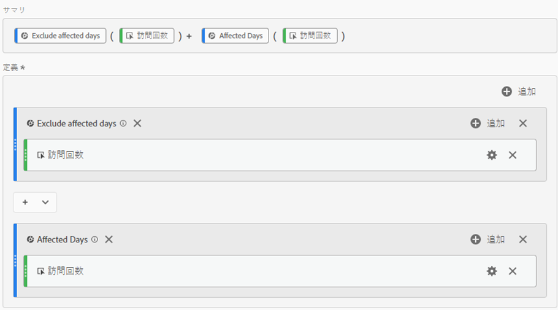
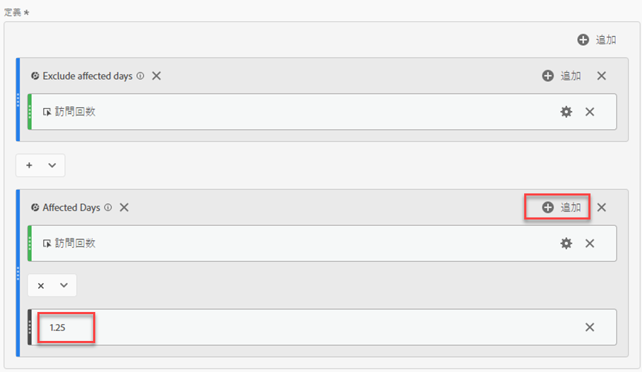
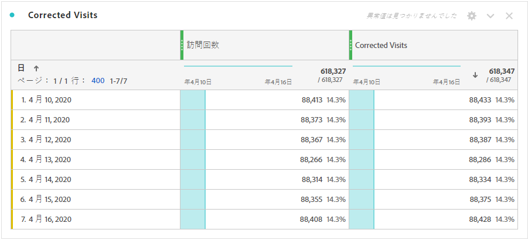
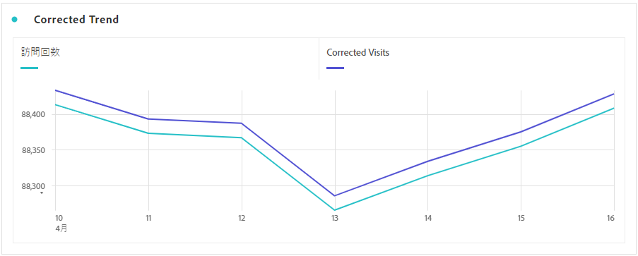

# イベントの影響を受けたデータの取得

イベント](overview.md)の影響を受けたデータ[がある場合、計算指標を使用して、イベント期間中の予測値を抽出できます。 例えば、25%のデータ低下を引き起こすイベントがあった場合、それを計算指標の乗数として使用できます。

これらの手順は、セグメント化と日付比較の両方の観点から、イベントの影響を理解する場合に最も効果的です。 イベントの影響を受けた日付を[前の範囲](compare-dates.md)と[分析](segments.md)の特定の日付を除外してから、このページに移動してください。

>[!NOTE]
>
>このアプローチは、特定の入力と日付範囲のセットに基づく予測です。 すべての使用事例やデータスライスに対する包括的なソリューションとはなりません。 さらに、この方法では、計算元として、影響を受ける日付範囲に少なくとも1つのヒットが含まれている必要があります。

影響を受ける期間の予測計算指標を作成するには：

1. 「影響を受ける日」と「影響を受ける日を除外する」の2つのセグメントを作成します。詳しくは、[分析](segments.md)内の特定の日付を除外するを参照してください。
2. **[!UICONTROL コンポーネント]** > **[!UICONTROL 計算指標]**&#x200B;に移動します。
3. 「**[!UICONTROL 追加]**」をクリックします。
4. 上記のセグメントの両方を定義キャンバスにドラッグします。 演算子を`+`に変更して合計します。
5. 両方追加のセグメント内の目的の指標。 例えば、「訪問回数」指標を使用できます。

   

6. 「影響を受ける日」コンテナの右上にある追加&#x200B;****&#x200B;をクリックし、「**[!UICONTROL 静的な数値]**」をクリックします。 「[イベントの影響を受ける日付と前の範囲](compare-dates.md)を比較」の説明に従い、静的な数値をデータのオフセット率に設定します。 この例では、オフセットは25%(1.25)です。

   

7. トレンドのフリーフォームテーブルに「修正済み」指標を並べて適用します。 イベント外のすべての日は、その標準の指標数を反映しますが、影響を受けるすべての日は、乗数のオフセットを使用します。

   

8. 線のビジュアライゼーションにデータを表示して、修正した指標の効果を確認します。

   
