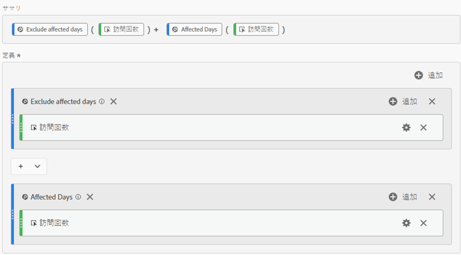
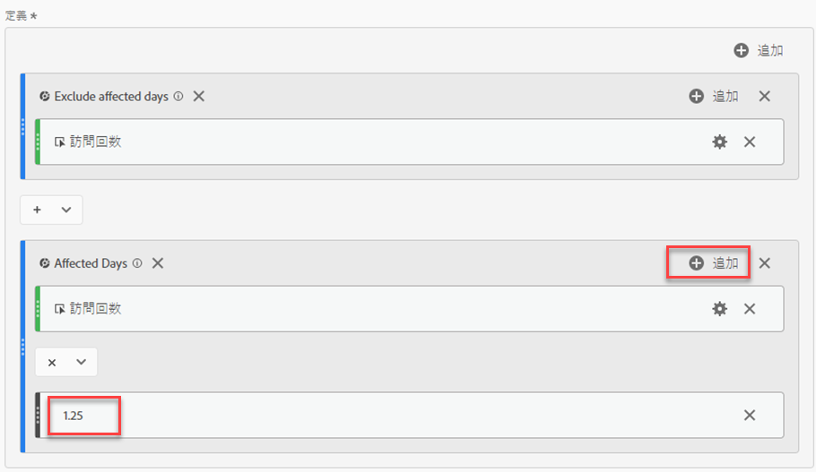
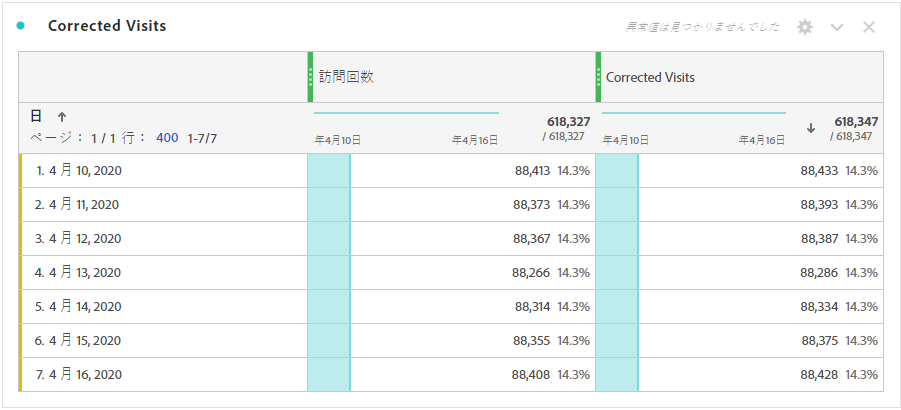
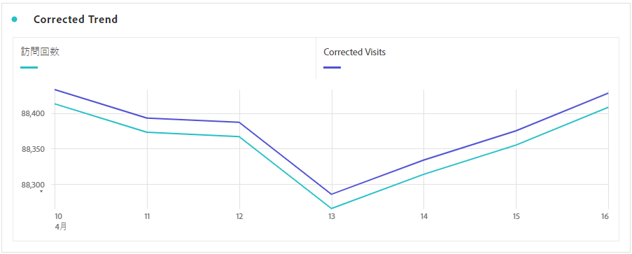

# イベントの影響を受けたデータの取得

イベントの影響を受けるデータ [がある場合は、計算指標を使用して、イベント期間中の推定値を導き出すことができます。 ](overview.md)例えば、データが25%減少したイベントがある場合、それを計算指標の乗数として使用できます。

これらのステップは、セグメンテーションと日付の比較の両方の観点から、イベントの影響を把握する場合に最も効果的です。 このページをフォローする前に、[ イベントの影響を受ける日付を以前の範囲](compare-dates.md)と[分析](segments.md)で特定の日付を除外するに従ってください。

>[!NOTE]
>
>このアプローチは、特定の入力セットと日付範囲にもとづく推定値です。 あらゆるユースケースやデータのスライスに対応する包括的なソリューションではありません。 さらに、このアプローチでは、影響を受ける日付範囲の計算に1回以上のヒットが必要です。

影響を受ける期間の推定計算指標を作成するには：

1. 「[分析で特定の日付を除外](segments.md)」の概要に従って、「影響を受ける日」と「影響を受ける日を除外」の2つのセグメントを作成します。
2. **[!UICONTROL コンポーネント]** > **[!UICONTROL 計算指標]**&#x200B;に移動します。
3. 「**[!UICONTROL 追加]**」をクリックします。
4. 上記の両方のセグメントを定義キャンバスにドラッグします。 それらの間の演算子を`+`に変更して合計します。
5. 両方のセグメント内で目的の指標を追加します。 例えば、「訪問回数」指標を使用できます。

   

6. 「影響を受ける日数」コンテナの右上にある「**[!UICONTROL 追加]**」をクリックし、**[!UICONTROL 静的な数値]**&#x200B;をクリックします。 「[ イベントの影響を受ける日付を以前の範囲](compare-dates.md)と比較する」の概要に従って、データをオフセットする割合に静的な数値を設定します。 この例では、オフセットは25%、つまり1.25です。

   

7. トレンドのフリーフォームテーブルに「修正済み」指標を並べて適用します。 イベント外のすべての日は通常の指標カウントを反映し、影響を受けるすべての日は乗数オフセットを使用します。

   

8. 修正した指標の効果を確認するには、データを行のビジュアライゼーションで表示します。

   
