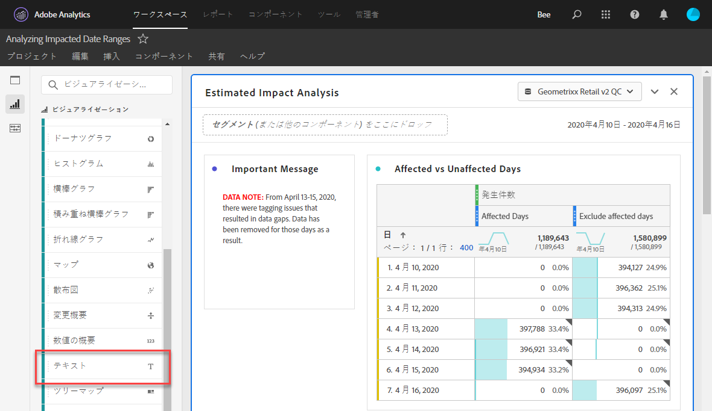
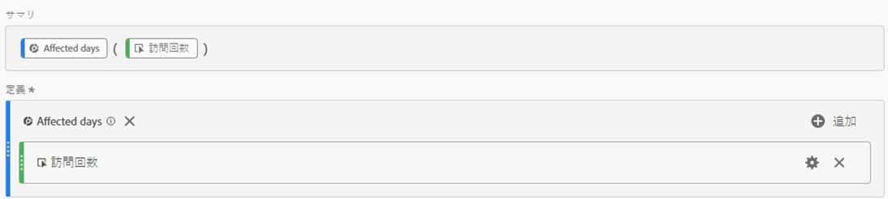
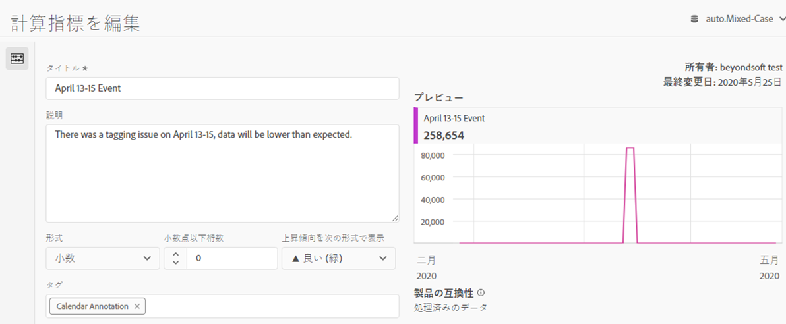
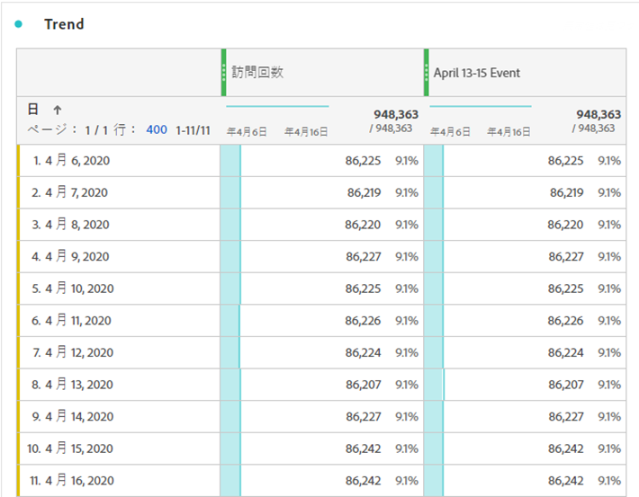
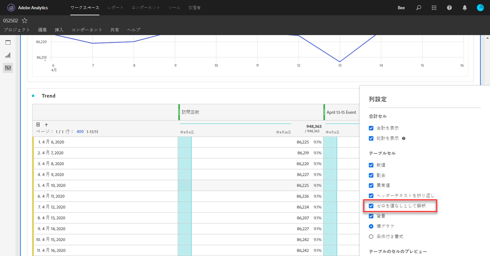
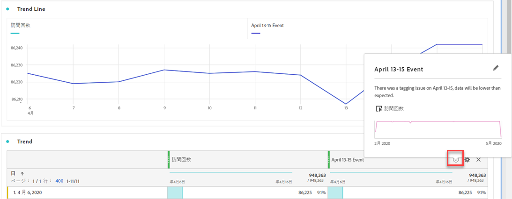
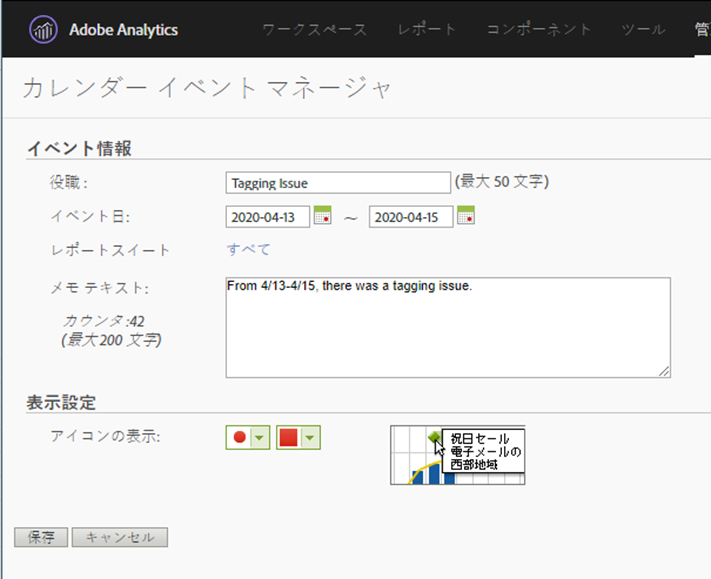

# イベントへの影響をユーザーに伝える

イベント](overview.md)の影響を受けたデータ[がある場合は、そのイベントを組織内のユーザーに伝えることが重要です。

* 一貫性を保つために、通信で使用できる一般的な免責事項を作成する
* イベント中およびその後も、Analyticsのユーザーと主な関係者に継続的に連絡を取る
* 次の月や年など、以降のマイルストーンに対してカレンダーリマインダーを設定します。 将来的には、このコミュニケーションにより、前月比または前年比のレポートでの影響をユーザーに示すことができます。

Adobe Analyticsでは、以下の節で、組織内のユーザーと連絡を取る様々な方法を示します。 また、Adobe Analytics以外の他の方法（電子メールなど）を使用して、ユーザーと通信することもできます。

## パネルまたはビジュアライゼーションの説明を通じて通信する

組織内のユーザー間でWorkspaceプロジェクトを共有している場合、パネルまたはビジュアライゼーションの説明を通じて、イベントの影響を伝えることができます。 パネルまたはビジュアライゼーションのヘッダーを右クリックし、「**[!UICONTROL 説明を編集]**」を選択します。

## テキストのビジュアライゼーションを通じた通信

また、専用のテキストビジュアライゼーションを通じて、イベントの影響を伝えることもできます。 解析ユーザーガイドの[テキストのビジュアライゼーション](/help/analyze/analysis-workspace/visualizations/text.md)を参照してください。

## Workspaceのトレンドに対する追加カスタムカレンダーイベント

Workspaceの任意のトレンドビジュアライゼーションに対して、影響を受けた日付範囲を表すシリーズを追加できます。

1. [分析](segments.md)内の特定の日付を除外するに従って、「影響を受ける日」セグメントを使用して計算指標を作成します。
1. 計算指標キャンバス追加に表示する指標です。

   

1. ユ追加ーザーに影響を知らせるタイトルと説明です。 必要に応じて、この指標にカレンダー注釈のタグを付けることもできます。

   

1. フリーフォームテーブルに、「日」ディメンションを追加します。 「追加訪問回数」と計算指標を列として並べて表示します。

   

1. 計算指標の列設定の歯車アイコンをクリックし、**[!UICONTROL 「ゼロを値]**&#x200B;なしとして解釈」を有効にします。

   

1. 線追加のビジュアライゼーション。 影響を受ける日は、異なる色で表されます。 詳細については、計算指標の「情報」アイコンをクリックすることもできます。

   

## Reports &amp; Analyticsでのカレンダーイベントの使用

Reports &amp; Analyticsを使用する場合、[カレンダーイベント](/help/components/t-calendar-event.md)を使用して、任意のトレンドレポートで影響を受ける日を強調表示できます。 この方法はAnalysis Workspaceには適用されない。

1. **[!UICONTROL コンポーネント]** > **[!UICONTROL カレンダーイベント]**&#x200B;に移動します。
2. 目的のタイトル、日付範囲、メモのテキストを入力します。
3. 「**[!UICONTROL 保存]**」をクリックします。

