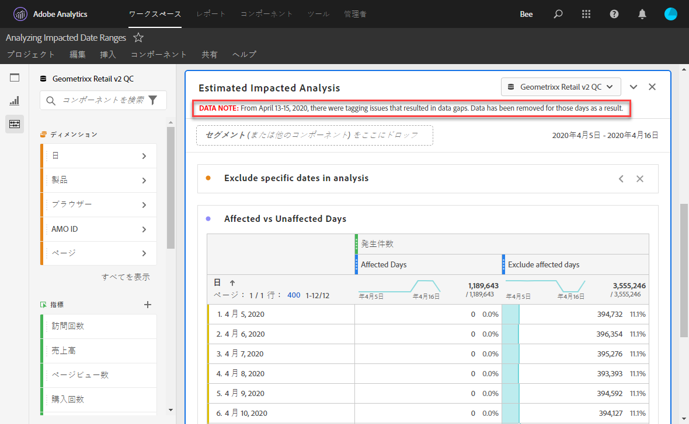
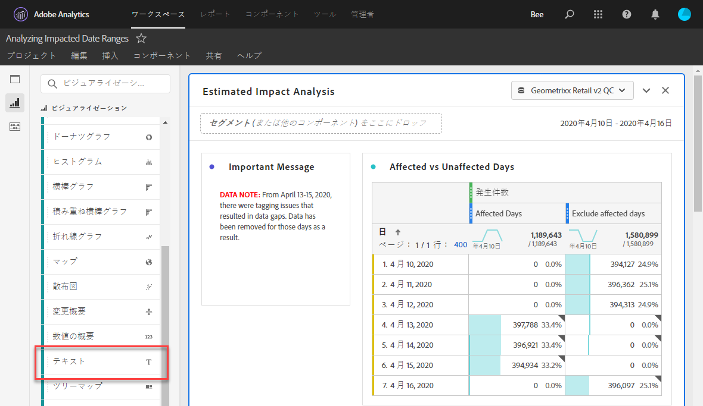
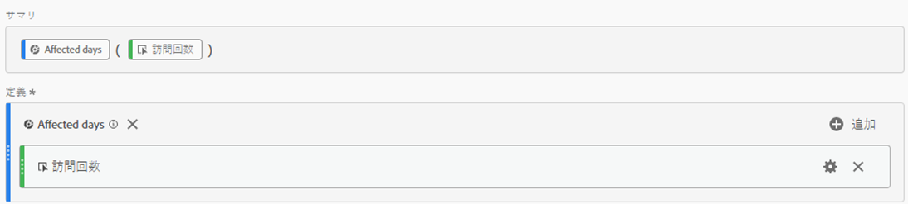
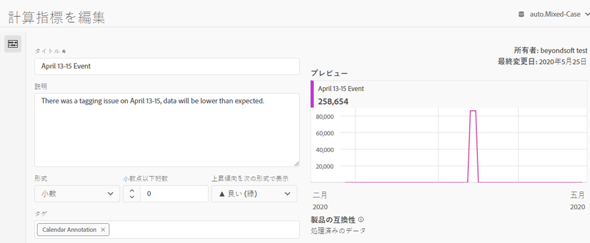
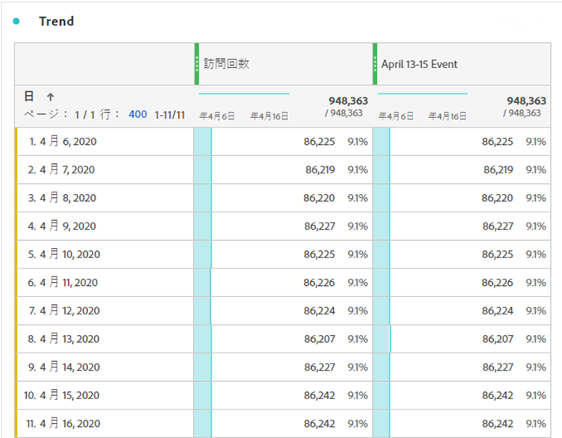
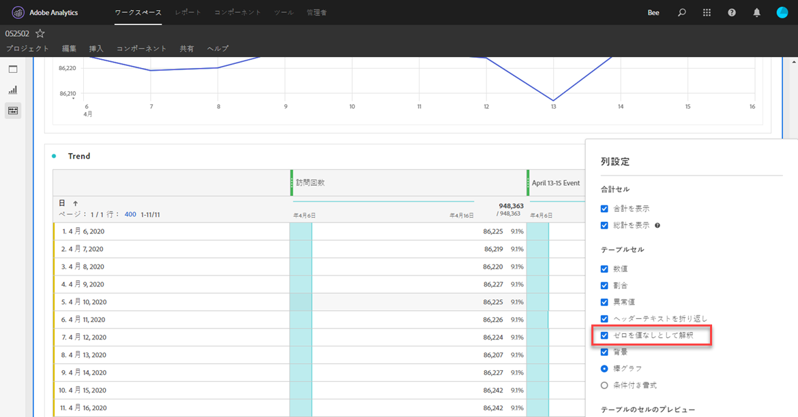
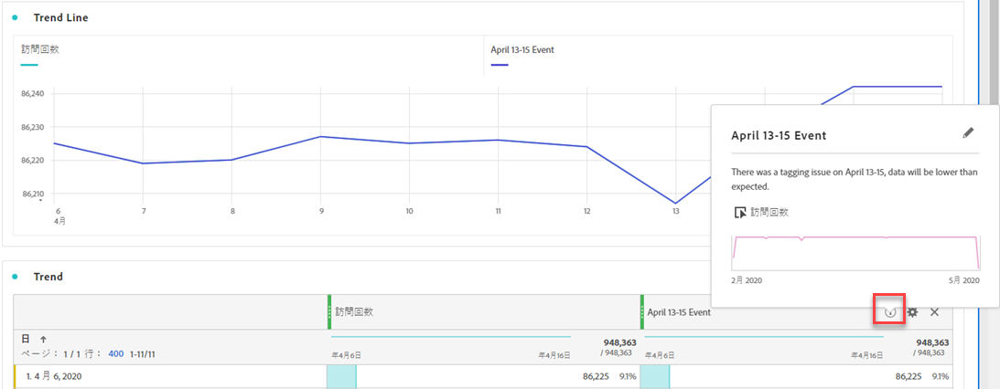

# イベントの影響をユーザーに伝える

イベントの影響を受けるデータ [がある場合は、そのイベントを組織内のユーザーに伝えることが重要です。](overview.md)

* 一貫性を保つためのコミュニケーションで使用できる、共通の免責事項を作成する
* イベント中およびイベント後に、Adobe Analyticsのユーザーと主要な関係者に継続的なコミュニケーションを提供したい
* 次の月や年など、その後のマイルストーンのカレンダーのリマインダーを配置します。 今後のコミュニケーションにより、レポートを閲覧するユーザーに、前月比または前年比レポートでの影響を思い出してもらうことができます。

Adobe Analyticsでは、組織内のユーザーとコミュニケーションを取るための様々な方法を以下のセクションで説明します。 電子メールなど、Adobe Analytics以外の方法を使用して、オーディエンスとコミュニケーションを取ることもできます。

## パネルまたはビジュアライゼーションの説明を通じたコミュニケーション

Workspace プロジェクトを組織内のユーザー間で共有している場合は、パネルまたはビジュアライゼーションの説明を使用して、イベントの影響を伝えることができます。 パネルまたはビジュアライゼーションヘッダーを右クリックし、**[!UICONTROL 説明を編集]**&#x200B;を選択します。

## テキストビジュアライゼーションを通じたコミュニケーション

専用のテキストビジュアライゼーションを通じて、イベントの影響を伝えることもできます。 Analyze ユーザーガイドの[ テキストビジュアライゼーション ](/help/analyze/analysis-workspace/visualizations/text.md)を参照してください。

## Workspaceのトレンドにカスタムカレンダーイベントを追加する

Workspaceでトレンドのビジュアライゼーションを作成する場合は、影響を受ける日付範囲を表すシリーズを追加できます。

1. 次の「影響を受ける日数」セグメントを使用して計算指標を作成します。[分析で特定の日付を除外](segments.md)。
1. 目的の指標を計算指標キャンバスに追加します。

   

1. ユーザーに影響を通知するタイトルと説明を追加します。 必要に応じて、この指標をカレンダー注釈としてタグ付けすることもできます。

   

1. フリーフォームテーブルに「日」ディメンションを追加します。 「訪問数」と計算指標を列として並べて追加します。

   

1. 計算指標の列設定の歯車アイコンをクリックし、**[!UICONTROL ゼロを値なしとして解釈]**&#x200B;を有効にします。

   

1. 線のビジュアライゼーションを追加します。 影響を受ける日は異なる色で表されます。 ユーザーは、計算指標の「情報」アイコンをクリックして詳細を確認することもできます。

   

