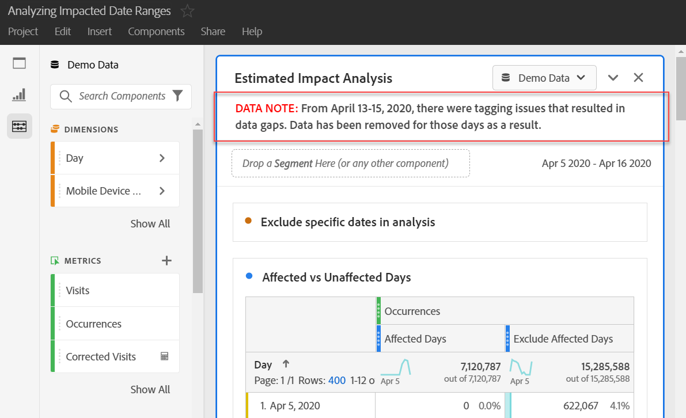

# イベントへの影響のユーザーへの伝達

データがある場合 [イベントの影響を受ける](overview.md)の場合は、そのイベントを組織内のユーザーに伝えることが重要です。

* 一貫性を保つために通信で使用できる一般的な免責事項を作成する
* イベント中およびイベント後に、Analytics ユーザーおよび主要関係者に継続的なコミュニケーションを提供する
* 次の月や年など、後続のマイルストーンに対してカレンダーリマインダーを配置します。 今後のこのコミュニケーションにより、前月比または前年比のレポートでの影響をレポート表示ユーザーに示すことができます。

Adobe Analytics内の以下の節では、組織内のユーザーとコミュニケーションを取る様々な方法を示します。 Adobe Analytics以外の他の方法（電子メールなど）を使用して、ユーザーとコミュニケーションを取ることもできます。

## パネルまたはビジュアライゼーションの説明を通じてコミュニケーションを取る

組織内のユーザー間で Workspace プロジェクトを共有している場合は、パネルやビジュアライゼーションの説明を通じて、イベントの影響を伝えることができます。 パネルまたはビジュアライゼーションのヘッダーを右クリックし、「 **[!UICONTROL 説明を編集]**.

## テキストビジュアライゼーションを通じた通信

また、専用のテキストビジュアライゼーションを使用して、イベントの影響を伝えることもできます。 詳しくは、 [テキストのビジュアライゼーション](/help/analyze/analysis-workspace/visualizations/text.md) 」を参照してください。

## Workspace のトレンドへのカスタムカレンダーイベントの追加

Workspace のトレンドビジュアライゼーションについては、影響を受けた日付範囲を表す一連のビジュアライゼーションを追加できます。

1. 次の手順で、「影響を受ける日数」セグメントを含む計算指標を作成します [分析内の特定の日付を除外する](segments.md).
1. 目的の指標を計算指標キャンバスに追加します。

   

1. ユーザーに影響を知らせるタイトルと説明を追加します。 必要に応じて、この指標をカレンダー注釈としてタグ付けすることもできます。

   

1. フリーフォームテーブルで、「日」ディメンションを追加します。 「訪問回数」と計算指標を列として並べて追加します。

   

1. 計算指標の列設定の歯車アイコンをクリックし、を有効にします。 **[!UICONTROL ゼロを値なしとして解釈]**.

   

1. 折れ線グラフのビジュアライゼーションを追加します。 影響を受ける日は異なる色で表されます。 ユーザーは、計算指標の「情報」アイコンをクリックして詳細を表示することもできます。

   

## Reports &amp; Analytics でのカレンダーイベントの使用

Reports &amp; Analytics を使用している場合、 [カレンダーイベント](/help/components/t-calendar-event.md) をクリックして、任意のトレンドレポートの影響を受ける日を強調表示します。 この方法は、Analysis Workspaceには適用されません。

1. に移動します。 **[!UICONTROL コンポーネント]** > **[!UICONTROL すべてのコンポーネント]** > **[!UICONTROL カレンダーイベント]**.
2. 目的のタイトル、日付範囲、メモテキストを入力します。
3. 「**[!UICONTROL 保存]**」をクリックします。

