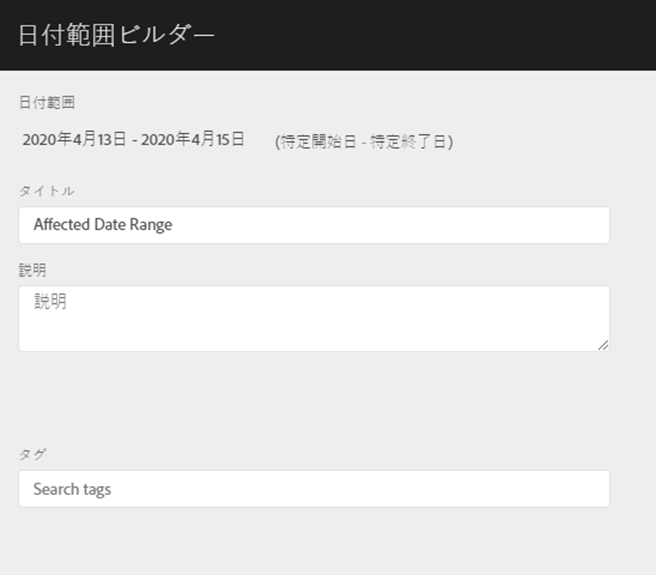
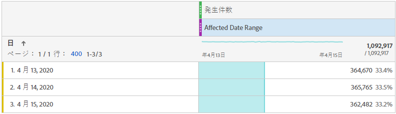
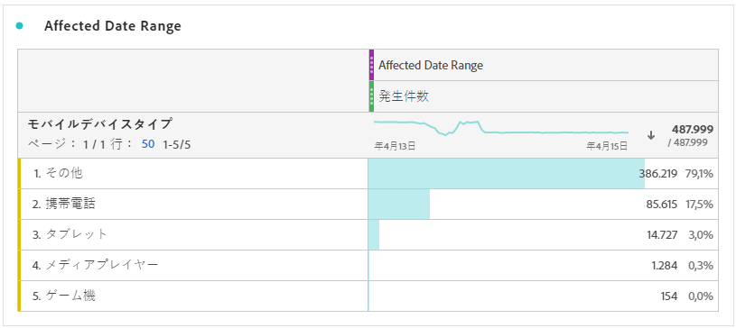
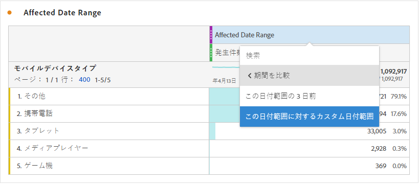
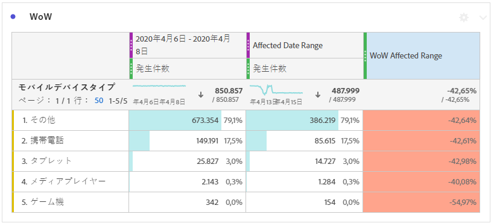
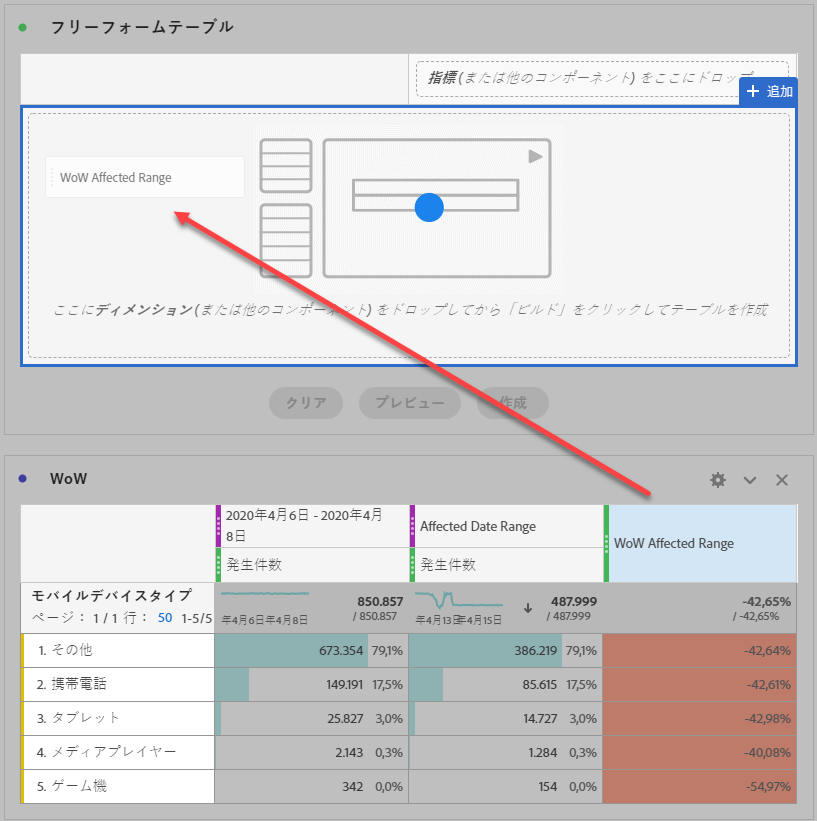
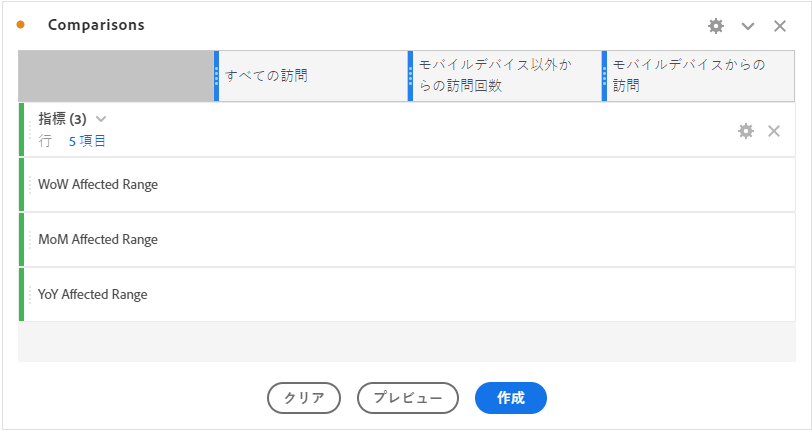
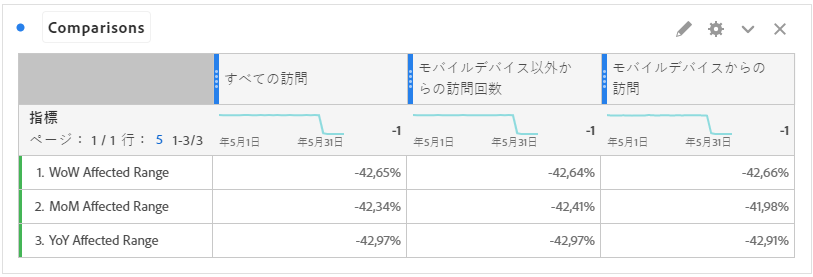

# イベントの影響を受けた日付と前の範囲を比較

イベント](overview.md)の影響を受けたデータ[がある場合は、過去の傾向を見て影響度を測定できます。 この比較は、イベントがデータに与える影響の大きさを理解するのに役立ちます。したがって、データを除外するか、レポートにメモを追加するか、無視するかを決定できます。

## イベントを含む日付範囲を作成します

イベントを含む日付範囲を作成して、そのイベントの影響を調べます。

1. **[!UICONTROL コンポーネント]** > **[!UICONTROL 日付範囲]**&#x200B;に移動します。
2. 「**[!UICONTROL 追加]**」をクリックします。
3. イベントが発生した日付範囲を選択します。 「**[!UICONTROL 保存]**」をクリックします。

   

## 表示イベント日と類似の前の範囲を並べて表示

フリーフォームテーブルのビジュアライゼーションを使用して、イベントの日付範囲間の指標を、類似した前の日付範囲と比較できます。

1. Workspaceプロジェクトを開き、フリーフォームテーブルに「日」ディメンションを追加します。 「回数」など、最近作成した日付範囲を指標に適用します。

   

2. 日付範囲を右クリックし、**[!UICONTROL 期間列]**&#x200B;追加 > **[!UICONTROL カスタム日付範囲をこの日付範囲]**&#x200B;にクリックします。
   * 前週比を使用する場合は、イベントから7日間を引いた値を選択します。 イベントとこの日付範囲の間の曜日が揃っていることを確認します。
   * 前月比の場合は、先月のイベントの範囲を選択します。 また、曜日を揃える場合は、イベントから28日を引いた値を選択することもできます。
   * 前年比の場合は、昨年のイベントの範囲を選択します。
3. 目的の日付範囲を選択すると、その日付範囲はフリーフォームテーブルに追加されます。 右クリックして、比較する数だけ日付範囲を追加できます。

   

## イベントと類似の前の範囲との差異率を計算

フリーフォームテーブルのビジュアライゼーションを使用して、イベントの日付範囲と類似の前の日付範囲のディメンション項目を比較します。 次の手順で、1週間を超える週の例を示します。

1. Workspaceプロジェクトを開き、フリーフォームテーブルに&#x200B;**非時間ディメンション**&#x200B;を追加します。 例えば、「モバイルデバイスタイプ」ディメンションを使用できます。 「回数」など、最近作成した日付範囲を指標に適用します。

   

2. 日付範囲を右クリックし、**[!UICONTROL 期間]**&#x200B;を比較して&#x200B;**[!UICONTROL カスタム日付範囲をこの日付範囲]**&#x200B;に比較します。 イベントから7日を引いた値を選択します。 イベントとこの日付範囲の間の曜日が揃っていることを確認します。

   

3. 結果の「変化率」指標の名前を、「影響を受ける範囲」など、より具体的な値に変更します。 情報アイコンをクリックし、編集鉛筆をクリックして指標名を編集します。

   

4. 前月と前年との比較で手順3と4を繰り返します。 この操作は、同じテーブルまたは別のテーブルで実行できます。

## 比較日付範囲を行として並べて分析する

上記の割合の変化をさらに分析する場合は、行に変換できます。

1. フリ追加ーフォームテーブルのビジュアライゼーションを作成し、表ビルダーを有効にします。 この操作により、パーセント値の変化指標を希望の順序に並べることができます。
2. `Ctrl`(Windows)または`Cmd`(Mac)を押しながら、3%の変更指標をテーブルの行に1つずつドラッグします。

   

3. 「追加すべての訪問」セグメントを表の列に追加し、その他の任意の目的のセグメントに追加します。

   

4. 「**[!UICONTROL 作成]**」をクリックします。結果の表から、対象となる週、月、年の範囲に対して、目的のセグメント全体で表示できます。

   
