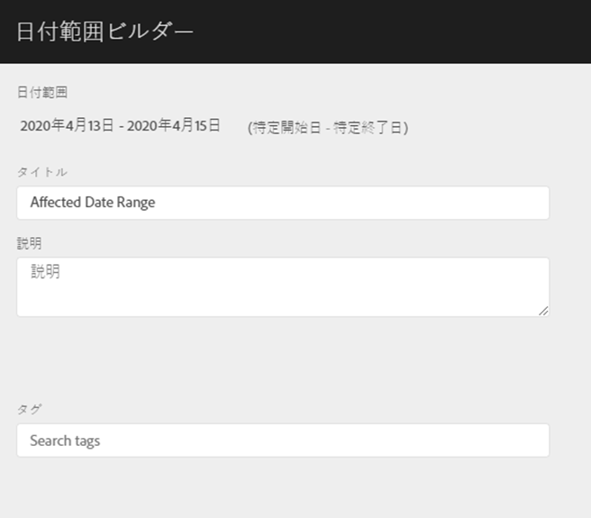
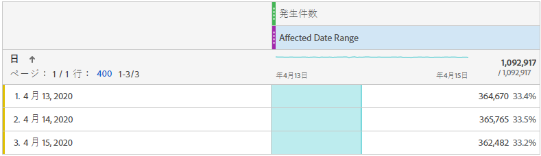
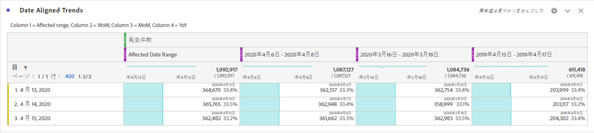
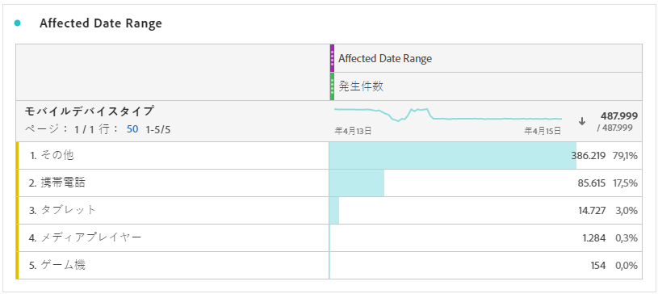
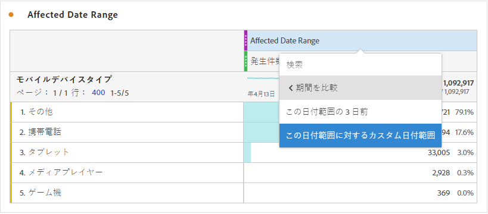
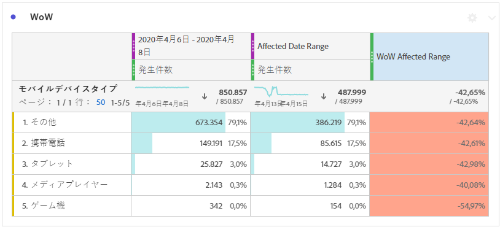
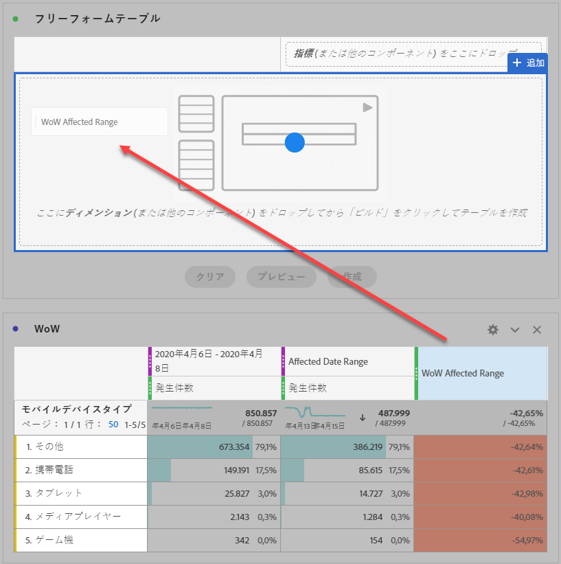
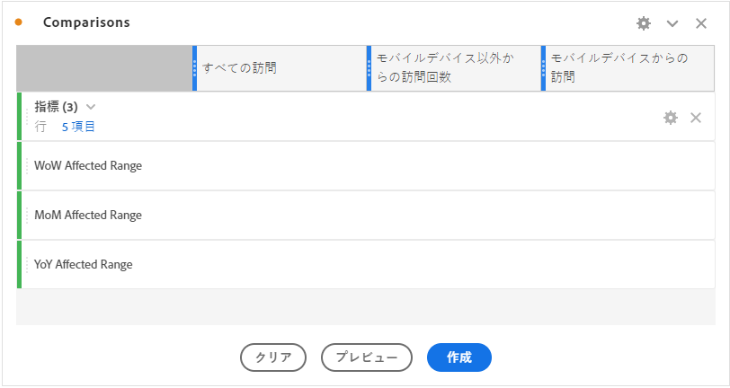
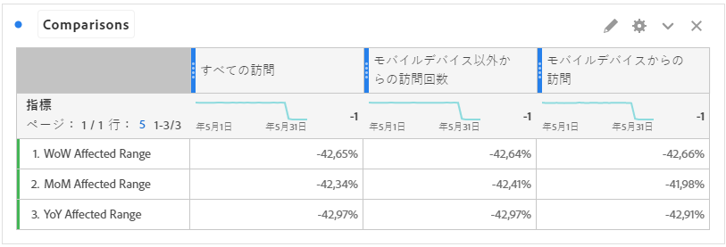

# イベントの影響を受ける日付と以前の範囲の比較

イベントの影響を受けるデータ [がある場合は、過去の傾向を確認して、その影響を測定できます。 ](overview.md)この比較は、イベントがデータにどの程度影響するかを把握するのに役立ちます。これにより、データを除外するか、レポートにメモを追加するか、無視するかを決定できます。

## イベントを含む日付範囲を作成します

イベントを含む日付範囲を作成して、そのイベントの影響を調査します。

1. **[!UICONTROL コンポーネント]** > **[!UICONTROL 日付範囲]**&#x200B;に移動します。
2. 「**[!UICONTROL 追加]**」をクリックします。
3. イベントが発生した日付範囲を選択します。 「**[!UICONTROL 保存]**」をクリックします。

   

## イベントの日付と類似する以前の範囲を並べて表示できます

フリーフォームテーブルのビジュアライゼーションを使用すると、イベントの日付範囲と類似する以前の日付範囲との間で任意の指標を比較できます。

1. Workspace プロジェクトを開き、フリーフォームテーブルに「日」ディメンションを追加します。 「発生回数」など、指標に積み重ねて最近作成した日付範囲を適用します。

   

2. 日付範囲を右クリックし、**[!UICONTROL 期間カラムを追加]** > **[!UICONTROL この日付範囲にカスタム日付範囲]**&#x200B;をクリックします。
   * 週ごとの比較の場合は、イベントの範囲から7日間を差し引いた値を選択します。 イベントとこの日付範囲の間の週の日数が揃っていることを確認します。
   * 月間比較の場合は、先月のイベントの範囲を選択します。 また、曜日を調整したい場合は、イベントの範囲から28日を差し引いた値を選択することもできます。
   * 前年比の比較では、昨年のイベントの範囲を選択します。
3. 必要な日付範囲を選択すると、フリーフォームテーブルに追加されます。 右クリックして、比較したい日付範囲を追加できます。

   

## イベントと類似の以前の範囲の差分率を計算します

フリーフォームテーブルのビジュアライゼーションを使用して、イベントの日付範囲と類似の以前の日付範囲の間のディメンション項目を比較します。 これらのステップは、週単位の例を示しています。

1. Workspace プロジェクトを開き、**非時間ディメンション**&#x200B;をフリーフォームテーブルに追加します。 例えば、「モバイルデバイスタイプ」ディメンションを使用できます。 「発生回数」など、指標に積み重ねられた最近作成された日付範囲を適用します。

   

2. 日付範囲を右クリックし、**[!UICONTROL 期間の比較]** > **[!UICONTROL カスタム日付範囲をこの日付範囲]**&#x200B;をクリックします。 イベントの範囲から7日間を引いた値を選択します。 イベントとこの日付範囲の間の週の日数が揃っていることを確認します。

   

3. 結果の「変更率」指標の名前を、「影響を受ける範囲」など、より具体的な名前に変更します。 情報アイコンをクリックし、「鉛筆を編集」をクリックしてメトリック名を編集します。

   

4. 前月比および前年比の比較について、手順3と4を繰り返します。 この操作は、同じテーブルまたは別のテーブルで実行できます。

## 比較日付範囲を行として並べて分析

上記のパーセント変化をさらに分析する場合は、それらを行に変換できます。

1. フリーフォームテーブルビジュアライゼーションを追加し、テーブルビルダーを有効にします。 このアクションを使用すると、変更率の指標を目的の順序で配置できます。
2. `Ctrl` （Windows）または`Cmd` （Mac）を押しながら、3%変更指標をテーブルの行に1つずつドラッグします。

   

3. 「すべての訪問」セグメントをテーブルの列と、その他の必要なセグメントに追加します。

   

4. 「**[!UICONTROL 作成]**」をクリックします。 結果のテーブルから、任意のセグメントで影響を受ける範囲と前の週、月、年を表示できます。

   
