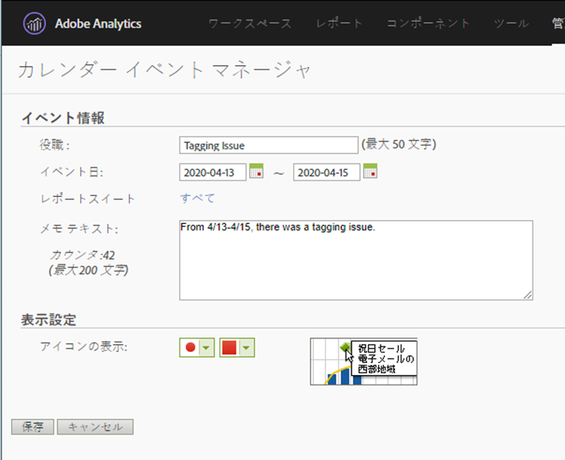

# ユーザーへの影響の伝達

イベントの影響を受け [たデータがある場合](../event-impacted.md)、組織内のユーザーにそのイベントを伝えることが重要です。 次の節では、組織内のユーザーとのコミュニケーション方法を示します。

## パネルまたはビジュアライゼーションの説明を通じて通信する

Workspaceプロジェクトを組織内のユーザー間で共有している場合、パネルやビジュアライゼーションの説明を通じてイベントの影響を伝えることができます。 パネルまたはビジュアライゼーションヘッダーを右クリックし、を選択しま **[!UICONTROL Edit description]**&#x200B;す。

## テキストのビジュアライゼーションを通じた通信

また、専用のテキストビジュアライゼーションを通じて、イベントの影響を伝えることもできます。 See [Text visualizations](/help/analyze/analysis-workspace/visualizations/text.md) in the Analyze user guide.

## Reports &amp; Analyticsでのカレンダーイベントの使用

Reports &amp; Analyticsを使用する場合、カレンダーイベントを使用して  、任意のトレンドレポートで影響を受ける日を強調表示できます。 このメソッドは、Workspaceには適用されません。分析ワークスペース

1. /に移動 **[!UICONTROL Components]** します **[!UICONTROL Calendar events]**。
2. 目的のタイトル、日付範囲、メモのテキストを入力します。
3. クリック **[!UICONTROL Save]**.

