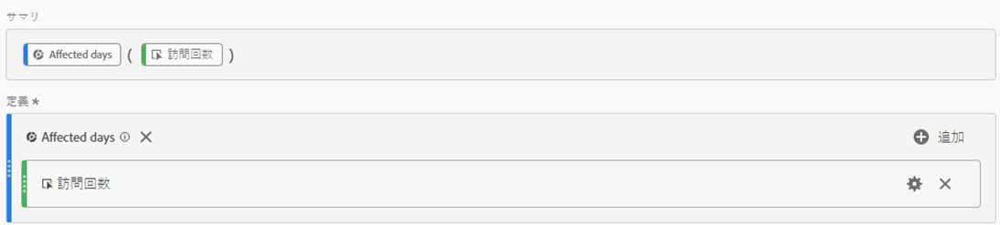
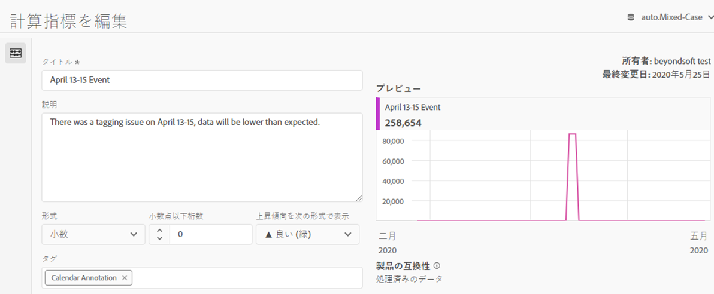
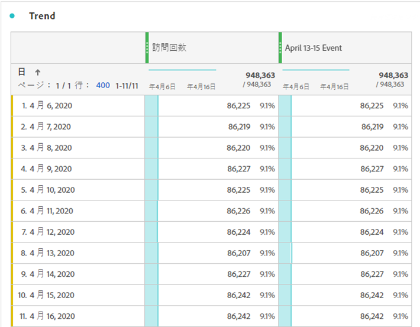
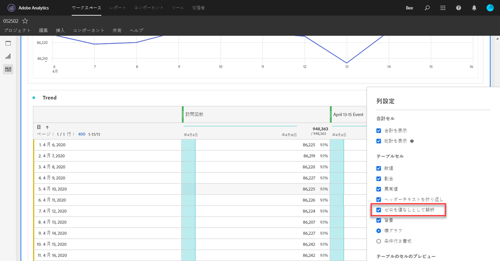
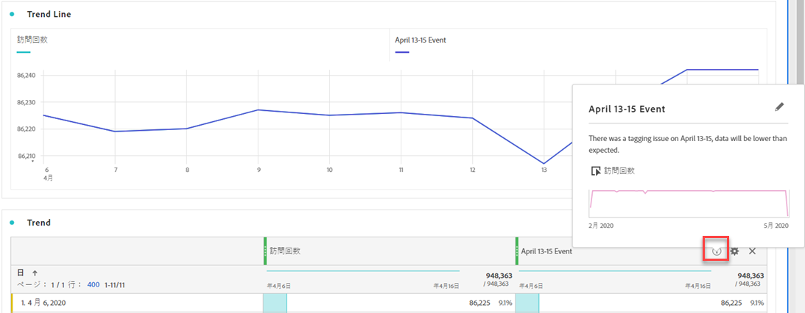

# ユーザーへの影響の伝達

イベントの影響を受け [たデータがある場合](../event-impacted.md)、組織内のユーザーにそのイベントを伝えることが重要です。

* 一貫性を保つために通信で使用できる一般的な免責事項を作成する
* イベント中およびその後、Analyticsユーザーと主要関係者に継続的な連絡を提供
* 次の月や年など、以降のマイルストーンに対するカレンダーリマインダーを配置します。 今後、このコミュニケーションを行うと、月々レポートや年次レポートでの影響をユーザーに通知するのに役立ちます。

Adobe Analytics内で、以下の節では、組織内のユーザーと通信する様々な方法を示します。 電子メールなど、Adobe Analytics以外の他の方法を使用して、ユーザーとの通信を行うこともできます。

## パネルまたはビジュアライゼーションの説明を通じて通信する

Workspaceプロジェクトを組織内のユーザー間で共有している場合、パネルやビジュアライゼーションの説明を通じてイベントの影響を伝えることができます。 パネルまたはビジュアライゼーションヘッダーを右クリックし、を選択しま **[!UICONTROL Edit description]**&#x200B;す。

## テキストのビジュアライゼーションを通じた通信

また、専用のテキストビジュアライゼーションを通じて、イベントの影響を伝えることもできます。 See [Text visualizations](/help/analyze/analysis-workspace/visualizations/text.md) in the Analyze user guide.

## Workspaceのトレン追加ドに対するカスタムカレンダーイベント

Workspaceの任意のトレンドビジュアライゼーションに対して、影響を受けた日付範囲を表すシリーズを追加できます。

1. 「影響を受ける日」セグメントを使用して計算指標を作成します。作成するには、「 [分析内の特定の日付を除外](/help/components/c-segmentation/use-cases/exclude-date-range.md)」
1. 計追加算指標キャンバスに対する目的の指標。

   

1. ユー追加ザーに影響を知らせるタイトルと説明。 必要に応じて、この指標にカレンダー注釈のタグを付けることもできます。

   

1. フリーフォームテーブルで、「日」ディメンションを追加します。 「訪追加問回数」と、列を並べて表示した計算指標。

   

1. 計算指標の列設定の歯車アイコンをクリックし、有効にしま **[!UICONTROL Interpret zero as no value]**&#x200B;す。

   

1. 線のビ追加ジュアライゼーション。 影響を受ける日は、異なる色で表示されます。 詳細については、計算指標の「情報」アイコンをクリックすることもできます。

   

## Reports &amp; Analyticsでのカレンダーイベントの使用

Reports &amp; Analyticsを使用する場合、カレンダーイベントを使用して  、任意のトレンドレポートで影響を受ける日を強調表示できます。 このメソッドは、Workspaceには適用されません。分析ワークスペース

1. /に移動 **[!UICONTROL Components]** します **[!UICONTROL Calendar events]**。
2. 目的のタイトル、日付範囲、メモのテキストを入力します。
3. クリック **[!UICONTROL Save]**.

