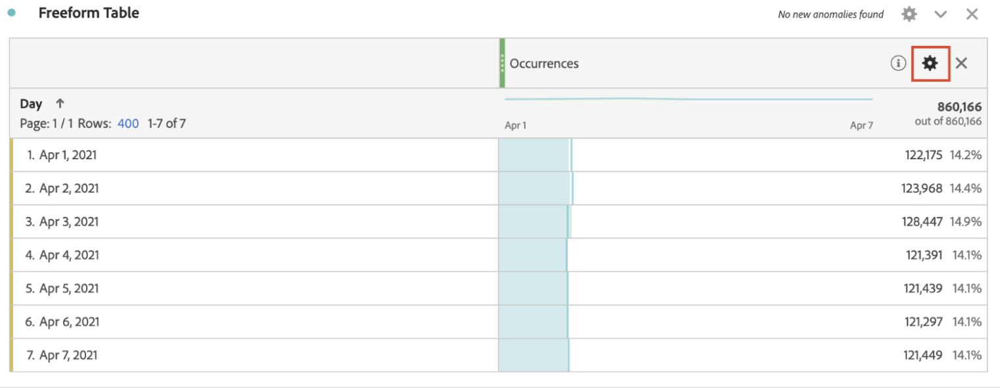

# インテリジェントデータスムージング

まれに、一部の要因がデータの品質に影響を及ぼすことがあります。 ボットトラフィック、実装の変更、またはサービスの中断は、すべて収集されたデータの整合性に影響を与える可能性があります。 また、イベントがデータの完全性にどのような影響を与えたかに関する分析も複雑になります。

インテリジェントデータスムージングは、[Analyticsラボ](/help/analyze/tech-previews/overview.md)のプロトタイプで、過去のトレンドを分析し、影響を受ける期間内の指標の値を予測することで、この表示を完了するのに役立ちます。 プロトタイプは、高度な機械学習アルゴリズムを適用して、分析対象期間の指標の期待値をプロットします。

## インテリジェントデータスムージングの実行

1. Adobe Analytics研究所に移動します。
   
1. インテリジェントデータスムージングプロトタイプを起動します。
   
1. フリ追加ーフォームテーブルに対して分析する必要がある指標です。 プロトタイプは1日の精度でのみ機能するので、テーブルのディメンションがDayであることを確認します。
   
1. イベントのウィンドウより広い日付範囲を選択しますが、イベントが含まれていることを確認してください。
   
1. フリーフォームテーブルの指標の歯車アイコンをクリックします。
   
1. 「[!UICONTROL データ設定]」で、「[!UICONTROL データのスムージング]」オプションを選択します。
   
1. イベントに対応する日付/日付範囲を選択し、「[!UICONTROL 適用]」をクリックします。
データスムージングのデータ範囲が、パネルで選択した日付範囲のサブセットであることを確認します。 表およびグラフ内の指標が、予測された値に置き換えられます。
   