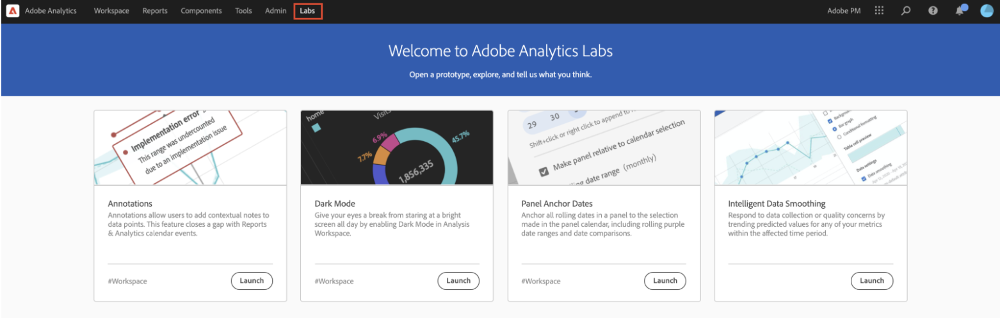

# インテリジェントデータスムージング

まれに、一部の要因がデータの品質に影響を与える可能性があります。 ボットトラフィック、実装の変更、またはサービスの中断は、収集されたデータの整合性に影響を与える可能性があります。 また、イベントがデータの完全性に与える影響についての分析も複雑になります。

インテリジェントデータスムージングは、 [Analytics Labs](/help/analyze/labs.md) これは、過去のトレンドを分析して、影響を受ける期間内の指標の値を予測することで、このビューを完了するのに役立ちます。 プロトタイプは高度な機械学習アルゴリズムを適用し、分析対象の期間における指標の期待値をグラフ表示します。

## インテリジェントデータスムージングの実行

1. Adobe Analytics Labs に移動します。
   
1. インテリジェントデータスムージングプロトタイプを起動します。
   
1. 分析が必要な指標をフリーフォームテーブルに追加します。 プロトタイプは 1 日単位の精度でのみ機能するので、テーブルのディメンションが「日」であることを確認します。
   
1. イベントのウィンドウより広い日付範囲を選択しますが、イベントが含まれていることを確認します。
   
1. フリーフォームテーブルで、指標の歯車アイコンをクリックします。
   
1. の下 [!UICONTROL データ設定]を選択し、 [!UICONTROL データのスムージング] オプション。
   
1. イベントに対応する日付/日付範囲を選択し、 [!UICONTROL 適用].
データスムージングのデータ範囲が、パネルで選択した日付範囲のサブセットであることを確認します。 テーブルとグラフの指標が、予測値に置き換えられます。
   
