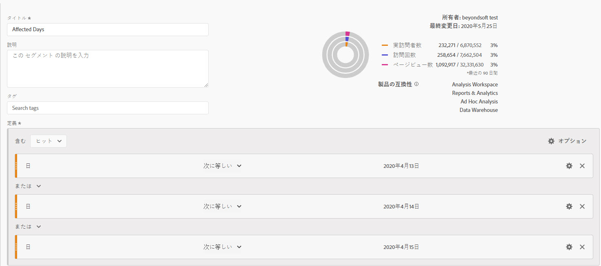
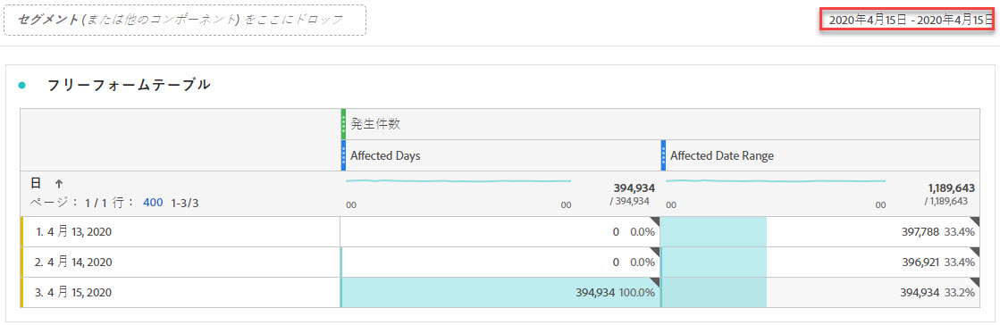
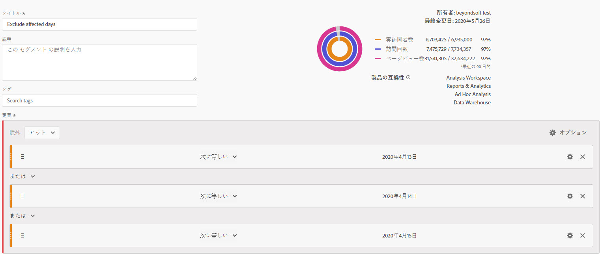
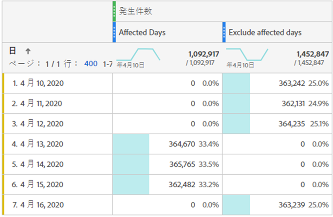
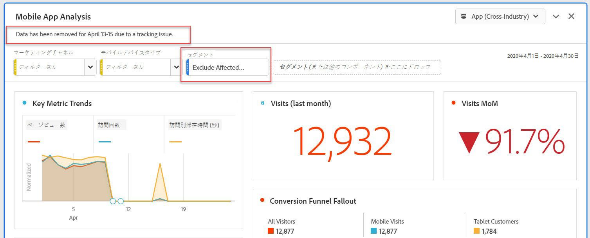
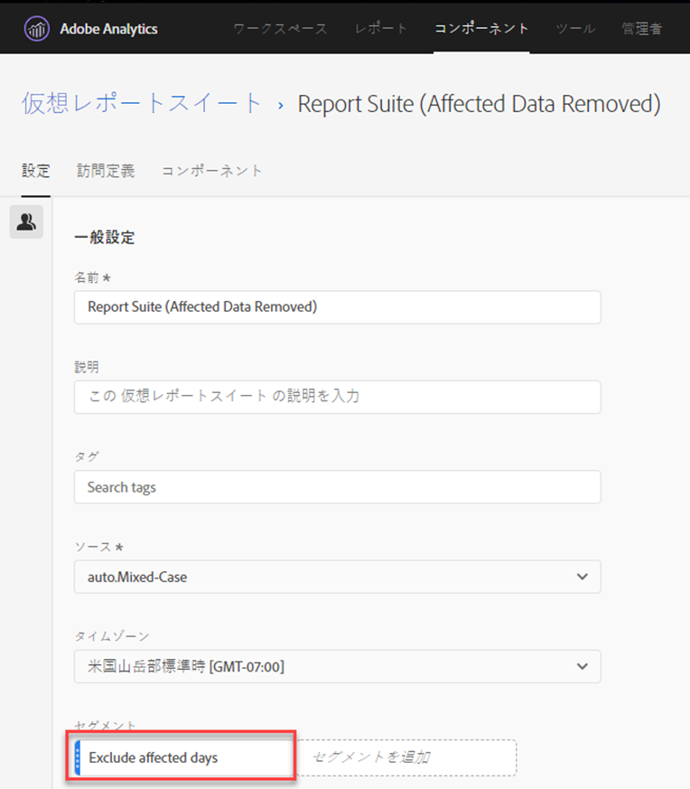

# 分析内の特定の日付を除外する

イベント](overview.md)の影響を受けたデータ[がある場合は、セグメントを使用して、レポートに含めたくない日付範囲を除外できます。 イベントの影響を受ける日付をセグメント化すると、部分的なデータに関する意思決定を行うのを防ぐのに役立ちます。

## 影響を受ける日を分離

影響を受ける日付または日付範囲を分離するセグメントを作成します。 このセグメントは、問題のある日のみに焦点を当てて、影響に関する詳細を確認する場合に役立ちます。

1. **[!UICONTROL コンポーネント]**/**[!UICONTROL セグメント]**&#x200B;に移動し、**[!UICONTROL 追加]**&#x200B;をクリックして、セグメントビルダーを開きます。
2. 「日」ディメンションを定義キャンバスにドラッグし、分離したい日と同じに設定します。
3. レポート内で分離したい日について、上記の手順を繰り返します。

Adobeでは、紫の日付範囲コンポーネントではなく、オレンジ色のディメンションコンポーネントを使用することをお勧めします。 紫の日付範囲コンポーネントを使用すると、プロジェクトのカレンダー範囲が上書きされます。

## 影響を受ける日の除外

影響を受ける日付または日付範囲を除外するセグメントを作成します。 このセグメントは、問題が発生した日を除外して、全体的なレポートへの影響を最小限に抑えたい場合に役立ちます。

1. **[!UICONTROL コンポーネント]**/**[!UICONTROL セグメント]**&#x200B;に移動し、**[!UICONTROL 追加]**&#x200B;をクリックして、セグメントビルダーを開きます。
2. セグメント定義キャンバスの右上にある&#x200B;**[!UICONTROL オプション]**/**[!UICONTROL 除外]**&#x200B;をクリックします。
3. 「日」ディメンションを定義キャンバスにドラッグし、削除する日と同じに設定します。
4. レポートから削除する日ごとに、上記の手順を繰り返します。

## レポートでこれらのセグメントを使用する

除外セグメントを作成した後は、他のセグメントと同様に使用できます。

### トレンドレポートでのセグメントの比較

「影響を受ける日」セグメントと「影響を受ける日数を除外する」セグメントの両方をレポートに適用して、並べて比較できます。 両方のセグメントを指標の上または下にドラッグして比較します。

テーブルまたはビジュアライゼーションにゼロを表示しない（dipsを引き起こす）場合は、列設定で&#x200B;**[!UICONTROL 「ゼロを値]**&#x200B;なしとして解釈」を有効にします。

テーブルまたはビジュアライゼーションにゼロを表示しない（dipsを引き起こす）場合は、列設定で&#x200B;**[!UICONTROL 「ゼロを値]**&#x200B;なしとして解釈」を有効にします。

### 除外セグメントのプロジェクトへの適用

「影響を受ける日数を除外」セグメントをWorkspaceプロジェクトに適用できます。 除外セグメントを&#x200B;*Drop a segment here*&#x200B;というラベルの付いたWorkspaceキャンバスセクションにドラッグします。

>[!TIP]
>
>除外されたデータに関するメモをパネルの説明に含めると、レポートを表示しやすくなります。 パネルのタイトルを右クリックし、「**[!UICONTROL 説明を編集]**」をクリックします。

### 仮想レポートスイートでの除外セグメントの使用

このセグメントを[仮想レポートスイート](/help/components/vrs/vrs-about.md)で使用すると、データをより簡単に除外できます。 このオプションは、影響を受ける日付範囲を含む各レポートに対してセグメントを適用する必要がない点に最適です。 既に仮想レポートスイートを主要なデータソースとして使用している場合は、既存のVRSにセグメントを追加できます。

1. **[!UICONTROL コンポーネント]** > **[!UICONTROL 仮想レポートスイート]**&#x200B;に移動します。
2. 「**[!UICONTROL 追加]**」をクリックします。
3. 目的の仮想レポートスイートの名前と説明を入力します。
4. 除外セグメントを&#x200B;**[!UICONTROL セグメント追加]**&#x200B;というラベルの付いた領域にドラッグします。
5. 右上の「**[!UICONTROL 続行]**」をクリックし、「**[!UICONTROL 保存]**」をクリックします。

