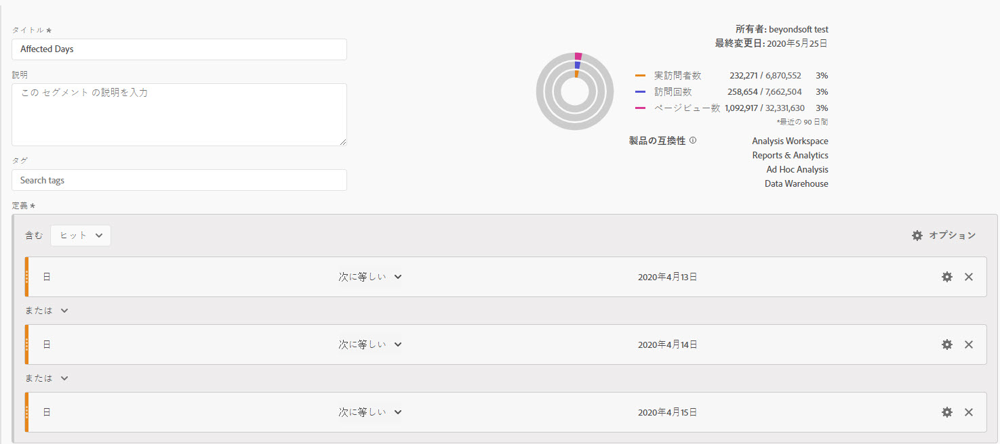
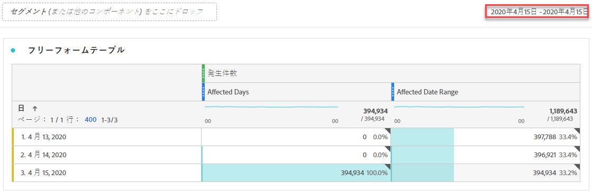
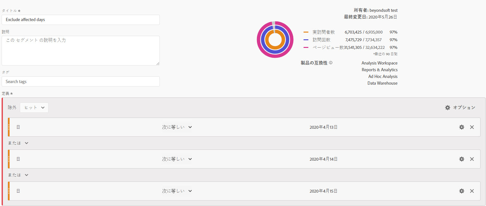
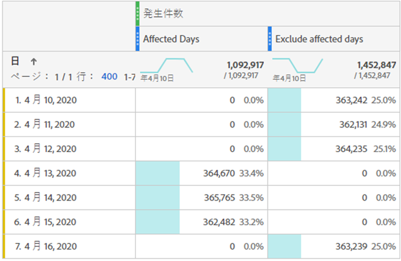
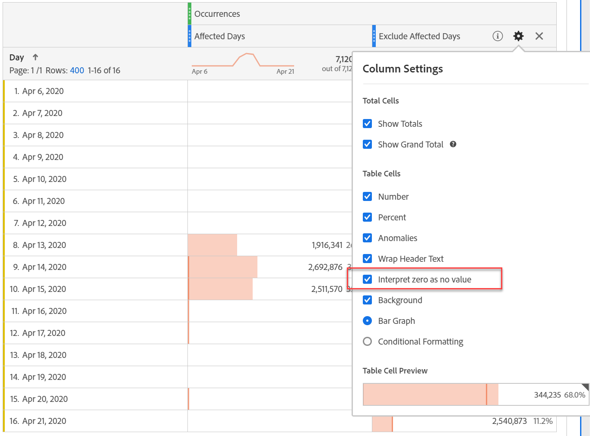
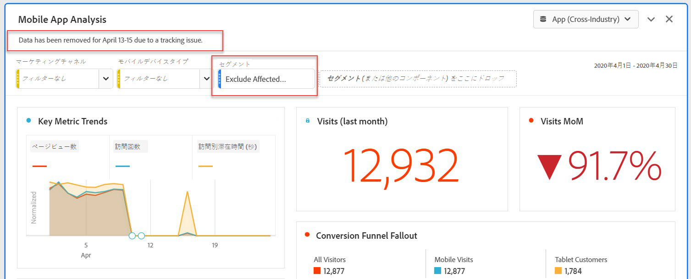
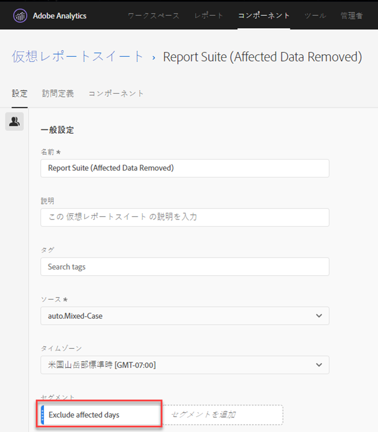

# 分析内の特定の日付を除外する

イベントの影響を受けるデータ [がある場合は、セグメントを使用して、レポートに含めたくない日付範囲を除外できます。 &#x200B;](overview.md)イベントの影響を受ける日付をセグメント化すると、部分的なデータに関する意思決定を妨げることができます。

## 影響を受けた日を分離 {#isolate}

影響を受ける日付または日付範囲を分離するセグメントを作成します。 このセグメントは、問題が発生した日のみに焦点を当て、その影響に関する詳しい情報を確認したい場合に役立ちます。

1. **[!UICONTROL コンポーネント]**/**[!UICONTROL セグメント]**&#x200B;に移動してセグメントビルダーを開き、**[!UICONTROL 追加]**&#x200B;をクリックします。
2. 「日」ディメンションを定義キャンバスにドラッグし、分離する日に等しく設定します。
3. レポートで特定したい日ごとに、上記のステップを繰り返します。

>[!TIP]
>
>OR ステートメントをAND ステートメントに変更するには、ORの横にある下向き矢印をクリックし、ANDを選択します。

Adobeでは、紫色の日付範囲コンポーネントではなく、オレンジ色のディメンション ディメンション コンポーネントを使用することをお勧めします。 紫色の日付範囲コンポーネントを使用すると、プロジェクトのカレンダー範囲が上書きされます。

## 影響を受ける日数を除外 {#exclude}

影響を受ける日付または日付範囲を除外するセグメントを作成します。 このセグメントは、問題が発生した日数を除外して、レポート全体への影響を最小限に抑えたい場合に便利です。

1. **[!UICONTROL コンポーネント]**/**[!UICONTROL セグメント]**&#x200B;に移動してセグメントビルダーを開き、**[!UICONTROL 追加]**&#x200B;をクリックします。
2. セグメント定義キャンバスの右上で、**[!UICONTROL オプション]**/**[!UICONTROL 除外]**&#x200B;をクリックします。
3. 「日」ディメンションを定義キャンバスにドラッグし、削除する日に設定します。
4. レポートで削除する日ごとに、上記の手順を繰り返します。

## レポートでこれらのセグメントを使用する

除外セグメントを作成したら、他のセグメントと同じように使用できます。

### トレンドレポートでのセグメントの比較 {#compare}

レポートに「影響を受ける日数」セグメントと「影響を受ける日数を除外」セグメントの両方を適用して、それらを並べて比較できます。 両方のセグメントを指標の上または下にドラッグして比較します。

テーブルまたはビジュアライゼーションにゼロを表示しない場合（ディップが発生する場合）は、列設定で「**[!UICONTROL ゼロを値なし]**」として解釈する」を有効にします。

テーブルまたはビジュアライゼーションにゼロを表示しない場合（ディップが発生する場合）は、列設定で「**[!UICONTROL ゼロを値なし]**」として解釈する」を有効にします。

### 除外セグメントをプロジェクトに適用する {#apply}

「影響を受ける日数を除外」セグメントをWorkspace プロジェクトに適用できます。 「セグメントを除外」を「*セグメントをここにドロップ*」というラベルの付いたWorkspace キャンバスのセクションにドラッグします。

>[!TIP]
>
>除外されたデータに関するメモをパネルの説明に含めて、レポートを表示するユーザーを支援します。 パネルのタイトルを右クリックし、**[!UICONTROL 説明を編集]**&#x200B;をクリックします。

### 仮想レポートスイートで除外セグメントを使用する {#use-vrs}

[仮想レポートスイート &#x200B;](/help/components/vrs/vrs-about.md)でセグメントを使用すると、より便利にデータを除外できます。 このオプションは、影響を受ける日付範囲を含む各レポートに対してセグメントを適用する必要がない場合に最適です。 既に仮想レポートスイートをデータソースとして使用している場合は、セグメントを既存の仮想レポートスイートに追加できます。

1. **[!UICONTROL コンポーネント]** > **[!UICONTROL 仮想レポートスイート]**&#x200B;に移動します。
2. 「**[!UICONTROL 追加]**」をクリックします。
3. 仮想レポートスイートの目的の名前と説明を入力します。
4. 除外セグメントを&#x200B;**[!UICONTROL セグメントを追加]**&#x200B;というラベルの付いた領域にドラッグします。
5. 右上の&#x200B;**[!UICONTROL 続行]**&#x200B;をクリックし、**[!UICONTROL 保存]**&#x200B;をクリックします。

