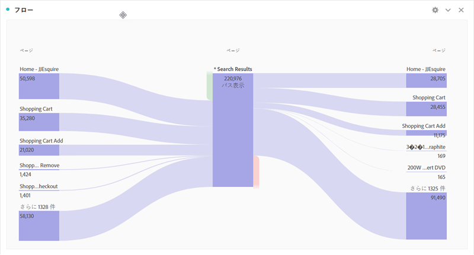

# 行動レポート

ビヘイビアーレポートには、ユーザーがサイトとどのようにやり取りしたかに関する情報が表示されます。

このページでは、Analysis Workspaceの使用に関する基本的な知識があると想定しています。See [Create a basic report in Analysis Workspace for Google Analytics users](create-report.md) if you are not yet familiar with the tool in Adobe Analytics.

## 動作フロー

行動フローレポートは、フロービジュアライゼーションを使用して再作成できます。

1. 左側のビジュアライゼーションアイコンをクリックし、フロービジュアライゼーションをフリーフォームテーブルの上のワークスペースにドラッグします
2. **ページ** ディメンションを見つけて、矢印アイコンをクリックしてページ値を表示します。ディメンション値は黄色で表示されます。
3. 開始するページ値を探し、「ディメンションまたは項目」という名前のスペースにドラッグします
4. このフローレポートはインタラクティブです。任意の値をクリックして、後続のページまたは前のページにフローを展開します。右クリックメニューを使用して、列を展開または折りたたみます。同じフローレポート内でも異なるディメンションを使用できます。

## サイトコンテンツ-すべてのページ

ページレポートには、サイト上の個々のページのパフォーマンスが表示されます。

1. In the Components menu, locate the **Pages** dimension and drag it onto the large freeform table area labeled &#39;Drop a Dimension here&#39;.
2. Drag the desired metrics onto the workspace alongside the automatically created **Occurrences** metric. See the [Metric translation guide](common-metrics.md) for details on how to obtain each respective metric.

代わりに、アドビではテンプレートと呼ばれる事前に作成されたいくつかのワークスペースを提供しています。コンテンツ消費（ウェブ）テンプレートは、すべてのページレポートに同様の値を提供します。

1. *[!UICONTROL プロジェクト] / [!UICONTROL 新規]*をクリックして、プロジェクトオプションを含むモーダルウィンドウを開きます。
2. コンテンツ消費（ウェブ）テンプレートをクリックし、「作成」をクリックします。

## サイトコンテンツ-コンテンツドリルダウン

コンテンツドリルダウンレポートでは、URL構造によってページトラフィックを調べることができます。Analysis Workspaceで使用するには、追加の実装が必要です。アドビでは、このデータが正確に収集されるように、導入コンサルタントに相談することを推奨しています。

## サイトコンテンツ-ランディングページ

ランディングページレポートには、サイト上のトップランディングページが表示されます。Landing pages are available in Analysis Workspace as the **Entry Page** dimension.

1. In the Components menu, locate the **Entry Page** dimension and drag it onto the large freeform table area labeled &#39;Drop a Dimension here&#39;.
2. Drag the desired metrics onto the workspace alongside the automatically created **Occurrences** metric. See the [Metric translation guide](common-metrics.md) for details on how to obtain each respective metric.

Adobe recommends using the **Visits** metric for this dimension.

## サイトコンテンツ-出口ページ

出口ページレポートには、個々の訪問の最後のページになったページが表示されます。同じ名前のAnalysis Workspaceで使用できます。

1. In the Components menu, locate the **Exit Page** dimension and drag it onto the large freeform table area labeled &#39;Drop a Dimension here&#39;.
2. Drag the desired metrics onto the workspace alongside the automatically created **Occurrences** metric. See the [Metric translation guide](common-metrics.md) for details on how to obtain each respective metric.

Adobe recommends using the **Visits** metric for this dimension.

## サイト速度レポート

サイト速度レポートでは、ページの読み込みがどれくらい速いかを表示し、ページ読み込み時間を増やす機会を表示します。

この機能には、両方のプラットフォームに追加の実装が必要です。アドビでは、このデータがAnalysis Workspace用に正しく構成されていることを確認するために、導入コンサルタントと協力することを推奨しています。[通常、パフォーマンスタイミングプラグイン](../../../implement/js-implementation/plugins/performancetiming.md) は、Adobe Analyticsのパフォーマンスデータを取得するためにeVarに割り当てられます。

## サイト検索レポート

サイト検索レポートは、訪問者がサイトの内部検索機能をどのように利用しているかについての洞察を提供します。

この機能には、両方のプラットフォームに追加の実装が必要です。アドビでは、このデータがAnalysis Workspace用に正しく構成されていることを確認するために、導入コンサルタントと協力することを推奨しています。通常、内部検索語句はクエリ文字列パラメータから取得され、レポート用のeVarに配置されます。

## イベントレポート

イベントには、GoogleとAdobe Analyticsの主な構造の違いがあります。両方のプラットフォームで、追加の実装の変更が適切に機能する必要があります。

* Google Analyticsでは、イベントはテキストとして実装で定義されます。イベントには、カテゴリ、アクションおよびラベルがあります。
* Adobe Analyticsでは、IDが割り当てられている管理コンソールでイベントが最初に設定されます。この識別子は導入コードで使用されます。次に例を示します。
   1. 管理コンソールで「登録」としてevent1を設定できます。
   2. 実装では、登録確認ページのイベント変数にevent1を含めます。登録確認ページが表示されるたびに、event1が増加します。
   3. Analysis Workspaceでは、「登録」は任意のレポートで使用する指標として表示されます。

この機能には実装の変更が必要なので、データがAnalysis Workspace用に正しく設定されていることを確認するために、導入コンサルタントと相談することをお勧めします。

## 投稿者レポート

GoogleはGoogle広告マネージャーとの接続を必要とする方法と同様に、Adobe Advertising Cloudというインサイトを提供する専用製品を提供しています。組織がこの製品の使用を希望する場合は、貴社のアカウントマネージャーにお問い合わせください。
