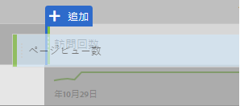
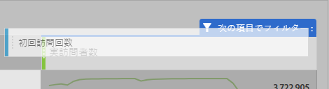
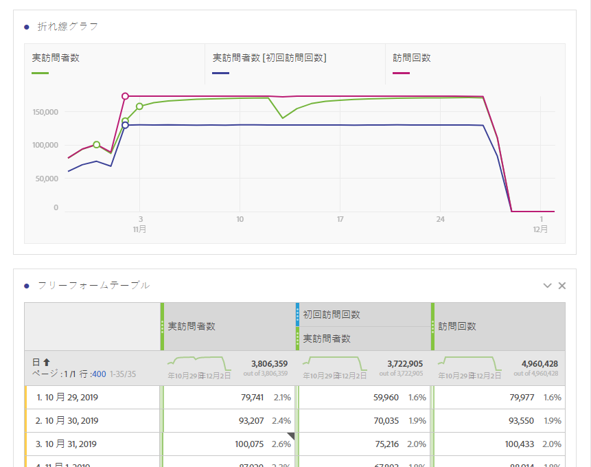
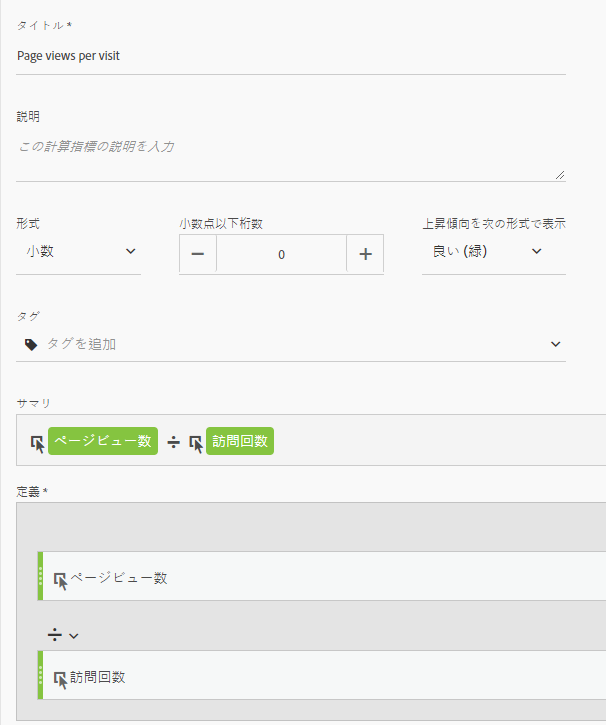
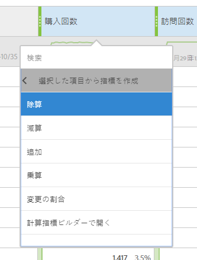

# 他のプラットフォームの翻訳ガイドでよく使用される指標

Google Analyticsなどの他のプラットフォームでは、多くのレポートで一般的な指標数が共有されています。このページでは、多くのレポートで使用される指標を再作成する方法について説明します。

複数の指標をワークスペースフリーフォームテーブルに追加するには、ワークスペース内の指標ヘッダーの横にあるコンポーネント領域から指標をドラッグします。

## 獲得指標

**ユーザー** は、Workspaceでの **実訪問者数** にほぼ等しくなります。See the [Unique Visitors](../../../components/c-variables/c-metrics/metrics-unique-visitors.md) metric in the Components user guide for additional details.

**新しいユーザー** は、次の方法で取得できます。

1. **個別訪問者** 指標をワークスペースにドラッグします。
2. Drag the **First Time Visits** segment above the Unique Visitors metric headers:

   

**セッション** は、分析ワークスペースの **訪問回数** とほぼ同じです。See the [Visits](../../../components/c-variables/c-metrics/metrics-visit.md) metric in the Components user guide for additional details.

## 行動指標

**直帰率** は、Analysis Workspaceで指標として簡単に使用できます。See the [Bounce Rate](../../../components/c-variables/c-metrics/metrics-bounce-rate.md) metric in the Components user guide for additional information.

**ページ/セッション** は計算指標です。これは、次のようにして取得できます。

1. 既にこの計算指標を作成している場合は、指標の下にある指標を探してワークスペースにドラッグします。
2. If you have not yet created this calculated metric, click the **+** icon near the metric list to open the Calculated Metric Builder.
3. 「訪問あたりのページビュー」のタイトルと、必要に応じて説明を付けます。
4. 形式を「小数」に設定し、小数点以下の桁数を2に設定します。
5. **ページビュー** 指標および **訪問** 回数指標を定義領域にドラッグします。
6. Arrange the definition so the formula is **Page Views divided by Visits**.

   

7. 「保存」をクリックしてワークスペースに戻ります。
8. 新しく定義した計算指標をワークスペースにドラッグします。

   Learn more about [Calculated Metrics](../../../components/c-variables/c-metrics/calculated-metric.md) in the Components user guide.

**解決までのSession Duration** is approximately equal to **Time Spent per Visit (seconds)**. Learn more about [Time Spent](../../../components/c-variables/c-metrics/metrics-time-spent.md) metrics in the Components user guide.

## コンバージョン指標

**目標コンバージョン率**、 **目標の合計**、 **目標の値** は、両方のプラットフォームで追加の実装を必要とします。実装が既に製品ディメンションと購入イベントに対応している場合は、次の手順を考慮してください。

1. **注文** 指標、 **売上** 高指標および **訪問** 指標をワークスペースにドラッグします。
1. Create a calculated metric of **Orders per Visit**. 両方の指標ヘッダーでCtrlキー（Windows）またはCommandキー（Mac OS）を押しながらクリックして、それらをハイライト表示します。Right-click one of the headers, select **Create Metric From Selection**, then click **Divide**. この新しい指標は、目標コンバージョン率に似ています。
1. 小数点以下の桁数が必要な場合は、計算指標を編集します。指標ヘッダーの情報ボタンをクリックし、鉛筆アイコンをクリックします。計算指標ビルダーウィンドウで"1桁または2桁の桁数を追加」を追加し、「保存」をクリックします。

   

導入で製品またはコンバージョンデータにまだ対応していない場合は、データの品質と整合性を確保するために、導入コンサルタントに相談することをお勧めします。
