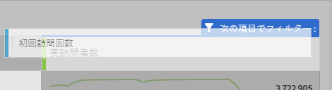
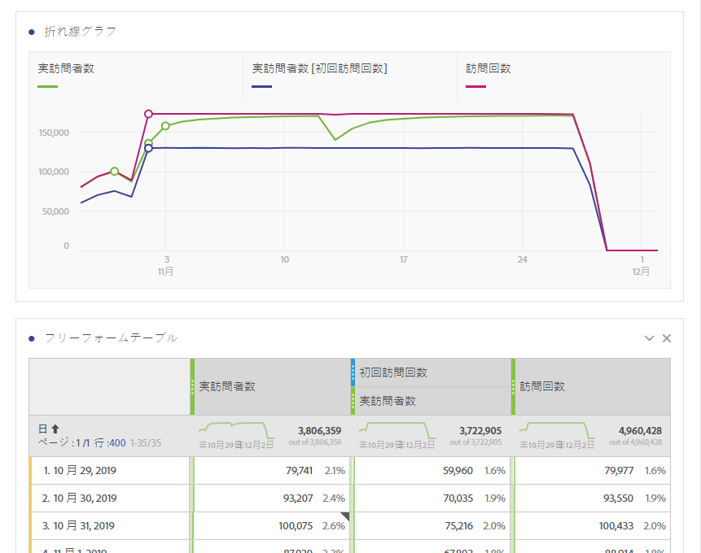

# 他のプラットフォームでよく使用される指標の互換性ガイド

Google Analytics などの他のプラットフォームでは、多くのレポートで共通の指標が使用されています。 このページでは、多くのレポートで使用される指標の再作成方法を説明します。

ワークスペースのフリーフォームテーブルに複数の指標を追加するには、ワークスペース内の指標ヘッダーの横にあるコンポーネント領域から指標をドラッグします。

## 獲得指標

**ユーザー数**&#x200B;は、Workspace の&#x200B;**ユニーク訪問者**&#x200B;とほぼ同じ役割を果たします。 詳しくは、コンポーネントユーザーガイドの「[ユニーク訪問者](/help/components/metrics/unique-visitors.md)指標」を参照してください。

**新規ユーザー数**&#x200B;は、次の方法で取得できます。

1. **ユニーク訪問者**&#x200B;指標をワークスペースにドラッグします。
2. **初回訪問回数**&#x200B;セグメントをユニーク訪問者指標ヘッダーの上にドラッグします。

   

**セッション数**&#x200B;は、Analysis Workspace の&#x200B;**訪問回数**&#x200B;とほぼ同じ役割を果たします。 詳しくは、コンポーネントユーザーガイドの「[訪問回数](/help/components/metrics/visits.md)指標」を参照してください。

## 行動指標

**バウンス率**&#x200B;は、Analysis Workspace では指標としてすぐに使用できます。 詳しくは、コンポーネントユーザーガイドの「[バウンス率](/help/components/metrics/bounce-rate.md)指標」を参照してください。

**ページ／セッション**&#x200B;は計算指標です。 この指標は、次の方法で取得できます。

1. この計算指標が作成済みの場合は、「指標」の下にあるこの指標を選択し、ワークスペースにドラッグします。
2. この計算指標をまだ作成していない場合は、指標リストの近くにある **+**&#x200B;アイコンをクリックし、計算指標ビルダーを開きます。
3. 必要に応じて、タイトルを「訪問あたりのページビュー数」に設定し、説明を追加します。
4. 形式を「小数」に設定し、小数点以下の桁数を 2 に設定します。
5. **ページビュー数**&#x200B;指標と&#x200B;**訪問回数**&#x200B;指標を、定義領域にドラッグします。
6. **訪問回数でページビュー数を割るように**&#x200B;数式を定義します。

   

7. 「保存」をクリックして、ワークスペースに戻ります。
8. 新しく定義した計算指標をワークスペースにドラッグします。

   [計算指標](/help/components/calculated-metrics/cm-overview.md)について詳しくは、コンポーネントユーザーガイドを参照してください。

**平均 セッション時間**&#x200B;は、**訪問別滞在時間（秒）**&#x200B;とほぼ同じ役割を果たします。 [訪問ごとの滞在時間](/help/components/metrics/time-spent-per-visit.md)の指標について詳しくは、コンポーネントユーザガイドを参照してください。

## コンバージョン指標

**目標コンバージョン率**、**目標達成率**、および&#x200B;**目標値**&#x200B;は、Adobe Analytics と Google Analytics で追加の実装が必要です。 製品ディメンションと購入イベントが実装されている場合は、次の手順を考慮します。

1. **注文**&#x200B;指標、**売上高**&#x200B;指標、**訪問回数**&#x200B;指標をワークスペースにドラッグします。
1. **訪問あたりの購入回数**&#x200B;の計算指標を作成します。 Ctrl キー（Windows）または Command キー（Mac）を押しながら両方の指標ヘッダーをクリックしてハイライト表示します。 いずれかのヘッダーを右クリックし、「**選択した項目から指標を作成**」を選択して、「**分割**」をクリックします。 この新しい指標は、目標コンバージョン率と同じ役割を果たします。
1. 小数点以下の桁数が必要な場合は、計算指標を編集します。 指標ヘッダーの「情報」ボタンをクリックし、鉛筆アイコンをクリックします。 計算指標ビルダーウィンドウに小数点以下の桁数を 1 桁または 2 桁追加し、「保存」をクリックします。

   

実装において製品データやコンバージョンデータに対応していない場合は、導入コンサルタントに依頼して、データの品質と整合性を確保することをお勧めします。
