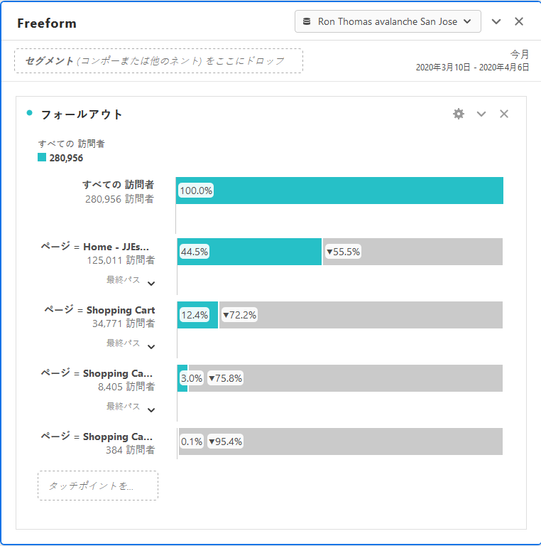
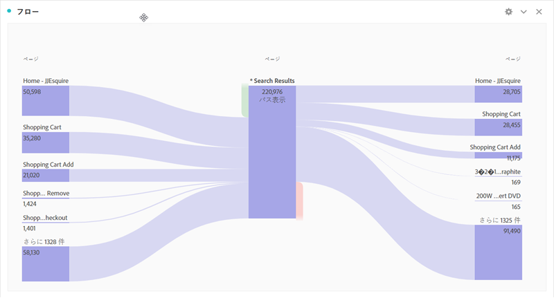

# コンバージョンレポート

「コンバージョン」とは、貴社のサイト上で訪問者が貴社の主要指標に直接翻訳しているアクションです。コンバージョンレポートには、訪問者のコンバージョンの詳細が表示されます。

このページでは、Analysis Workspaceの使用に関する基本的な知識があると想定しています。See [Create a basic report in Analysis Workspace for Google Analytics users](create-report.md) if you are not yet familiar with the tool in Adobe Analytics.

## 目標レポート

目標は、Google AnalyticsユーザーがWebサイトのコンバージョンを定義できるようにすることです。これらは、ファネル、逆行動フロー、マルチチャネルファネル、アトリビューションを作成するデフォルトの方法です。Google Analyticsの目標は遡及されず、管理ページでのみ設定できます。また、ページ、イベント、滞在時間または平均ページ数に基づいています。

Adobe Analyticsでは、指標を任意のコンテキストで適用できるので、目標の概念は必須ではありません。追跡するイベントに対応する限り、コンバージョンレポートを微調整し、履歴データの結果をすぐに得ることができます。

### ファネルビジュアライゼーション

ファネルビジュアライゼーションレポートは、コンバージョンに必要な特定の一連のステップについて、アナリストに重点的に取り組みます。例えば、購入を行う前に、eコマースサイトの訪問者は、買い物かご、請求ページ、配送ページ、支払いページ、注文確認ページにアクセスする必要があります。

Analysis Workspaceでは、このデータはフォールアウトビジュアライゼーションを使用して表示できます。

1. 左側のビジュアライゼーションアイコンをクリックし、フリーフォームテーブルの上のワークスペースにフォールアウトビジュアライゼーションをドラッグします
2. Click the components icon on the left, then locate the **Pages** dimension.
3. ページディメンションの横にある矢印アイコンをクリックすると、ページ値が表示されます。ディメンション値は黄色で表示されます。
4. 目的のページを最初のタッチポイントとして指定し、ビジュアライゼーションの「タッチポイントを追加」というラベルの空間にドラッグします。
5. ページ値をビジュアライゼーションにドラッグして、必要なタッチポイントを追加し続けます。

フォールアウトビジュアライゼーションは、ページディメンションのみに制限されています。すべてのディメンション、指標またはセグメントを使用して、組織のニーズに合わせてフォールアウトレポートを調整できます。

## eコマースレポート

eコマースレポートは、製品やサービスを販売しているサイトで、購入した商品の注文件数と売上高を測定するために使用されます。この機能はAdobe Analyticsで使用でき、「製品」レポートと呼ばれます。

Google AnalyticsのeコマースレポートとAdobe Analyticsの製品レポートの両方に、カスタマイズの変更が必要になります。See the [Products](../../../components/c-variables/dimensionslist/reports-products.md) dimension in the Components user guide for more information.

## 複数チャネルファネルレポート

マルチチャネルファネルレポートには、獲得レポートを提供するその他のマーケティングチャネルデータが含まれています。これらのレポートは、訪問者がどのようにサイトに到達したかではなく、訪問者のコンバージョン方法に焦点を当てます。

> [!NOTE]
>
> Adobe Analyticsのマルチチャネルレポートの使用には、製品変数と購入イベントに対応するためのマーケティングチャネルとカスタム実装の両方が必要です。これらの機能がまだレポートスイートに設定されていない場合は、導入コンサルタントにお問い合わせください。

### マルチチャネル-アシストコンバージョン

アシストコンバージョンは、各チャネルがコンバージョンを支援する回数を示します。In Analysis Workspace, the **Order Assists** metric can be used.

1. In the Components menu, locate the **Marketing Channel** dimension and drag it onto the large freeform table area labeled 'Drop a Dimension here'.
2. Drag the **Order Assists** metric on top of the automatically created **Occurrences** metric header to replace it. 必要に応じて、追加の指標をワークスペースにドラッグできます。

### マルチチャネル-トップコンバージョンパス

コンバージョンパスレポートは、コンバージョン前にユーザーがとる最上位のチャネルパスを示します。Analysis Workspaceは、フローレポートを使用して、上位のコンバージョンパスを視覚化します。

1. 左側のパネルアイコンをクリックし、属性パネルをフリーフォームテーブルの上にドラッグします。
2. Click the Components icon on the left, locate the **Marketing Channel** dimension, and drag it to the box labeled 'Add Dimension'.
3. 指標（注文など）の下の目的のコンバージョンイベントを探し、「指標を追加」というラベルの付いたボックスにドラッグします。計算指標はアトリビューションパネルではサポートされていません。
4. 「作成」をクリックします。
5. 結果のレポートで、「チャネルフロー」ビジュアライゼーションを見つけます。このフローには、購入前に訪問者が移動したトップパスが表示されます。

このフローのビジュアライゼーションはインタラクティブです。各チャネルをクリックして、いずれかの方向にフローを展開します。

### マルチチャネル-時間ラグ

時間の時差レポートは、訪問者がサイト上でのコンバージョンを行うまでに要した時間を示します。In Analysis Workspace, this data is available using the **Days Before First Purchase** dimension. これは、適切に導入された購入イベントのコンテキストでのみ利用できます。

1. In the Components menu, locate the **Days Before First Purchase** dimension and drag it onto the large freeform table area labeled 'Drop a Dimension here'.
2. Drag the desired metrics onto the workspace alongside the automatically created **Occurrences** metric. See the [Metric translation guide](common-metrics.md) for details on how to obtain each respective metric.

Adobe recommends using the **Orders**, **Units**, or **Revenue** metrics with this dimension.

For other types of conversions, including custom events, the **Time Prior to Event** dimension is available. 訪問者が訪問内でイベントをトリガーするまでに要した時間を分単位で示します。

1. In the Components menu, locate the **Time Prior to Event** dimension and drag it onto the large freeform table area labeled 'Drop a Dimension here'.
2. Drag the desired metrics onto the workspace alongside the automatically created **Occurrences** metric. See the [Metric translation guide](common-metrics.md) for details on how to obtain each respective metric.

アドビでは、カスタムイベントまたは購入イベントと共にこのディメンションを使用することをお勧めします。

### マルチチャネル-パスの長さ

パスの長さレポートには、コンバージョンイベントの前に表示されるチャネルの数が表示されます。Analysis Workspaceでは、アトリビューションパネルには、そのビジュアライゼーションの1つにこのデータが含まれています。

1. 左側のパネルアイコンをクリックし、フリーフォームテーブルの上にアトリビューションパネルをドラッグします
2. Click the Components icon on the left, locate the **Marketing Channel** dimension, and drag it to the box labeled 'Add Dimension'.
3. 指標（注文など）の下の目的のコンバージョンイベントを探し、「指標を追加」というラベルの付いたボックスにドラッグします。計算指標はアトリビューションパネルではサポートされていません。
4. 「作成」をクリックします。
5. 結果のレポートで、「旅行あたりのタッチポイント」ビジュアライゼーションを探します。このヒストグラムには、購入前に訪問者がタッチしたチャネルの数が表示されます。
