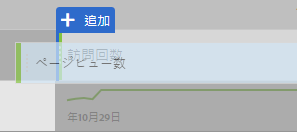

# Google Analyticsユーザー用のAnalysis Workspaceでの基本レポートの作成

Analysis Workspace（Adobe Analytics内の主要機能の1つ）は、収集されたデータに関するあらゆるインサイトを得るための堅牢な領域です。レポートは、Google AnalyticsとAdobe Analyticsでは非常に異なります。

* Google Analyticsのレポート構造を使用すると、地域や参照トラフィックなどの特定のタイプのデータを選択できます。プラットフォームでは、そのデータを表示する最善の方法に基づいて、プリバ分割されたレポートビューを使用します。
* Analysis Workspaceのレポート構造には空白のキャンバスがあり、正確なレポートのニーズをより柔軟に満たすことができます。

Analysis Workspaceは、プリタブ化されたレポートよりもキャンバスのように機能するので、Google Analyticsからレポートを再作成することは、適切なビジュアライゼーションとコンポーネントを使用するだけで済みます。

## Workspaceで使用されるキーワード

* **パネル** はワークスペースの包括的な構成要素です。ほとんどのシナリオでは、フリーフォームパネルが使用されます。
* **ビジュアライゼーション** はすべてのフリーフォームパネルを構成します。これらの目的は、異なる形式でデータを表現することです。ほとんどの形式はテーブルですが、ドーナツグラフや折れ線グラフなどのその他の時間があります。Google Analyticsの多くのレポートは、次の2つのビジュアライゼーションと同じです。折れ線グラフとフリーフォームテーブル。
* **コンポーネント** がビジュアライゼーションに配置され、データが返されます。レポートのニーズに合わせて、様々な方法でコンポーネントを混在させることができます。
   * **ディメンション** は変数値で、通常はテキストを含みます。例としては、ページ名、リファラー、地域国などがあります。テーブルの行として最も一般的に表示されます。
   * **指標は** 通常、一部の並べ替えのイベントまたはコンバージョンを表します。例えば、ページビューなどの一般的なイベントや、購入や登録などの一般的なイベントがあります。これらは、テーブルの列として最もよく表示され、ディメンションごとのイベント発生回数を示します。
   * **セグメント** はデータのサブセットであり、Google Analyticsのセグメントと同様に動作します。これにより、カスタマイズしたフィルターを作成して、データの特定の部分に集中することができます。
   * **日付範囲** を使用すると、イベントが発生したときにデータを整理できます。これは経時的にトレンドを表示し、一般的に指標と対になります。

## Workspaceでの基本レポートの作成

すべてのページレポート（Google Analyticsのものと同様）を作成するには、適切なコンポーネントをワークスペースキャンバスにドラッグします。

1. Log in to [experiencecloud.adobe.com](https://experiencecloud.adobe.com) using your Adobe ID credentials.
2. 右上の9正方形アイコンをクリックし、色付きのAnalyticsロゴをクリックします。
3. 上部ナビゲーションバーで、「ワークスペース」をクリックします。
4. 「新規プロジェクトを作成」ボタンをクリックします。
5. モーダルポップアップで、「空白のプロジェクト」が選択されていることを確認し、「作成」をクリックします。
6. 左側には、ディメンション、指標、セグメントおよび日付範囲のリストが表示されます。ページディメンション（オレンジ色のオレンジ色）を見つけ、「ここにディメンションをドロップ」というラベルの付いたキャンバスにドラッグします。
7. 今月のトップページを示すレポートが表示できます。Analysis Workspace automatically populates the report with the [Occurrences](../../../components/c-variables/c-metrics/metrics-occurrences.md) metric.
8. 通常、Google Analyticsのテーブルには7-8の指標が含まれています。直帰率指標（緑色の色）を見つけて、回数指標ヘッダーの横にドラッグします。「回数」の横にある直帰率指標をドラッグすると、両方の指標が並べて表示されます。
9. 既存の指標ヘッダーの横に指標をドラッグすることで、多くの指標を並べて配置できます。See [commonly used metrics](common-metrics.md) for information on how to obtain metrics typically used in Google Analytics.

   

## Workspaceの事前ビルドレポートテンプレートから開始する

プロジェクトテンプレートにアクセスして、コンテンツ消費テンプレート（Google Analyticsのすべてのページレポート）を作成します。

1. 「新規プロジェクトを作成」ボタンをクリックします。
2. 「すべてのテンプレート」に一覧表示されている「コンテンツ消費（Web）」アイコンを探してダブルクリックします。
3. 事前ビルドされている各ビジュアライゼーションを参照します。入口ページフロー、トップページテーブル、出口ページフロー、入口サイトセクションフロー、トップサイトセクションテーブル。

   

## ツールでテストする

Analysis Workspaceはレポートツールなので、データ収集には影響しません。意図的にコンポーネントをプロジェクトにドラッグしても、何が動作するかを確認することはありません。ディメンションと指標の様々な組み合わせをワークスペースプロジェクトにドラッグして、利用可能なものを確認します。

誤って無効なコンポーネントをワークスペースプロジェクトにドラッグした場合、またはステップに戻る場合は、Ctrl+ Zキー（Windows）またはCommand+ Zキー（Mac）を押して最後のアクションを取り消します。You can also start with a clean slate by clicking *[!UICONTROL Project] &gt; [!UICONTROL New]* in the upper left menu.

アドビでは、右クリックのコンテキストメニューで、Analysis Workspaceに多数の機能を配置しました。多くのビジュアライゼーションおよびコンポーネントは、より詳細な分析とインタラクションを目的として右クリックすることができます。ワークスペース内のコンポーネントを右クリックして、利用可能なオプションを確認することを検討してください。

## 使用するディメンションと指標の把握

Analysis Workspaceに慣れていて、通常、Google Analyticsで表示される特定のレポートを再作成する場合は、それぞれのページに関するレポートを探します。

* [リアルタイムレポート](realtime-reports.md)
* [オーディエンスレポート](audience-reports.md)
* [獲得レポート](acquisition-reports.md)
* [行動レポート](behavior-reports.md)
* [コンバージョンレポート](conversions-reports.md)
