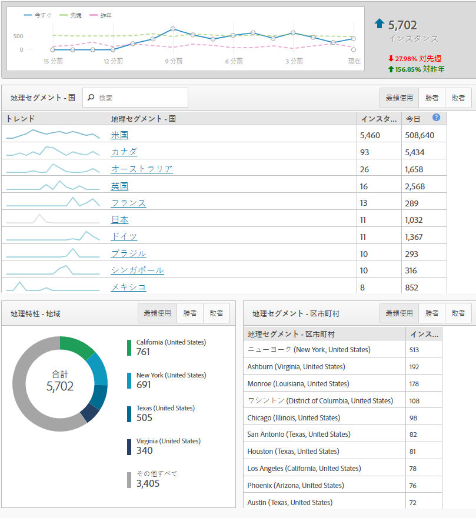
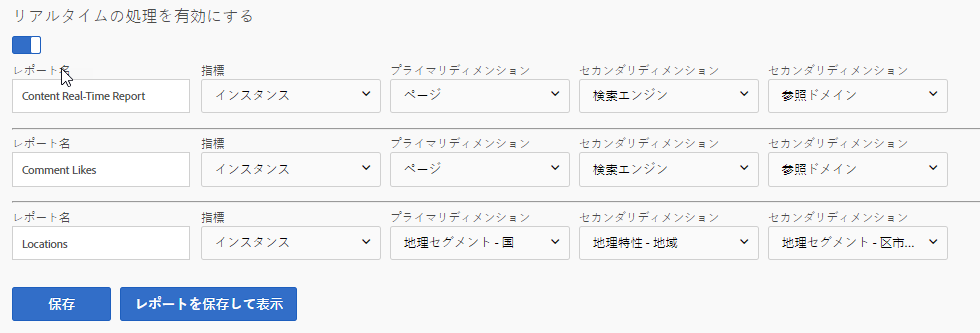

# リアルタイムレポート

リアルタイムレポートには、現在貴社サイトで発生していることが表示されます。これらのタイプのレポートは、サイトに対する更新のすぐな結果を確認するために特に重要です。例えば、ブラックフライデーで販売を実行している会社は、特定のページへのトラフィックを測定し、その瞬間のパフォーマンスに基づいてどの販売を優先順位付けするかを決定できます。

リアルタイムレポートは、まだAnalysis Workspaceに導入されていないいくつかの機能の1つです。Reports&amp; Analyticsを使用して、このデータを取得します。データの収集を開始するには、いくつかの簡単な設定が必要です。

リアルタイムレポート設定ページに到達するには（必要な管理者権限）:

1. Click [!UICONTROL Reports] in the Adobe Analytics header navigation.
2. In the left menu, Click *[!UICONTROL Site Metrics]* &gt; *[!UICONTROL Real-Time]*.
3. レポートスイートにリアルタイムが有効になっていない場合、レポートスイートを設定するためのリンクを含むメッセージが表示されます。If the report suite has real-time enabled, click [!UICONTROL Configure] near the real-time report's title.

アドビでは、最大3つのリアルタイムレポートを使用してデータを同時に収集できます。データをリアルタイムで収集するには、それぞれを設定する必要があります。

## リアルタイムロケーション

リアルタイムの場所は、現在の時間の中で訪問者がサイトを訪れた場所を示します。3つのリアルタイムレポートのいずれかを設定して場所データを表示するには:

1. Click [!UICONTROL Configure] near the real-time report's title.
2. リアルタイムレポートスロットの次のいずれかの操作を行います。
   * リアルタイムレポートに名前を付けます。（例:「ロケーション」）。
   * 通常、インスタンスは指標として使用されます。ユーザー/実訪問者は、現時点ではリアルタイムレポートでは利用できません。
   * プライマリディメンションの場合、地理特性-国は一般に使用されます。地理特性-地域、地理特性-米国DMA、地理特性-都市も利用できます。
   * 2つのセカンダリディメンションについては、このトラフィックに対して表示したい追加のデータを使用してください。セカンダリディメンションは、場所に固有のものである必要はありません。
3. [!UICONTROL 「保存してレポートを表示」をクリック]します。

## リアルタイムトラフィックソース

リアルタイムトラフィックソースは、現在の時間の中で訪問者がサイトを訪問した場所を示します。3つのリアルタイムレポートのいずれかを設定してトラフィックソースデータを表示するには:

1. リアルタイムレポートのタイトルの近くにある「設定」をクリックします。
2. リアルタイムレポートスロットの次のいずれかの操作を行います。
   * リアルタイムレポートに名前を付けます。（例:「トラフィックソース」）。
   * 通常、インスタンスは指標として使用されます。ユーザー/実訪問者は、現時点ではリアルタイムレポートでは利用できません。
   * プライマリディメンションの場合、参照ドメインは通常使用されます。検索エンジンと検索キーワードも利用できます。
   * 2つのセカンダリディメンションについては、このトラフィックに対して表示したい追加のデータを使用してください。セカンダリディメンションはトラフィックソースに固有のものである必要はありません。
3. [!UICONTROL 「保存してレポートを表示」をクリック]します。

## リアルタイムコンテンツ

リアルタイムコンテンツは、訪問者が現在閲覧しているページを示します。3つのリアルタイムレポートのいずれかを設定してコンテンツデータを表示するには:

1. Click [!UICONTROL Configure] near the real-time report's title.
2. リアルタイムレポートスロットの次のいずれかの操作を行います。
   * リアルタイムレポートに名前を付けます。（例:"Content"）。
   * 通常、インスタンスは指標として使用されます。ユーザー/実訪問者は、現時点ではリアルタイムレポートでは利用できません。
   * プライマリディメンションの場合、ページは通常使用されます。これらの変数を実装で定義する場合、サイトセクションとサーバーも使用できます。
   * 2つのセカンダリディメンションについては、このトラフィックに対して表示したい追加のデータを使用してください。セカンダリディメンションはコンテンツに固有のものである必要はありません。
3. [!UICONTROL 「保存してレポートを表示」をクリック]します。

## リアルタイムイベント

リアルタイムイベントは、サイトで最も多く発生しているイベントを示します。Google Analyticsでは、イベントは特定のアクション（通常、ページビューとは無関係なアクション）が発生した回数を取り込みます。GAイベントは、カテゴリ、ラベルおよびアクションと共に送信されます。Adobe Analyticsでは、カスタムイベントは管理コンソールでわかりやすい名前になり、任意のディメンションと共に分析できます。Google Analyticsイベントと同様のAdobe Analyticsでディメンションを探す場合、カスタムリンクディメンションを適用することを検討してください。これは、多くの場合、ページビューとは無関係なデータを収集するための包括的なリンクとして使用されるもので、ダウンロード用には離脱リンク-ダウンロード用リンク-ダウンロードリンクとして使用されます。

> [!NOTE] リアルタイムレポートでカスタムイベントを使用する場合、カスタムイベントと同じヒットでディメンション値を定義する必要があります。例えば、「参照ドメイン」ディメンションに「登録」カスタムイベントを表示している場合、追加の実装なしにデータは返されません。参照ドメインは最初のヒットにのみ表示され、カスタムイベントは通常訪問時に表示されるので、データはリアルタイムレポートに関連付けることはできません。このデータは、標準の処理遅延を使用して、Analysis Workspaceを使用して使用できます。通常は30~90分です。

## リアルタイムコンバージョン

リアルタイム変換では、プラットフォーム間でデータが異なります。Google Analyticsの目標は、Adobe Analyticsの指標および成功イベントです。Adobe Analyticsのほとんどの指標（成功イベントや売上高などの標準指標の両方）をリアルタイムレポートで使用できます。Google Analyticsと同様に、リアルタイムレポートで製品名、トラッキングコード、キャンペーンパフォーマンスなどのディメンションを適用することもできます。

1. Click [!UICONTROL Configure] near the real-time report's title.
2. リアルタイムレポートスロットの次のいずれかの操作を行います。
   * リアルタイムレポートに名前を付けます。（例:"Conversions"）。
   * 通常、インスタンスは指標として使用されます。ユーザー/実訪問者は、現時点ではリアルタイムレポートでは利用できません。
   * プライマリディメンションの場合、トラッキングコードは通常使用されます。また、実装で使用する製品ディメンションも使用できます。
   * 2つのセカンダリディメンションについては、このトラフィックに対して表示したい追加のデータを使用してください。セカンダリディメンションは、コンバージョンに固有のものである必要はありません。
3. [!UICONTROL 「保存してレポートを表示」をクリック]します。

> [!NOTE] 「注文件数」などのイベント以外のイベントを使用する場合は、同じヒット上のディメンションとイベントが実装で定義されていることを確認してください。ディメンションとイベントが同じヒットで起動しない場合、標準の処理遅延を使用して、そのデータはAnalysis Workspaceで利用できます。通常は30~90分です。
