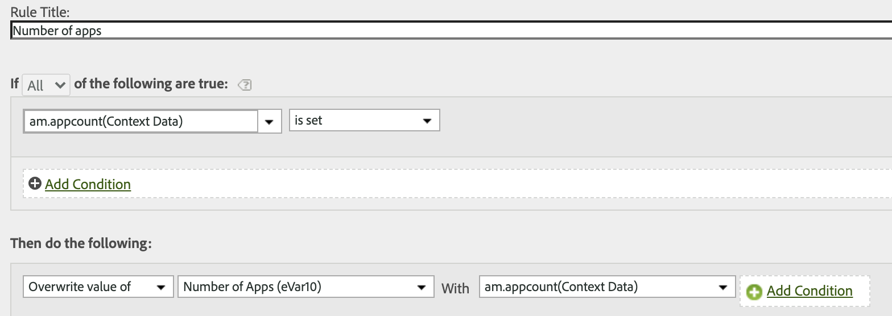

# Mobile Servicesの処理ルールのAdobe Analyticsへの移行

このドキュメントでは、Mobile Services UIで作成した追加の処理ルール（ライフサイクル指標を除く）をAdobe Analyticsに移行する方法について説明します。

処理ルールは、コンテキストデータ変数の値を prop および eVar に移動するために使用されます。例えば、「検索語」コンテキストデータ変数の値をコマース変数eVarの値に配置し、すべてのヒットでその値を上書きできます。 処理ルールがないと、Analytics にレポートが出力されないため、コンテキストデータ変数は無意味となります。

このドキュメントでは、Analysis Workspaceでのモバイル使用レポートの実行方法についても説明します。

## 処理ルールの移行

処理ルールや使用レポート機能などの補完的な機能としてMobile Servicesを利用している場合は、Analytics UI(処理ルールUIまたはAnalysis Workspace)にシームレスに移動して、これらの機能を実現できます。 ライフサイクル指標、またはAA処理ルールUIで設定されたルールの場合、移行を行う必要はありません。 ライフサイクル指標は、モバイルSDKが最初にアプリに実装されたときに自動的に収集される、「そのまま使用できる」指標です。

ただし、Mobile Services UI（ライフサイクル指標を除く）に追加の処理ルールを設定した場合は、Mobile Servicesへのアクセス権を失った後にAnalyticsでその処理ルールを編集または削除できるように、それらの処理ルールを移行する必要があります。

1. Log in to `experience.adobe.com` and go to Mobile Services.
1. コンテキスト変数のマッピングをAdobe Analyticsに移行するモバイルアプリの歯車アイコンをクリックします。
1. 変数と指標の **[!UICONTROL 管理メニュー項目をクリックし、「]** カスタム変数 **** 」タブをクリックします。 ここでは、設定に追加されたコンテキスト変数マッピング（コンテキストデータ）を確認できます。 これらの設定をメモしておく（またはスクリーンショットを撮る）。 例：

   

1. Experience Cloudで、Adobe Analyticsに切り替え、Mobile Servicesで閲覧していたのと同じモバイルレポートスイートにあることを確認します。
1. 管理者 **[!UICONTROL /]** レポートスイート **[!UICONTROL /]** 設定 **[!UICONTROL /一般的な設定]** /処理ルール ********&#x200B;の編集に移動します。
1. 「**[!UICONTROL Add Rule]**」をクリックします。
1. 条件を無視して、Mobile Servicesに存在するのと同じコンテキスト変数の追加に進みます。

   

1. 「**[!UICONTROL 保存]**」をクリックします。

## Analysis Workspaceのモバイル使用レポート

Analysis Workspaceには、モバイル指標とディメンションに加えて（レポートスイートがMobile Servicesに対して有効になっている場合）、分析を促進するモバイルプロジェクトテンプレートがいくつか用意されています。

* **[!UICONTROL メッセージ]**:アプリ内メッセージングとプッシュメッセージングのパフォーマンスに重点を置いています。
* **[!UICONTROL 場所]**:マップに位置データを表示します。
* **[!UICONTROL 主要指標]**:アプリの主要指標の傾向を保ちます。
* **[!UICONTROL アプリの使用状況]**:アプリのユーザー数、起動数、初回起動数はいくつですか。また、セッションの長さの平均はどれくらいですか。
* **[!UICONTROL 獲得]**:モバイルダウンロード計測用リンクのパフォーマンスはどのようか。
* **[!UICONTROL パフォーマンス]**:アプリのパフォーマンスはどのようで、ユーザーはどこで問題を抱えていますか。
* **[!UICONTROL リテンション]**:常連ユーザーは誰で、何をしているか。
* **[!UICONTROL ジャーニー]**:アプリで目立つ使用パターンは何か。

以下に、モバイルアプリの使用状況テンプレートの抜粋を示します。

テンプレートにアクセスするには：

1. Log in to `experience.adobe.com` and select Analytics.
1. Mobile Servicesが有効なレポートスイートに存在することを確認します。
1. Click the **[!UICONTROL Workspace]** tab.
1. 「**[!UICONTROL 新規プロジェクトを作成]**」をクリックします。
1. 任意のモバイルテンプレートを選択し、「 **[!UICONTROL 作成]**」をクリックします。

## 他のMobile Services機能の移行

以下のMobile Services機能もAdobe Analyticsとの関係を持ちますが、購入したAdobe AnalyticsSKUが必要です。

* 「ダウンロード計測用リンク」
* プッシュメッセージ
* アプリ内メッセージ
* 目標地点管理

有料機能としてMobile Servicesを利用する場合、他の内部/外部ツールへの実行可能な移行パスはありません。

* ダウンロード計測用リンクについては、お客様のニーズを満たすためにAdobeパートナーにお問い合わせいただけます。
* プッシュメッセージおよびアプリ内メッセージは、Adobe Campaign StandardとAdobe Campaign Classicで利用できます（プッシュのみ）。 ただし、ターゲティングに使用される基になるデータセットは異なります。 お客様のAdobeアカウントチームと協力して、メッセージングデータの移行オプションを決定することをお勧めします。
* ロケーション機能については、AEPのすべてのお客様が無料で利用できる新しい [Adobe Experience Platformロケーションサービス](https://www.adobe.com/experience-platform/location-service.html)(AEP)を導入することをお勧めします。
