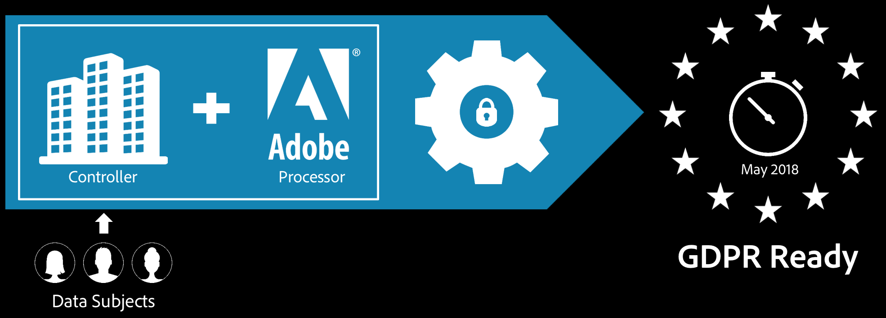

# Adobe Analytics と GDPR

このドキュメントでは、GDPR におけるデータ主体のアクセス権および削除権に対応するために、Adobe Analytics でどのような作業が必要かを説明します。

>[!IMPORTANT]
>
>このドキュメントの内容は法的な助言ではなく、その代用になるものでもありません。GDPR に関する助言については、お客様の企業の法務部門にご相談ください。

2018年5月25日に、欧州連合の General Data Protection Regulation（GDPR）が施行されました。アドビの対応と、アドビの製品をご利用のお客様への影響について詳しくは、 [GDPR とお客様への影響](https://www.adobe.com/jp/privacy/general-data-protection-regulation.html) を参照してください。

アドビはソフトウェアやサービスを企業に提供する際に、サービスの一環として、お客様に代わって個人データの受信および保管をおこなうデータ処理者としての役割を果たします。アドビはデータ処理者として、お客様の許可と指示（お客様とアドビとの間で締結された契約の内容など）に従って個人データを処理します。

データ管理者であるお客様は、アドビに処理および保管を委任する個人データを決めます。Adobe Experience Cloud ソリューションをご利用のお客様の場合は、お客様が使用しているソリューションと、お客様が Adobe Experience Cloud アカウントに送信するよう設定した情報に基づいて、アドビは個人データをホストします。サンプルのリストについては、[Adobe Experience Cloud のプライバシー](https://www.adobe.com/jp/privacy/experience-cloud.html#collect)を参照してください。

## アドビによる GDPR データの処理方法

Adobe Experience Cloud には、ブランドのデータガバナンスインフラストラクチャと、消費者エクスペリエンスの作成と管理に使用するアドビのツールを接続する統合ソリューションが用意されています。Adobe Experience Cloud のデータガバナンス機能により、データガバナンスポリシーをデータ使用に直接リンクできます。

「[Adobe Analytics による GDPR の処理方法](https://www.adobe.com/jp/data-analytics-cloud/analytics/general-data-protection-regulation.html)」を確認してください。ここでは、GDPR 対応の手順と、Adobe Experience Cloud GDPR API との統合方法について説明しています。

## GDPR 対応の準備とお客様の Adobe Analytics データ

アドビは、お客様自身がレポートスイートのカスタムデータのことを最も熟知していると考えているので、お客様がデータガバナンスの各種設定を指定できるようにしています。

そのため Adobe Analytics にはデータガバナンス用ユーザーインターフェイスが用意されており、データ管理者であるお客様は、Analytics のレポートスイートと、レポートスイート内のすべてのディメンションと指標に[プライバシー用ラベル](/help/admin/tools/privacy-labeling/labels.md#data-governance-labels)を設定できます。お客様は、個人を直接的または間接的に特定できるデータを含むデータセット内の列を識別し、それらのデータに対するアクセス要求または削除要求を送信できます。各要求では、Analytics のデータガバナンス用ユーザーインターフェイスで設定されたラベルが、対象の要求に対応する固有識別子として扱われます。

ラベルの設定方法について詳しくは、[レポートスイートデータのラベル設定](/help/admin/tools/privacy-labeling/labeling-overview.md)を参照してください。
